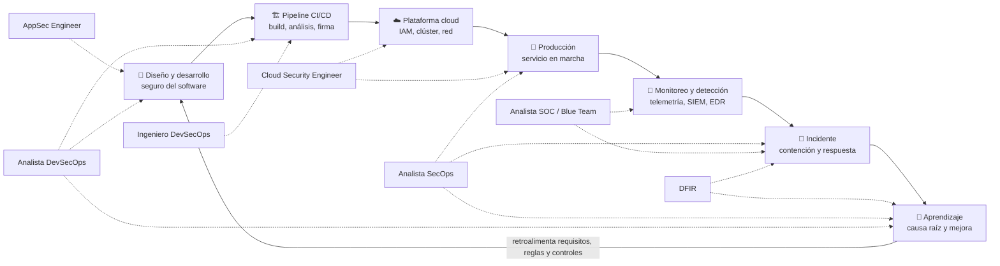

# 🗺️ Matriz de roles: SOC, SecOps, DevSecOps, AppSec, Cloud Security y DFIR

Los nombres de estos puestos **se solapan en las ofertas de empleo y no significan lo mismo**. Esta
página los separa por lo único que no engaña: **qué hace la persona todos los días, qué decide y qué
entrega**. Es el mapa transversal de las [rutas por rol](../rutas/README.md) de la familia
defensiva y de seguridad del software.

> Regla de lectura: **el contenido de la oferta manda sobre el título**. Si un anuncio dice
> "Especialista DevSecOps" y describe triaje, priorización y reportes, es un
> [Analista DevSecOps](../rutas/devsecops-analista.md); si describe pipelines, firma y políticas, es
> un [Ingeniero DevSecOps](../rutas/devsecops-engineer.md); si describe ambas cosas, es una vacante
> mixta y conviene negociarla como tal.

## 🧭 Las tres distinciones que más se confunden

1. **SOC ≠ SecOps.** El [analista de SOC](../rutas/soc-blue-team.md) trabaja sobre **eventos**:
   detecta, triaja alertas, caza y escala. El [analista SecOps](../rutas/secops-analista.md) trabaja
   sobre **controles y riesgo**: cobertura, vulnerabilidades, parcheo, accesos, SLA y métricas. Uno
   descubre que algo pasó; el otro se asegura de que la causa desaparezca y no vuelva.
2. **AppSec ≠ DevSecOps.** [AppSec](../rutas/appsec.md) mira **hacia dentro del software**: diseño,
   modelado de amenazas, revisión de código, ASVS, acompañamiento al desarrollador. DevSecOps mira
   **el proceso** por el que ese software se construye, se verifica y se entrega. AppSec define qué
   hay que comprobar; DevSecOps hace que se compruebe solo, siempre y en el momento correcto.
3. **Cloud Security ≠ DevSecOps.** [Cloud Security](../rutas/cloud-security.md) protege **la
   plataforma donde corre** lo desplegado: IAM de la nube, postura y CSPM, segmentación, clúster,
   logging y respuesta en la nube. DevSecOps protege **el camino** hasta ahí: código, dependencias,
   imagen, pipeline, firma y procedencia. Se cruzan en IaC, contenedores y Kubernetes, y esa
   frontera hay que acordarla por escrito en cada organización.

Y una cuarta, dentro de cada familia: **analista ≠ ingeniero**. El analista **opera y decide** sobre
el riesgo; el ingeniero **construye y mantiene** la capacidad técnica. En empresas pequeñas una
persona hace ambas; eso no las convierte en el mismo puesto, solo en el mismo contrato.

## 🔄 El ciclo completo y quién interviene en cada tramo

Lectura del diagrama, tramo a tramo:

| Tramo | Quién manda | Quién acompaña |
|---|---|---|
| **Diseño y desarrollo** | [AppSec Engineer](../rutas/appsec.md) | [Analista DevSecOps](../rutas/devsecops-analista.md) (requisitos y deuda), desarrollo |
| **Pipeline CI/CD** | [Ingeniero DevSecOps](../rutas/devsecops-engineer.md) | Analista DevSecOps (triaje de lo que produce), AppSec (qué comprobar) |
| **Plataforma cloud** | [Cloud Security Engineer](../rutas/cloud-security.md) | Ingeniero DevSecOps (IaC, imágenes, despliegue) |
| **Producción** | Cloud Security + operaciones | [Analista SecOps](../rutas/secops-analista.md) (controles y parcheo) |
| **Monitoreo y detección** | [Analista SOC / Blue Team](../rutas/soc-blue-team.md) | [Ingeniero SecOps](../rutas/secops-engineer.md) (telemetría y automatización) |
| **Incidente** | SOC → [DFIR](../rutas/dfir.md) según gravedad | Analista SecOps (contención operativa y runbook), Cloud Security si es en la nube |
| **Aprendizaje y retroalimentación** | DFIR + Analista SecOps | Analista DevSecOps y AppSec, que convierten la lección en control o en requisito |

El bucle importa más que las cajas: **un incidente que no cambia el diseño, el pipeline o el control
se va a repetir**. El tramo de retroalimentación es donde estos siete roles dejan de ser silos.

## 📊 Matriz comparativa

La matriz completa se presenta en cinco bloques —identidad, trabajo, decisiones, entregables y
recorrido en el programa— porque una sola tabla de quince columnas es ilegible. Todas comparten la
misma primera columna, así que se leen en paralelo.

### Bloque 1 — Identidad y momento del ciclo

| Rol | Misión | Momento del ciclo donde interviene |
|---|---|---|
| [**Analista SOC / Blue Team**](../rutas/soc-blue-team.md) | Detectar lo que está pasando ahora y escalarlo a tiempo | Monitoreo y detección; primeras fases del incidente |
| [**Analista SecOps**](../rutas/secops-analista.md) | Que los controles funcionen y que el riesgo operativo baje de forma medible | Producción continua; contención, parcheo y cierre |
| [**Ingeniero SecOps / Security Engineer**](../rutas/secops-engineer.md) | Construir y sostener la plataforma operativa de seguridad, y eliminar el trabajo manual | Transversal a operación y respuesta |
| [**Analista DevSecOps**](../rutas/devsecops-analista.md) | Convertir miles de hallazgos automáticos en decisiones defendibles | Desde el código hasta antes del despliegue; retroalimentación |
| [**Ingeniero DevSecOps**](../rutas/devsecops-engineer.md) | Que el camino seguro sea el camino fácil, automatizado de punta a punta | Pipeline CI/CD y entrega; frontera con la nube |
| [**AppSec Engineer**](../rutas/appsec.md) | Que el software se diseñe y se escriba con menos vulnerabilidades | Requisitos, diseño, código y pruebas de aplicación |
| [**Cloud Security Engineer**](../rutas/cloud-security.md) | Que la plataforma donde corre todo esté bien configurada, vigilada y segmentada | Plataforma cloud y producción; respuesta en la nube |
| [**DFIR**](../rutas/dfir.md) | Reconstruir qué pasó, con evidencia defendible, y cerrar el incidente grave | Incidente y aprendizaje |

### Bloque 2 — Qué opera, qué analiza y qué construye

| Rol | Qué **opera** | Qué **analiza** | Qué **construye** |
|---|---|---|---|
| **Analista SOC / Blue Team** | SIEM, EDR, cola de alertas, casos | Eventos, alertas, telemetría, comportamiento de un atacante | Reglas de detección (Sigma), consultas de hunting, casos documentados |
| **Analista SecOps** | Consolas de control, escáner, ticketing, runbooks | Hallazgos de vulnerabilidad, cobertura de control, accesos, SLA | Runbooks, backlog operativo, métricas y reportes |
| **Ingeniero SecOps** | EDR/XDR de la flota, integraciones, APIs internas | Detecciones que requieren respuesta técnica, huecos de proceso | Automatizaciones, APIs internas, integraciones, ingeniería de detección |
| **Analista DevSecOps** | Backlog de seguridad del SDLC, informes de escáner, excepciones | SAST, DAST, SCA, secretos, IaC y contenedores; explotabilidad y contexto | Criterio de priorización, registro de excepciones, tableros, matriz de evidencia |
| **Ingeniero DevSecOps** | Pipelines, gates, bóveda de secretos, registro de artefactos | Cobertura y coste de los controles; amenazas al propio pipeline | Pipelines reutilizables, SBOM, firma y procedencia, políticas OPA/Rego |
| **AppSec Engineer** | Herramientas de análisis y pruebas de aplicación | Diseño, código, APIs, lógica de negocio | Modelos de amenazas, requisitos de seguridad, guías de secure coding, correcciones |
| **Cloud Security Engineer** | Cuentas de nube, IAM, CSPM, clúster, logging | Postura, permisos, configuración, señales de la nube | Terraform e IaC seguros, líneas base, detecciones y respuesta en la nube |
| **DFIR** | Herramientas forenses, adquisición, timeline | Artefactos, memoria, disco, red, cadena de eventos | Informe forense, IOCs, línea de tiempo, lecciones aprendidas |

### Bloque 3 — Decisiones, herramientas y nivel de programación

| Rol | Decisiones que puede tomar | Herramientas (categorías) | Nivel de programación |
|---|---|---|---|
| **Analista SOC / Blue Team** | Clasificar y escalar una alerta; declarar incidente; proponer una detección | SIEM, EDR, threat intel, Sigma, ATT&CK | Bajo–medio: consultas y scripting puntual |
| **Analista SecOps** | Priorizar y descartar hallazgos; acordar SLA y ventana; contener; proponer excepción | Escáner, EDR, SIEM, IAM, ticketing, KEV/EPSS | Bajo–medio: scripting de utilidad |
| **Ingeniero SecOps** | Diseño de la automatización; contención técnica; qué se integra y cómo | EDR/XDR, SOAR, APIs, Python/Bash, CI/CD | **Alto**: escribe y mantiene código en producción |
| **Analista DevSecOps** | Falso positivo o real; orden del backlog; SLA; excepción con vencimiento; verificar cierre | SAST/DAST/SCA, secretos, IaC, SBOM, KEV/EPSS, backlog | Medio: **lee** código con soltura, automatiza informes |
| **Ingeniero DevSecOps** | Qué control va en qué etapa; qué bloquea y qué avisa; umbrales; modelo de identidad del pipeline | CI/CD, OPA/Rego, SBOM y firma, bóveda, Kubernetes, IaC | **Alto**: código y configuración que otros usan a diario |
| **AppSec Engineer** | Aceptar o rechazar un diseño; severidad real de una vulnerabilidad; requisitos de seguridad | Proxy de intercepción, SAST, ASVS, threat modeling | Medio–alto: revisa código, escribe PoC y correcciones |
| **Cloud Security Engineer** | Configuración segura de la cuenta y del clúster; permisos; contención en la nube | CSPM, IAM, Terraform, Kubernetes, logging cloud | Medio–alto: IaC y automatización |
| **DFIR** | Alcance de la investigación; preservación de evidencia; criterio de erradicación | Volatility, YARA, adquisición, timeline | Medio: scripting forense |

### Bloque 4 — Entregables y métricas

| Rol | Entregables | Métricas con las que se le evalúa |
|---|---|---|
| **Analista SOC / Blue Team** | Casos, reglas Sigma, informes de detección, hunting documentado | MTTD, tasa de falso positivo, cobertura ATT&CK, alertas por analista |
| **Analista SecOps** | Reporte priorizado, tickets, runbooks, excepciones, informe mensual | Cobertura de control, MTTR, deuda y su edad, cumplimiento de SLA, reapertura |
| **Ingeniero SecOps** | Automatizaciones, APIs, integraciones, runbooks técnicos | Trabajo manual eliminado, cobertura de la flota, fiabilidad del automatismo |
| **Analista DevSecOps** | Informe de triaje, backlog priorizado, excepciones, tableros, matriz SSDF/SAMM | Falsos positivos entregados, MTTR por severidad, deuda, cobertura de escaneo, adopción |
| **Ingeniero DevSecOps** | Pipelines, gates documentados, SBOM, firmas, políticas Rego, runbook de reversión | Adopción, tiempo añadido al pipeline, cobertura de SBOM/firma, secretos de larga vida restantes, nivel SLSA |
| **AppSec Engineer** | Modelos de amenazas, requisitos, revisiones, informes de vulnerabilidad | Vulnerabilidades evitadas en diseño, tiempo de corrección, cobertura ASVS |
| **Cloud Security Engineer** | Informe CSPM, módulos IaC seguros, líneas base, detecciones cloud | Desviaciones abiertas, permisos excesivos, cobertura de logging, MTTR en la nube |
| **DFIR** | Informe forense, línea de tiempo, IOCs, cadena de custodia | Tiempo hasta la causa raíz, calidad y defendibilidad de la evidencia |

### Bloque 5 — Clases, laboratorios y progresión

| Rol | Clases del programa | Laboratorios | Progresión típica | Colabora sobre todo con |
|---|---|---|---|---|
| **Analista SOC / Blue Team** | Partes 8 (181–200), 6, 1; 202 y 215 de la 9 | `blue-team-soc`, `rootcause-windows` | SOC L1 → L2 → L3 / ingeniería de detección → DFIR o SecOps | SecOps, DFIR, Ingeniero SecOps |
| **Analista SecOps** | 071; 181–183, 189, 195–197; 202, 215–217, 219; 313, 315, 318, 319, 321, 322, 324; 279, 280, 282, 285, 287; 240, 245 | `blue-team-soc` (trayecto propio), `rootcause-windows`, `devsecops-pipeline` (solo priorización), `cloud-security` | Mesa de ayuda/sysadmin/SOC L1 → Analista SecOps → Ingeniero SecOps, gestión de vulnerabilidades o GRC | TI, SOC, DFIR, DevSecOps, Cloud Security |
| **Ingeniero SecOps** | 007, 009, 015–019; 181–200; 202, 205–206, 216; 236–248 (parcial), 110, 247; 313, 315, 318, 324, 330 | `blue-team-soc`, `rootcause-windows`, `appsec-code`, `devsecops-pipeline` | SOC/sysadmin → Security Engineer → Sr./Staff → líder de ingeniería de seguridad | SOC, SecOps, TI, DevSecOps |
| **Analista DevSecOps** | 236–248 (con foco en 238–241, 243, 245, 246, 248); 087, 110; 318, 321, 323, 330; 277, 282, 284, 287; 227, 230, 231 | `devsecops-pipeline` (trayecto propio), `appsec-code`, `appsec-web`, `cloud-security` | Desarrollo/QA/SOC/VM → Analista DevSecOps → Ingeniero DevSecOps, AppSec o gobierno del programa | Desarrollo, AppSec, Ingeniero DevSecOps, Cloud Security, cumplimiento |
| **Ingeniero DevSecOps** | 236–248 **entera**; 221–235 (227–230, 233); 063; 087, 110; 313, 315, 323, 324, 330; 182, 202; 282, 284 | `devsecops-pipeline` (trayecto propio), `cloud-security`, `appsec-code`, `appsec-web` | Desarrollo/DevOps/SRE/SecOps → Ingeniero DevSecOps → Staff / plataforma / arquitectura | Desarrollo, plataforma, Cloud Security, AppSec, Analista DevSecOps |
| **AppSec Engineer** | 086–115 **núcleo**; 046–065; 236–248; 291–300 | `appsec-web`, `appsec-code`, `devsecops-pipeline` | Desarrollo/pentest web → AppSec → AppSec Sr. / arquitectura de seguridad de producto | Desarrollo, DevSecOps, producto |
| **Cloud Security Engineer** | 221–235 **núcleo**; 236–248; 046–065; 110; 234–235 | `cloud-security`, `devsecops-pipeline` | Cloud/DevOps/infra → Cloud Security → Sr./Principal → arquitectura | Plataforma, DevSecOps, SOC, SecOps |
| **DFIR** | 201–220 **núcleo**; 141–160; 181–200; 325–326 | `dfir-memoria`, `blue-team-soc`, `rootcause-windows` | SOC L2 → DFIR → forense sénior / consultoría de respuesta | SOC, SecOps, legal, Cloud Security |

## 🎯 Cómo elegir entre ellos

Cuatro preguntas honestas, respondidas en orden:

1. **¿Quieres decidir o construir?** Decidir → perfiles de *analista*. Construir → perfiles de
   *ingeniero*. No hay uno mejor: hay techos y rutinas distintas.
2. **¿Te interesa más el software o la infraestructura?** Software → AppSec o DevSecOps.
   Infraestructura y operación → SOC, SecOps o Cloud Security.
3. **¿Cuánta programación quieres en tu semana?** Casi nada → SOC o Analista SecOps. Leer código y
   automatizar informes → Analista DevSecOps. Escribir código que otros usan → Ingeniero SecOps o
   Ingeniero DevSecOps.
4. **¿Prefieres el tiempo real o el tiempo largo?** Tiempo real (turnos, alertas, incidentes) → SOC
   y DFIR. Tiempo largo (programas, deuda, plataformas) → SecOps, DevSecOps y Cloud Security.

Una casilla que esta matriz **no** contiene, y que conviene reconocer en un anuncio: cuando la oferta
suma a todo lo anterior la **disponibilidad de la plataforma** —servidores, Microsoft 365 y Active
Directory, virtualización, respaldos, enlaces— ya no estás mirando ninguno de estos siete puestos,
sino una **jefatura de infraestructura y ciberseguridad**
([ruta](../rutas/jefe-infraestructura-ciberseguridad.md)). La señal que lo delata es que el mismo
cargo responde por que el correo funcione y por el SGSI; ahí el eje deja de ser *analista o
ingeniero* y pasa a ser *operar y responder*.

Y un consejo que ahorra años: **el primer puesto no define la carrera**. Los cruces entre estas
casillas son la norma, no la excepción, y casi todos comparten un mismo cimiento — la
[Parte 0](../classes/parte-0-fundamentos-y-prerrequisitos/README.md).

## 📎 Fuentes y marcos de referencia

Las descripciones de responsabilidades de esta matriz se apoyan en marcos públicos y primarios, no
en definiciones inventadas. Consultados en **agosto de 2026**:

- **NIST Cybersecurity Framework 2.0** (2024) — las funciones *Govern, Identify, Protect, Detect,
  Respond, Recover* estructuran el ciclo del diagrama: <https://www.nist.gov/cyberframework>
- **NIST SP 800-218, Secure Software Development Framework (SSDF) v1.1** (2022) — las prácticas
  contra las que el Analista DevSecOps mapea evidencia: <https://csrc.nist.gov/pubs/sp/800/218/final>
- **NIST SP 800-61, Computer Security Incident Handling Guide** — el ciclo de respuesta que ejecutan
  SOC, SecOps y DFIR: <https://csrc.nist.gov/pubs/sp/800/61/r2/final>
- **OWASP SAMM** — modelo de madurez del software seguro: <https://owaspsamm.org/>
- **OWASP ASVS** — requisitos de verificación de aplicaciones, terreno de AppSec:
  <https://owasp.org/www-project-application-security-verification-standard/>
- **OWASP DevSecOps Guideline** — mapa de controles del pipeline:
  <https://owasp.org/www-project-devsecops-guideline/>
- **MITRE ATT&CK** — lenguaje común de detección y cobertura: <https://attack.mitre.org/>
- **CISA Known Exploited Vulnerabilities (KEV)** — explotación confirmada:
  <https://www.cisa.gov/known-exploited-vulnerabilities-catalog>
- **FIRST EPSS** y **CVSS** — probabilidad de explotación y severidad:
  <https://www.first.org/epss/> · <https://www.first.org/cvss/>
- **SLSA** — niveles de integridad de la cadena de suministro: <https://slsa.dev/>
- **OpenSSF** — buenas prácticas de código abierto y cadena de suministro:
  <https://openssf.org/>
- **CycloneDX** y **SPDX** — formatos de SBOM: <https://cyclonedx.org/> · <https://spdx.dev/>
- **CIS Controls y Benchmarks** — prioridades operativas y líneas base:
  <https://www.cisecurity.org/controls>

Esta página **no incluye datos salariales ni tendencias del mercado laboral**: cada guía de rol
remite a ofertas reales, indicando país, moneda y fecha, porque cualquier cifra publicada aquí
quedaría desactualizada y no sería verificable.

## 🔗 Relacionado

- [Rutas por rol](../rutas/README.md) · [Examen final por rol](examen-final-por-rol.md) ·
  [Rúbrica de evaluación](rubrica-evaluacion.md) · [Syllabus](syllabus.md)
- [Laboratorios](../labs/README.md) · [Certificaciones](../certificaciones/README.md)
