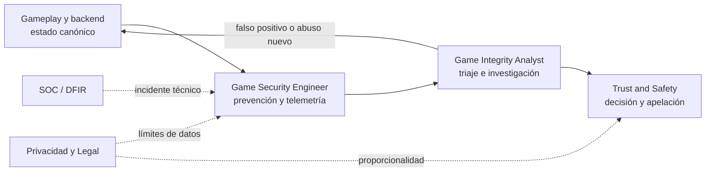

# 🎮 Modelo operativo de Game Security

La Parte 19 enseña una disciplina, no un equipo aislado. Proteger la integridad de un juego exige
separar quién **diseña controles**, quién **investiga señales**, quién **decide una sanción** y quién
responde por privacidad, soporte e incidentes. Este documento conecta esas responsabilidades con
las rutas del programa y fija límites de seguridad para la práctica.

## Dos perfiles centrales, no un cargo universal

| Perfil | Misión | Decide | Entregables principales |
|---|---|---|---|
| [Game Security / Anti-Cheat Engineer](../rutas/game-security-engineer.md) | Reducir confianza incorrecta en el cliente y construir prevención, telemetría y detección | Arquitectura de autoridad, invariantes, esquema de eventos y controles técnicos | Threat model, validaciones de servidor, reglas, pruebas de regresión y RCA |
| [Game Integrity / Anti-Cheat Analyst](../rutas/game-integrity-analyst.md) | Convertir señales ambiguas en casos reproducibles y decisiones revisables | Triaje, suficiencia de evidencia, escalamiento y propuesta de acción | Caso investigado, consulta, paquete de evidencia, métricas de falsos positivos y recomendación |

El ingeniero construye la capacidad; el analista la opera y cuestiona su salida. En equipos pequeños
una persona puede cubrir ambos perfiles, pero debe conservar la separación entre **crear una señal**
y **declararla prueba suficiente**.

## Roles adyacentes y límites de decisión

| Rol adyacente | Responsabilidad en Game Security | No debe decidir por sí solo |
|---|---|---|
| Gameplay / Backend Engineer | Estado canónico, economía, inventario, matchmaking y corrección funcional | Que una anomalía implica intención maliciosa |
| Data / ML Engineer | Calidad del dataset, features, evaluación, drift y reproducibilidad | Una sanción basada sólo en el score del modelo |
| Trust & Safety / Player Support | Política, revisión humana, apelaciones y comunicación con jugadores | Arquitectura técnica o retención ilimitada de datos |
| Privacidad / Legal | Base, finalidad, minimización, retención, transferencias y derechos aplicables | La conclusión técnica de un caso sin revisar su evidencia |
| SOC / DFIR | Incidentes contra cuentas, backend, pipeline o el propio anti-cheat | Confundir respuesta a un incidente con enforcement competitivo |
| Product / liderazgo | Riesgo aceptado, recursos, experiencia del jugador y métricas de negocio | Suprimir controles de debido proceso para mejorar una métrica |

La flecha de regreso evita que el programa anti-cheat se reduzca a sancionar. Un caso debe mejorar
la autoridad, el diseño o la telemetría para que la misma causa no reaparezca.

## Flujo de decisión auditable

1. **Definir el abuso y el activo:** ventaja, economía, cuenta, disponibilidad o privacidad.
2. **Reproducir en un entorno propio:** el [Game Security Range](../labs/game-security/README.md) o
   un target interno expresamente autorizado.
3. **Corregir autoridad e invariantes:** retirar del cliente decisiones que el servidor puede validar.
4. **Instrumentar lo mínimo:** propósito, campos, versión, acceso, retención y condición de borrado.
5. **Evaluar la señal:** baseline, casos legítimos difíciles, precision/recall, segmentos y drift.
6. **Investigar el caso:** separar observación, indicador, inferencia y conclusión; conservar contexto.
7. **Aplicar revisión proporcional:** escalamiento, acción reversible cuando sea posible y apelación.
8. **Cerrar con RCA y regresión:** documentar causa raíz, control, prueba y métrica posterior.

Una puntuación, una coincidencia de memoria o una trayectoria anómala son señales. Ninguna prueba por
sí sola la identidad, la intención o la culpabilidad de una persona.

## Límites de seguridad de la práctica

- Usa únicamente el rango local, software propio o un entorno con autorización escrita que nombre
  versión, cuentas, técnicas, horario, datos, contactos y criterio de parada.
- No conectes trainers, automatizaciones, instrumentación o proxies del curso a juegos o servicios
  de terceros, aunque sean gratuitos o la prueba no altere una clasificación.
- No desarrolles ni distribuyas bypasses contra anti-cheat de terceros. Reporta vulnerabilidades al
  proveedor mediante su canal oficial y sigue su política de divulgación.
- No recolectes telemetría «por si acaso». Justifica finalidad, minimiza campos y privilegios, limita
  retención y registra quién consultó cada caso.
- Prueba reglas y modelos con jugadores legítimos difíciles, accesibilidad, latencia y hardware
  diverso. Una tasa global puede ocultar daño concentrado en un segmento.
- Separa investigación técnica, decisión de sanción y apelación. Registra versión de la regla o
  modelo, datos utilizados, explicación y revisor.
- Trata el propio anti-cheat como software sensible: firma, actualización segura, mínimo privilegio,
  rollback, respuesta a vulnerabilidades y monitoreo de abuso interno.

Estas reglas complementan [Seguridad y ética](../SECURITY_AND_ETHICS.md), la
[Clase 025](../classes/parte-0-fundamentos-y-prerrequisitos/025-etica-legalidad-alcance-y-divulgacion-responsable/README.md)
y la [Clase 359](../classes/parte-19-seguridad-de-videojuegos-cheats-y-anticheat/359-privacidad-gobernanza-sanciones-seguridad-anticheat/README.md).

## Evidencia mínima por responsabilidad

| Decisión | Evidencia mínima |
|---|---|
| Cambiar autoridad cliente-servidor | Threat model, invariante, prueba vulnerable/segura y regresión |
| Añadir telemetría | Finalidad, diccionario de datos, acceso, retención y prueba de calidad |
| Publicar una detección | Dataset card, baseline, matriz de confusión, segmentos y plan de drift |
| Escalar un caso | Consulta reproducible, timeline, versión del detector y alternativas descartadas |
| Sancionar | Política aplicable, evidencia suficiente, revisor, proporcionalidad y vía de apelación |
| Cerrar un incidente | RCA, mitigación, prueba de regresión, comunicación y métrica posterior |

## Fuentes que sostienen el modelo

- [Epic Games — Networking Overview](https://dev.epicgames.com/documentation/unreal-engine/networking-overview-for-unreal-engine):
  autoridad y replicación cliente-servidor usadas para asignar responsabilidades técnicas.
- [Valve — Latency Compensating Methods](https://developer.valvesoftware.com/wiki/Latency_Compensating_Methods_in_Client/Server_In-game_Protocol_Design_and_Optimization):
  predicción, reconciliación y latencia que impiden interpretar toda divergencia como abuso.
- [NIST Privacy Framework](https://www.nist.gov/privacy-framework): gestión del riesgo de privacidad
  aplicada a telemetría, acceso, retención y decisiones sobre personas.
- [scikit-learn — Outlier detection](https://scikit-learn.org/stable/modules/outlier_detection.html):
  diferencia entre novelty/outlier detection y límites de inferir conducta desde anomalías.
