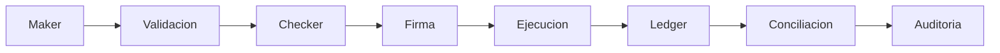

# Laboratorio — descuadre entre ledger, operación y blockchain

**Organización ficticia:** Nebula Custody

**Modalidad:** análisis offline reproducible + consulta opcional de Bitcoin testnet

**Riesgo:** no usa claves privadas, credenciales, fondos ni sistemas reales

## Misión

El motor diario de conciliación informa que el saldo BTC del ledger no coincide
con la realidad observada. El estudiante actúa como equipo conjunto de SOC, DFIR,
tesorería, IAM/PAM y auditoría. Debe cuantificar la diferencia, reconstruir la
secuencia, preservar evidencia, evaluar hipótesis y proponer controles sin
atribuir intención cuando los datos no la demuestran.

## Resultados verificables

Al terminar podrás:

1. reconciliar verdad contable, operacional y criptográfica;
2. correlacionar eventos con `request_id`, `approval_id`, `tx_hash` y tiempo;
3. detectar una ruptura de segregación de funciones y señales de abuso privilegiado;
4. preservar artefactos y registrar su cadena de custodia;
5. separar observación, inferencia, hipótesis y conclusión no soportada;
6. producir causa raíz y controles cuya eficacia pueda probarse.

## Estructura

| Recurso | Uso |
|---|---|
| `data/` | doce fuentes sintéticas del caso |
| `analizar_caso.py` | conciliación y controles de integridad referencial |
| `consultar_testnet.py` | consulta opcional, sólo lectura, de Bitcoin testnet |
| `THREAT_MODEL.md` | activos, actores, DFD, STRIDE, insider y abuse cases |
| `PLAYBOOKS.md` | ocho playbooks específicos de custodia |
| `DATA_DICTIONARY.md` | contrato semántico de campos y fuentes |
| `templates/` | cadena de custodia e informe de hallazgos |
| `EVALUACION.md` | entregables y rúbrica |
| `SOLUCION.md` | solución docente; abrir después de resolver |

## Preparación

- Python 3.10 o posterior; no requiere paquetes externos.
- Copia de trabajo del laboratorio. No edites `data/` durante el análisis.
- Para la etapa opcional online, conexión HTTPS saliente a Blockstream testnet.

Desde la raíz del repositorio:

```powershell
python labs/custodia-activos-digitales/analizar_caso.py
python -m unittest discover -s labs/custodia-activos-digitales/tests -v
```

La primera orden debe terminar con `RESULTADO: ALERTA` y cuantificar una diferencia
BTC de `0.70000000`. El test confirma que el hallazgo no depende de inspección
manual ni de red.

## Procedimiento profesional

### 1. Detection e identification

1. Calcula SHA-256 de cada archivo y registra herramienta, versión, hora y zona.
2. Ejecuta el analizador sin modificar datos.
3. Anota qué regla abrió el caso y qué activos están afectados.
4. No denomines «fraude» a la alerta: formula al menos tres explicaciones
   alternativas (evento tardío, error de registro, operación no autorizada, fee o
   error de normalización) y qué evidencia discriminaría entre ellas.

### 2. Preservation y acquisition

1. Copia `templates/CADENA_CUSTODIA.md` a tu carpeta de entrega.
2. Trata cada CSV/JSONL como exportación adquirida: identificador, origen lógico,
   método, hash, custodio y transferencia.
3. Conserva originales de sólo lectura y analiza copias verificadas.
4. Registra desfase de reloj y zona; un hash prueba igualdad de bytes, no
   procedencia, exhaustividad ni interpretación correcta.

### 3. Examination, analysis y correlation

Reconstruye esta unión, sin asumir que compartir tiempo significa compartir causa:

```text
withdrawals.request_id
  -> approvals.request_id
  -> application_logs.request_id
  -> blockchain.request_id + tx_hash
  -> ledger.reference
  -> access_logs.session_id / security_alerts.correlation_id
```

Para cada retiro responde quién solicitó, quién aprobó, qué identidad ejecutó, qué
credencial/sesión se usó, qué política decidió, qué dirección recibió, qué TXID
resultó, qué asiento quedó y quién podía alterar esa evidencia.

### 4. Consulta blockchain read-only

El dataset funciona offline. Para practicar adquisición desde una fuente externa,
usa un TXID real de **Bitcoin testnet** obtenido por el docente o por un explorador
de testnet:

```powershell
python labs/custodia-activos-digitales/consultar_testnet.py tx <TXID_TESTNET> --out evidencia-tx.json
python labs/custodia-activos-digitales/consultar_testnet.py address <DIRECCION_TESTNET> --out evidencia-address.json
```

El script fija el endpoint en testnet, guarda bytes de respuesta y muestra SHA-256.
Una API de explorador es una fuente derivada: para mayor aseguramiento se
contrasta con un nodo propio mediante RPC y se documentan altura, confirmaciones,
endpoint y momento de adquisición. No envíes transacciones ni pegues seeds.

### 5. Timeline, findings y reporting

Construye una timeline UTC. Cada fila debe citar fuente y `event_id`. Clasifica:

- **observado:** aparece directamente en un artefacto;
- **inferido:** conclusión razonable que enlaza observaciones;
- **hipótesis:** explicación pendiente de evidencia;
- **no determinado:** el dataset no permite concluir.

Completa `templates/INFORME_HALLAZGOS.md`. La raíz no puede ser el nombre de una
persona: modela decisiones, permisos, ausencia o bypass de controles, calidad de
datos y supervisión. Una conducta individual puede ser una observación relevante,
pero intención y responsabilidad requieren evidencia y proceso competente.

## Esquema mínimo de eventos

Los JSONL incluyen: `event_id`, `timestamp`, `user_id`, `role`, `session_id`,
`device_id`, `source_ip`, `action`, `asset`, `amount`, `source_wallet`,
`destination_wallet`, `approval_id`, `request_id`, `tx_hash`, `block_number`,
`exchange`, `result`, `risk_score` y `correlation_id`. Campos vacíos son valores
ausentes, no evidencia de que el hecho no ocurrió.

Para resistencia a alteración, el diseño objetivo exige reenvío temprano a una
cuenta separada, almacenamiento WORM/object-lock cuando corresponda, cifrado,
control de acceso independiente, sincronización temporal, hashes o firmas de
lotes, alertas por silencio y pruebas de restauración. «Blockchain para logs» no
es requisito ni solución automática.

## Maker-checker y segregación de funciones



| Capacidad | Maker | Checker | Firmante/operador | Conciliador | Auditor | Admin plataforma |
|---|:---:|:---:|:---:|:---:|:---:|:---:|
| Crear solicitud | sí | no | no | no | no | soporte técnico |
| Aprobar | no | sí | no | no | no | no |
| Firmar/transmitir | no | no | sí, con política | no | no | no |
| Registrar asiento | servicio | no | no | no | no | mantener, sin editar datos |
| Conciliar/cerrar excepción | no | no | no | sí | revisar | no |
| Borrar/alterar evidencia | no | no | no | no | no | no |

La tabla describe incompatibilidades, no sólo roles. ABAC agrega importe, activo,
destino allowlisted, horario, dispositivo, riesgo, número de aprobaciones y estado
del conciliador. Acceso JIT/JEA limita duración y comandos; MFA resistente al
phishing reduce account takeover; PAM graba sesión y rota credenciales. La cuenta
break-glass requiere doble custodia, alerta inmediata, motivo, expiración y revisión.

## Seguridad de wallets: decisión, no catálogo

| Modelo | Ventaja | Riesgo/límite | Uso razonado |
|---|---|---|---|
| Clave única | simple y rápida | punto único de compromiso y control | saldos mínimos con límites estrictos |
| Multisig on-chain | quórum verificable por protocolo | metadatos, soporte y recuperación dependen de la cadena | tesorería con firmantes independientes |
| MPC | ninguna parte reconstruye normalmente la clave | protocolo, proveedor y gobernanza siguen siendo críticos | operación frecuente con políticas distribuidas |
| HSM-backed | aislamiento y operaciones auditables | un HSM firma órdenes válidas aunque sean ilegítimas | raíz de confianza junto a approval workflow |

Hot, warm y cold describen exposición y disponibilidad, no una garantía absoluta.
La arquitectura combina límites/velocity, allowlist con enfriamiento, simulación,
ceremonias de clave, backups probados, rotación, recuperación ante desastre y
reconciliación independiente.

## Errores comunes y troubleshooting

| Síntoma | Causa probable | Corrección |
|---|---|---|
| el script termina con código 2 | encontró la anomalía prevista | verifica que muestre `RESULTADO: ALERTA`; no es un fallo del laboratorio |
| aparecen decimales imprecisos | se usó `float` o una hoja redondeó | usa `Decimal` y conserva ocho decimales para BTC |
| el TXID no existe | se usó el identificador sintético offline en la API real | usa un TXID de Bitcoin testnet entregado por el docente |
| la API responde error/timeout | red, rate limit o identificador inválido | conserva el error, reintenta más tarde y no sustituyas la fuente sin documentarlo |
| se concluye quién fue por `user_id` | se confundió cuenta con persona | busca IdP, MFA, PAM, endpoint y evidencia contextual |
| ledger y cadena no unen | se compararon snapshots, fees o ventanas distintas | revisa semántica, cobertura, dirección, estado y tiempo |

## Preguntas frecuentes

**¿La blockchain es la fuente definitiva?**

Es definitiva para ciertas propiedades del protocolo observado, no para propiedad
económica, autorización interna, identidad humana ni saldos mantenidos fuera de
cadena.

**¿Por qué el script devuelve un código distinto de cero?**

Porque automatización y CI deben poder distinguir un caso conciliado de una alerta.
El test unitario es la validación verde; el comando del caso demuestra la detección.

**¿Puedo usar mainnet?**

No es necesario ni parte del ejercicio. El cliente incluido fija Bitcoin testnet y
no tiene ninguna función de firma o transmisión.

**¿Multisig o MPC resuelven insider risk?**

Reducen rutas unilaterales si los participantes y dominios son independientes. No
eliminan colusión, políticas erróneas, administración excesiva ni recuperación débil.

## Cierre y navegación

- [Rúbrica y entregables](EVALUACION.md)
- [Modelo de amenazas](THREAT_MODEL.md)
- [Playbooks](PLAYBOOKS.md)
- [Solución docente](SOLUCION.md)
- [← Caso transversal y diagnóstico](../../docs/caso-custodia-activos-digitales.md)
- [← Índice de laboratorios](../README.md)
