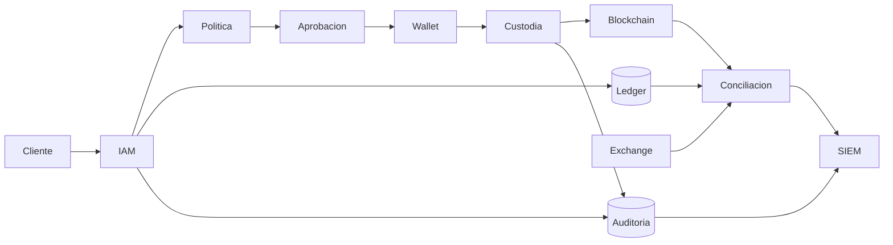
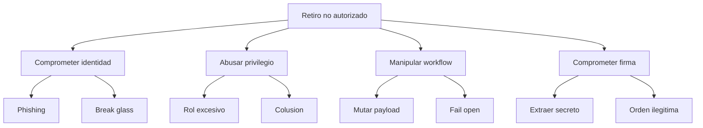

# Threat model — Nebula Custody

## Alcance y objetivos

Se modela desde la creación de un retiro hasta su conciliación. Se protegen claves,
wallets, seeds, API keys, cuentas de exchange, HSM/MPC, nodos, ledger, base de
datos, identidades, permisos, logs e información financiera. Los objetivos son:
ninguna transferencia unilateral, firma sólo después de política/aprobación,
registro completo, conciliación independiente y evidencia preservable.

## Actores y fronteras

Actores internos: tesorería, aprobador de riesgo, operador de wallet, conciliador,
auditor, desarrollador, soporte y administrador cloud/plataforma. Actores externos:
cliente, proveedor de custodia/exchange y atacante. Un insider puede ser malicioso,
negligente, coaccionado o tener su cuenta comprometida; el modelo no infiere cuál.

Las fronteras importantes son usuario→API, aplicación→dominio de claves,
organización→proveedor y productores→cuenta de auditoría. Cruzarlas exige identidad
del workload, autorización contextual, cifrado, integridad, telemetría y manejo de
errores. El auditor no administra productores; el administrador no borra auditoría.

## STRIDE y tratamientos

| ID | Elemento | STRIDE / escenario | Consecuencia | Controles y prueba |
|---|---|---|---|---|
| T1 | sesión privilegiada | Spoofing: token/admin comprometido | acceso a workflow | FIDO2, device posture, JIT; simular token robado desde equipo no conforme |
| T2 | request | Tampering: cambia destino/importe tras aprobar | firma distinta de lo revisado | firma de intención/canonical payload; prueba de mutación debe fallar |
| T3 | approval | Repudiation: no queda quién aprobó | decisión no defendible | evento firmado, reloj, sesión PAM; reconstrucción independiente |
| T4 | logs | Tampering: productor o admin borra rastro | investigación incompleta | reenvío, cuenta separada, WORM, alerta por silencio; prueba de borrado denegada |
| T5 | seed/API key | Information disclosure | toma de control | HSM/MPC, secret manager, no exportable, rotación; escaneo y ceremonia probada |
| T6 | nodo/policy | Denial of service | retiros bloqueados o fail-open | colas, circuit breaker, fail-closed definido, DR; prueba de dependencia caída |
| T7 | rol de servicio | Elevation of privilege | bypass maker-checker | workload identity y deny explícito; test de permiso negativo |
| T8 | conciliación | Tampering/error: omite wallet o fee | falso cierre | inventario firmado, control de completitud, doble revisión y test con anomalía |

## Árbol de ataque: salida no autorizada

El árbol evidencia por qué proteger la clave no basta: el atacante puede lograr que
un firmante sano procese una orden de negocio inválida. Se necesitan barreras
independientes y telemetría en cada rama.

## Insider threat y abuse cases

| Abuse case | Precondición | Señales | Prevención/limitación |
|---|---|---|---|
| admin asume rol de wallet | trust policy demasiado amplia | JIT ausente, equipo nuevo, horario/país atípico | separación de cuentas, JEA, approval y session recording |
| maker se autoaprueba | rol combinado o validación sólo UI | mismo sujeto/cuenta correlacionada | deny en backend, identidades independientes |
| conciliador cierra diferencia | puede editar fuente o excepción | cierre sin evidencia/segunda revisión | independencia, evidencia adjunta, auditoría inmutable |
| operador cambia allowlist | misma sesión puede cambiar y retirar | destino nuevo seguido de retiro | cooling period y aprobación separada |
| colusión | controles dependen sólo de dos humanos | patrones de pares/importes/destinos | límites, rotación, analítica, tercera firma por riesgo |
| negligencia con API key | secretos en código/chat | detección de secreto o uso anómalo | secret manager, credenciales cortas y rotación automática |

## Relación con MITRE ATT&CK

Como vocabulario defensivo, pueden ser pertinentes Valid Accounts (T1078), Account
Discovery (T1087), Impair Defenses (T1562), Modify Cloud Compute Infrastructure
(T1578) y Exfiltration Over Web Service (T1567), según evidencia real. El mapeo
describe comportamientos observables; no convierte un error o abuso de negocio en
una intrusión ni atribuye un actor.

## Riesgo residual y revisión

Multisig/MPC/HSM no eliminan colusión, políticas defectuosas, supply chain, pérdida
de disponibilidad ni recuperación mal probada. El modelo se revisa al cambiar
cadena, proveedor, quórum, límites, API, esquema de eventos o proceso de DR.

[← Laboratorio](README.md)
