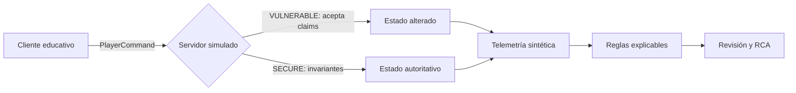

# Game Security Range

Laboratorio local y mínimo para aplicar seguridad de videojuegos sin interactuar con títulos,
procesos ni anti-cheat de terceros. Modela jugador, targets sintéticos, posición, velocidad,
orientación, salud, munición, arma, disparo y puntuación. `GameServer` representa la autoridad y
emite decisiones estructuradas; la matemática cubre FOV, predicción y WORLD→SCREEN; los datasets y
detectores permiten estudiar telemetría y falsos positivos.



El diagrama muestra la comparación causal: el mismo comando cruza una frontera de confianza; el
modo decide si el claim se convierte en estado o en evidencia de rechazo. La detección complementa
la prevención y conserva contexto para investigar, pero no reemplaza la autoridad.

## Preparación y ejecución

Requiere Python 3.12 y no instala dependencias. Desde esta carpeta:

```powershell
python -m unittest discover -s tests -v
```

Para experimentar, importa `game_security` desde una consola Python. No abre puertos. Si una clase
añade transporte, debe enlazar exclusivamente a `127.0.0.1`, documentar el puerto y terminar el
proceso con `Ctrl+C`. El reset consiste en crear una nueva instancia de `GameServer`; no existe
persistencia oculta ni servicio que limpiar.

## Modos, escenarios y evidencia

- `NORMAL`: comportamiento sintético plausible para construir una línea base.
- `VULNERABLE`: acepta claims deliberadamente inseguros de salud/munición.
- `SECURE`: el servidor valida secuencia, velocidad, cadencia y estado.
- `DETECTION`: analiza datasets con alertas que exponen señal, valor, umbral y explicaciones.

El catálogo reproducible está en [SCENARIOS.md](SCENARIOS.md) y los perfiles en
[datasets/README.md](datasets/README.md). Las demostraciones de health/ammo, velocidad, radar/ESP,
snap/smooth aim, tracking, trigger y cadencia se limitan a estas estructuras sintéticas. No hay API
para abrir memoria, inyectar código, capturar input global o descubrir procesos arbitrarios.

## Evidencia y límites éticos

Una ejecución válida conserva: comando, decisión del servidor, señales, configuración, semilla y
versión del esquema. Una alerta es una hipótesis priorizada, no culpabilidad. El alumno debe anotar
posibles explicaciones legítimas y demostrar la causa raíz antes de proponer sanción. Está prohibido
adaptar el rango para evadir, interferir o probar anti-cheat de terceros sin autorización expresa.
