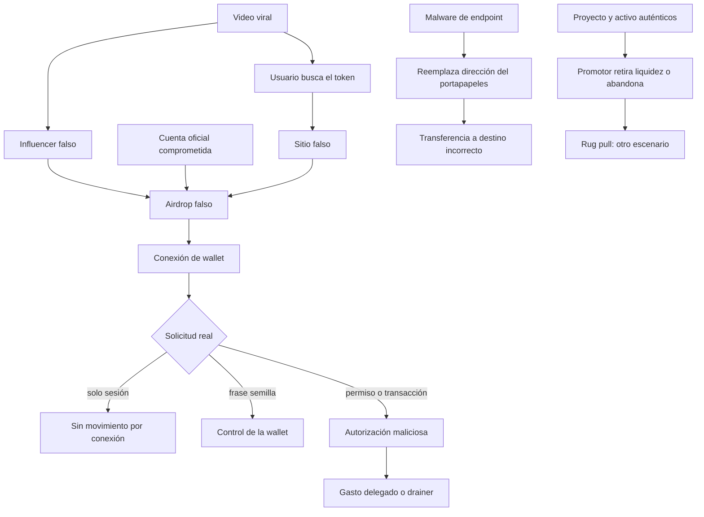

# Laboratorio — del video viral al robo de activos

**Escenario ficticio:** lanzamiento de `OrbitPup (PUP)`

**Modalidad:** análisis offline reproducible de evidencia sintética

**Riesgo:** no usa wallets, frases semilla, fondos, contratos, programas ni redes reales

## Misión

Un video viral afirma que una figura conocida acaba de lanzar un memecoin. La búsqueda del nombre
lleva a resultados patrocinados y cuentas sociales que anuncian un airdrop. Una cuenta imitadora y
la cuenta oficial —comprometida durante parte de la ventana— enlazan la misma landing. La página
imita al proyecto, muestra un contador y solicita conectar una wallet. Después aparece una petición
descrita como `Claim 250 PUP`, pero la acción decodificada concede gasto ilimitado a un tercero; ese
tercero mueve otro activo de la víctima. En el endpoint también se observa reemplazo del
portapapeles. Un segundo expediente independiente presenta retiro abrupto de liquidez.

Tu misión es reconstruir la secuencia, clasificar cada mecanismo sin mezclarlo con los demás y
proponer controles que rompan la cadena antes, durante y después de la firma.

## Resultados verificables

Al terminar podrás:

1. verificar un token por **red + identificador de contrato/mint**, no por símbolo o logo;
2. relacionar dominio, cuenta, publicación y sesión sin tratar ninguna señal aislada como prueba;
3. distinguir conexión de wallet, firma de mensaje, autorización y transferencia;
4. explicar por qué un drainer, el robo de frase semilla y un ataque de portapapeles son rutas distintas;
5. separar un rug pull del activo falso y de la transacción maliciosa;
6. construir una timeline y un plan de contención con hechos, inferencias, hipótesis y límites.

## El caso completo y sus bifurcaciones



El diagrama tiene tres lecturas cruciales. Primero, el engaño puede usar una cuenta falsa o una
cuenta auténtica tomada; por eso el nombre de usuario no basta. Segundo, **conectar una wallet no es
sinónimo de robo**: normalmente crea una sesión y revela una dirección pública, mientras el efecto
económico requiere una operación, permiso o secreto adicional según el protocolo. Tercero, el rug
pull no es el último paso obligatorio del drainer: puede existir con un activo auténtico y compradores
que hicieron exactamente la transacción que pretendían, pero bajo promesas o controles de liquidez
engañosos.

## Qué representa cada término

| Caso | Mecanismo | Evidencia que lo discrimina | Error que evita |
|---|---|---|---|
| Fake token | nombre/símbolo imitado con otro identificador | red e identificador canónico contrastados | asumir que el ticker identifica el activo |
| Fake website | origen web sin relación demostrada con el proyecto | dominio, redirecciones, procedencia y enlaces oficiales | creer que TLS o buen diseño prueban legitimidad |
| Impersonation / fake influencer | identidad aparente usada como autoridad | historia de cuenta, enlaces independientes y origen del medio | validar por avatar, insignia o seguidores |
| Account takeover | publicación real emitida desde sesión comprometida | IdP, dispositivo, MFA, sesión y hora de la publicación | asumir que una cuenta auténtica siempre habla por su dueño |
| Fake airdrop / phishing | premio y urgencia llevan a una acción sensible | texto, landing, formulario y petición de wallet | reducir phishing al correo electrónico |
| Seed phrase theft | entrega del secreto raíz | captura del formulario y evidencia de envío si existe | confundirla con una autorización revocable |
| Malicious contract/program | código o instrucción produce efectos no entendidos | acción decodificada, cuentas, permisos, simulación y estado | confiar en la etiqueta del botón |
| Wallet drainer | permisos/firma/secreto permiten transferencias posteriores | vínculo entre autorización, spender y movimiento | decir que “conectar” drenó la wallet |
| Clipboard attack | malware lee o sustituye un valor copiado | proceso, padre, valor anterior/nuevo y destino | atribuir todo al sitio web |
| Rug pull | promotor retira liquidez, vende o abandona contra lo prometido | control de LP/admin, estado del lock, flujos y comunicaciones | llamar rug pull a cualquier caída de precio |

## Estructura y preparación

| Recurso | Uso |
|---|---|
| `data/caso.json` | evidencia sintética de los casos `LV-001` y `LV-002` |
| `analizar_caso.py` | reglas transparentes que producen hallazgos y límites |
| `tests/` | comprueba cobertura y distinciones conceptuales |
| `RUBRICA.md` | entregables y criterios de dominio |
| `SOLUCION.md` | contraste docente; abrir después de resolver |

Solo necesitas Python 3.10 o posterior. Desde la raíz del repositorio:

```powershell
python labs/lanzamientos-virales/analizar_caso.py
python labs/lanzamientos-virales/analizar_caso.py --json
python -m unittest discover -s labs/lanzamientos-virales/tests -v
```

La primera orden debe terminar con `RESULTADO: 10 hallazgos razonados`; los tests deben aprobar sin
red. El analizador es una ayuda pedagógica, no un detector universal: sus reglas conocen el esquema
del dataset y hacen explícito por qué emiten cada clasificación.

## Laboratorio guiado

### 1. Preservar antes de interpretar

1. Calcula SHA-256 de `data/caso.json` y registra hora, herramienta y zona.
2. Conserva una copia sin modificar. La evidencia ya está normalizada a UTC, pero no asumas que una
   plataforma real exportaría el mismo esquema.
3. Crea una tabla `evento · tiempo · fuente · observación · inferencia · límite`.

### 2. Verificar identidad y procedencia

1. Compara dominio visitado con `official_reference.project_domain`.
2. Compara símbolo y `advertised_asset_id` con la referencia oficial. Explica por qué el símbolo
   coincidente no resuelve la identidad.
3. Analiza por separado `@0rbitpup`, `@orbitpup` y `@LiaNovaLive`. La cuenta oficial tiene una anomalía
   de sesión; la cuenta imitadora tiene otro nombre; la supuesta influencer carece de procedencia.
4. Formula una hipótesis alternativa para cada señal. Una cuenta nueva puede ser legítima; una sesión
   desde otro país puede ser viaje o VPN; su fuerza aparece al correlacionarlas.

### 3. Leer intención y autorización

1. Separa el texto visible `Claim 250 PUP` de `decoded_actions`.
2. Comprueba que `wallet_connection.state_change` es `false`: la conexión no explica el movimiento.
3. Relaciona el `spender` autorizado en `evt-008` con el que aparece en `evt-009`.
4. Explica qué se podría revocar si la autorización se detectara antes del movimiento y por qué una
   frase semilla entregada exigiría migrar activos a una wallet nueva, no solo revocar un permiso.
5. No generalices el JSON a todas las redes: en otras arquitecturas habrá instrucciones, cuentas,
   programas y firmas con semántica propia. El método estable es **decodificar el efecto**.

### 4. Separar rutas que coinciden en el impacto

`evt-010` muestra sustitución de portapapeles. Eso puede cambiar una dirección antes de que el usuario
la confirme, pero no causó el gasto delegado ya correlacionado con `evt-008`–`evt-009`. Conserva ambas
rutas en el alcance: una explicación mejor sustentada no borra la otra infección.

Después analiza `liquidity_case`. Es un expediente distinto: el activo está verificado, no hay drainer
y la evidencia apunta a control de liquidez incompatible con la promesa publicada. Clasificarlo como
rug pull exige esa mecánica o abandono probado; una vela roja o una caída viral no bastan.

### 5. Responder sin destruir evidencia

Construye acciones por condición:

- **antes de firmar:** cerrar la página, verificar por canal independiente y revisar red, activo,
  destino, spender, importe, permisos e instrucciones;
- **approval detectado sin transferencia:** revocar por herramienta oficial/verificada, desconectar la
  sesión cuando corresponda y vigilar movimientos;
- **frase semilla expuesta:** desde un dispositivo limpio crear una wallet nueva y migrar según un
  plan seguro; tratar la anterior como comprometida;
- **endpoint comprometido:** aislar preservando evidencia, adquirir memoria/telemetría y erradicar el
  malware antes de operar con direcciones;
- **activos movidos:** preservar TXID, tiempos, direcciones, capturas y contacto con proveedores por
  canales verificados; no pagar a supuestos recuperadores;
- **cuenta social tomada:** revocar sesiones, recuperar identidad, preservar publicaciones y publicar
  una advertencia por canales independientes.

Las acciones exactas dependen de red, wallet, proveedor, jurisdicción y actividad en curso. No existe
una operación universal que revierta una transferencia confirmada.

## Reto verificable

Entrega una timeline con los diez eventos, una matriz de hipótesis y un playbook de una página. Debe
explicar dónde se rompe la cadena con al menos un control de identidad, uno de interfaz, uno de
autorización, uno de endpoint y uno de respuesta.

**Criterio de aceptación:** ningún hallazgo usa el símbolo como identificador; conexión y firma quedan
separadas; drainer, seed theft, clipboard y rug pull se tratan como mecanismos distintos; cada
conclusión cita `event_id` y declara un límite.

## Errores comunes

| Error | Corrección |
|---|---|
| «Tenía HTTPS, por tanto era oficial» | TLS protege el canal hacia ese dominio; verifica quién controla el origen. |
| «La cuenta era la oficial» | Una cuenta auténtica puede estar tomada; correlaciona sesión y publicación. |
| «Conectó la wallet y perdió todo» | Busca la firma, permiso, transacción o exposición de secreto que produjo capacidad. |
| «La simulación dijo OK, entonces era seguro» | Simulación y decodificación reducen incertidumbre; no prueban identidad ni ausencia de rutas futuras. |
| «Toda caída es rug pull» | Exige control, retiro/venta/abandono y contradicción con lo prometido; modela también mercado y liquidez. |
| «La blockchain prueba quién lo hizo» | Prueba efectos del protocolo; identidad e intención requieren evidencia adicional. |

## Fuentes y alcance

- SEC, [alerta sobre estafas con criptoactivos](https://www.investor.gov/introduction-investing/general-resources/news-alerts/alerts-bulletins/investor-alerts/crypto-scams): respalda uso de redes sociales, suplantación, cuentas comprometidas, memecoins y FOMO; no convierte toda promoción en fraude.
- MetaMask, [qué es una aprobación de token](https://support.metamask.io/stay-safe/safety-in-web3/what-is-a-token-approval/): respalda el riesgo de permisos excesivos y su revocación en ese ecosistema; no describe todas las redes.
- MetaMask, [canales oficiales de soporte](https://support.metamask.io/stay-safe/safety-in-web3/what-are-metamasks-official-support-channels/): respalda que soporte no solicita la frase de recuperación.
- Ethereum Foundation, [Trillion Dollar Security Project](https://ethereum.org/reports/trillion-dollar-security/): respalda riesgos de firma ciega, approvals y frontends comprometidos.
- Solana, [conceptos fundamentales](https://solana.com/docs/core): respalda la relación entre transacciones, instrucciones, programas y cuentas en Solana; se usa para mostrar que la semántica varía por red.
- MITRE ATT&CK, [T1115 Clipboard Data](https://attack.mitre.org/techniques/T1115/): respalda acceso y sustitución del portapapeles como comportamiento de endpoint.
- SEC, [litigio sobre un rug pull y control de LP tokens](https://www.sec.gov/enforcement-litigation/litigation-releases/lr-26223): respalda la mecánica alegada de retiro de liquidez; una demanda no equivale a sentencia sobre otros proyectos.

## Navegación

- [Rúbrica](RUBRICA.md)
- [Solución docente](SOLUCION.md)
- [Diagnóstico de integración curricular](../../docs/caso-lanzamientos-virales.md)
- [Índice de laboratorios](../README.md)
