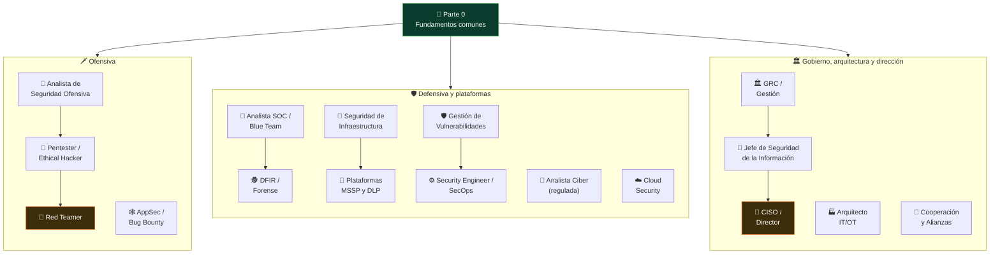

# 🧭 Rutas guiadas por rol

<!-- cabecera-rutas:inicio -->

[⬅️ Volver al programa](../README.md) ·
[📚 Índice de clases](../classes/README.md) ·
[🧪 Laboratorios](../labs/README.md) ·
[🎓 Certificaciones](../certificaciones/README.md)

<!-- cabecera-rutas:fin -->

El programa tiene 340 clases; **no todas son para todos a la vez**. Estas rutas ordenan el
recorrido según el rol al que apuntas: qué partes hacer, en qué orden, con qué laboratorios
practicar y a qué certificación apuntar. Todas asumen que **empiezas por la Parte 0**
(fundamentos): es el cimiento común.

> Leyenda: 📚 partes/clases · 🧪 laboratorio · 🚩 reto CTF · 🎓 certificación sugerida.

<!-- mapa-roles:inicio -->

Las flechas dentro de cada familia marcan la **progresión natural** entre roles; todos
parten de la Parte 0. Los nodos naranjas son los techos de carrera de su familia.

<!-- mapa-roles:fin -->

<!-- tabla-roles:inicio -->

| | Rol | Nivel de entrada | Foco | Partes | Certificación faro |
|:---:|---|---|---|---|---|
| 🎯 | **[Pentester / Ethical Hacker](pentester.md)** | intermedio (requiere base sólida de redes y sistemas) | ofensiva generalista | `0 · 1 · 2 · 3 · 4 · 5 · 12` | OSCP |
| 🔴 | **[Red Teamer](red-team.md)** | avanzado; parte de la ruta de Pentester | emulación de amenazas, C2, OPSEC y ataque a Active Directory | `5 · 6 · 7` | CRTO / OSEP |
| 🔵 | **[Analista SOC / Blue Team](soc-blue-team.md)** | accesible; una de las mejores puertas de entrada | telemetría, SIEM, detección, threat hunting y respuesta | `0 · 1 · 6 · 8 · 9` | BTL1 |
| 🛡️ | **[Analista de Gestión de Vulnerabilidades](gestion-vulnerabilidades.md)** | junior/intermedio (base de sistemas y redes) | vulnerability management y security operations | `0 · 1 · 3 · 8 · 9 · 11 · 17` | CySA+ |
| 🕵️ | **[DFIR / Analista forense](dfir.md)** | intermedio; con base de blue team o sysadmin | adquisición forense, memoria, timelines y respuesta | `0 · 1 · 6 · 8 · 9` | GCFA (SANS) |
| 🕸️ | **[AppSec / Bug Bounty](appsec.md)** | intermedio (requiere web, HTTP y algo de programación) | seguridad de aplicaciones web | `0 · 2 · 4 · 11 · 15` | BSCP / eWPTX |
| ☁️ | **[Cloud Security Engineer](cloud-security.md)** | intermedio; se llega desde dev, sysadmin o SOC | responsabilidad compartida, IAM, CSPM y contenedores | `0 · 2 · 4 · 10 · 11` | AWS Security Specialty / CKS (Kubernetes Security) |
| 🏛️ | **[GRC / Gestión de seguridad](grc.md)** | medio; alcanzable desde auditoría o TI | marcos, políticas, gestión de riesgo y auditoría | `0 · 8 · 9 · 11 · 14` | CISSP |
| 🎩 | **[CISO / Director de Seguridad de la Información](ciso.md)** | dirección; se llega con 8–15 años de carrera | mandato, estrategia, riesgo empresarial y presupuesto | `0 · 8 · 9 · 14 · 17` | CISSP + CISM (y CRISC / ISO 27001 LI) |
| 🏦 | **[Analista de Ciberseguridad (institución regulada)](analista-ciberseguridad.md)** | intermedio; suele pedir ~2 años de experiencia y titulación | SIEM, eventos, vulnerabilidades e incidentes NIST/ISO | `0 · 8 · 9 · 14` | CompTIA CySA+ / BTL1 |
| 🧱 | **[Analista de Seguridad de Infraestructura (plataformas, SIEM y cumplimiento)](seguridad-infraestructura.md)** | junior/semi-senior; ~1 año administrando servidores | plataformas, fuentes del SIEM y cumplimiento | `0 · 1 · 2 · 8 · 10` | CompTIA Security+ → CySA+ (+ SC-200 del lado Microsoft) |
| 🧩 | **[Ingeniero de Operación de Plataformas de Seguridad (MSSP y DLP)](operacion-plataformas-dlp.md)** | junior; ~1 año operando herramientas de seguridad | operación de plataformas, DLP y ciclo del dato | `0 · 8 · 9 · 10 · 14 · 17` | Security+ (+ cert del fabricante que operes) |
| 👔 | **[Jefe de Seguridad de la Información](ciso-jefe-seguridad.md)** | senior; ~3 años liderando proyectos | estrategia, riesgo, cumplimiento y equipo a cargo | `0 · 8 · 9 · 14 · 17` | CISSP (+ ISO 27001 Lead Implementer / CISM) |
| 🧰 | **[Analista de Seguridad Ofensiva (consultoría)](analista-seguridad-ofensiva.md)** | junior / semi-senior; 1–2 años de experiencia y titulación | pentest de apps, APIs y redes, y evidencia técnica | `0 · 1 · 3 · 4 · 7 · 17` | eJPT o CompTIA PenTest+ (no OSCP todavía) |
| ⚙️ | **[Security Engineer / SecOps (endpoint y automatización)](secops-engineer.md)** | intermedio; perfil híbrido seguridad + desarrollo | EDR/XDR, automatización, APIs y endpoint | `0 · 4 · 8 · 9 · 11 · 17` | CompTIA CySA+ (+ BTL1 en la parte operativa) |
| 🏭 | **[Arquitecto de Ciberseguridad IT/OT (industria e infraestructura crítica)](arquitecto-it-ot.md)** | senior; 4–5 años con exposición a entornos OT | arquitectura IT/OT, modelo Purdue e IEC 62443 | `1 · 10 · 13 · 14 · 17` | IEC 62443 Cybersecurity Specialist + GICSP |
| 🤝 | **[Analista de Cooperación y Alianzas Técnicas](cooperacion-alianzas.md)** | junior-intermedio; híbrido técnico + gestión | cooperación técnica, intel sharing y alianzas | `0 · 1 · 8 · 14` | CISSP / ISO 27001 |

Cada rol tiene una **guía de carrera completa**: qué es, un día en el puesto, qué necesitas saber, tu ruta en el programa con su diagrama, certificaciones, salario orientativo y progresión.

<!-- tabla-roles:fin -->
---

## 🎯 Pentester / Ethical Hacker

Ofensiva generalista: reconocimiento, explotación, web, post-explotación y reporte.

1. 📚 **Parte 0** — Fundamentos (001–025)
2. 📚 **Parte 1** — Redes (026–045)
3. 📚 **Parte 2** — Criptografía (046–065) · foco en hashing, TLS, contraseñas
4. 📚 **Parte 3** — Pentesting: metodología (066–085)
5. 📚 **Parte 4** — Seguridad web (086–115)
6. 📚 **Parte 5** — Explotación de binarios (116–140) · al menos 116–125
7. 📚 **Parte 12** — OSINT e ingeniería social (249–260)

- 🧪 [`appsec-web`](../labs/appsec-web/README.md) · [`red-team-ad`](../labs/red-team-ad/README.md)
- 🚩 [CTF web / pwn / redes](../ctf/README.md)
- 🎓 **OSCP** (PEN-200) · CompTIA PenTest+
- 📖 **[Guía de carrera completa →](pentester.md)** — qué es, día a día, skills, certis, salario y progresión.

## 🔴 Red Teamer

Emulación de adversarios, evasión y dominio de Active Directory.

1. Ruta de Pentester (arriba) como base
2. 📚 **Parte 7** — Red Team y operaciones ofensivas (161–180)
3. 📚 **Parte 6** — Análisis de malware (141–160) · para entender payloads y evasión
4. 📚 **Parte 5** — Explotación (116–140) · desarrollo de exploits y evasión

- 🧪 [`red-team-ad`](../labs/red-team-ad/README.md) (+ GOAD)
- 🎓 **CRTO** · OSEP (PEN-300)
- 📖 **[Guía de carrera completa →](red-team.md)** — qué es, día a día, skills, certis, salario y progresión.

## 🔵 Analista SOC / Blue Team

Detección, monitoreo, threat hunting y respuesta temprana.

1. 📚 **Parte 0** — Fundamentos (001–025)
2. 📚 **Parte 1** — Redes y NSM (026–045)
3. 📚 **Parte 6** — Análisis de malware (141–160) · triaje y comportamiento
4. 📚 **Parte 8** — Blue Team, detección y SOC (181–200)
5. 📚 **Parte 9** — DFIR (201–220) · al menos respuesta a incidentes

- 🧪 [`blue-team-soc`](../labs/blue-team-soc/README.md)
- 🚩 [CTF forense / redes](../ctf/README.md)
- 🎓 **BTL1** (Blue Team Level 1) · CompTIA CySA+
- 📖 **[Guía de carrera completa →](soc-blue-team.md)** — qué es, día a día, skills, certis, salario y progresión.

## 🛡️ Analista de Gestión de Vulnerabilidades

Ciclo de vulnerabilidades, hardening/parchado, controles (AV/EDR) y reporte — el rol de *vulnerability management / security operations*.

1. 📚 **Parte 0** — Fundamentos (001–025) · Windows, Linux y redes
2. 📚 **Parte 1** — Redes y escaneo (026–045) · Nmap y enumeración
3. 📚 **Parte 3** — Análisis de vulnerabilidades (**071**, Nessus/OpenVAS) y reporte (**085**)
4. 📚 **Parte 17** — **318** Gestión del programa de vulnerabilidades · **322** Threat Intelligence · **324** Hardening y gestión de configuración · **321** Comunicación y reporte
5. 📚 **Parte 8** — **189** EDR · 188 Threat hunting · 195 Threat Intelligence · 197 Métricas del SOC
6. 📚 **Parte 11** — 240 SCA/dependencias · **245** Gestión de vulnerabilidades a escala
7. 📚 **Parte 9** — **219** Ejercicios de mesa (simulacros) · + Partes 3–7 para las pruebas de penetración de validación

- 🧪 [`appsec-code`](../labs/appsec-code/README.md) (SAST/vulns en código) · [`devsecops-pipeline`](../labs/devsecops-pipeline/README.md) (**priorización KEV/EPSS/CVSS e informe**) · [`appsec-web`](../labs/appsec-web/README.md) · [`rootcause-windows`](../labs/rootcause-windows/README.md) (controles/EDR en Windows)
- 🎓 **CompTIA CySA+** · Security+ · (certs de producto: Tenable/Qualys/Rapid7)
- 📖 **[Guía de carrera completa →](gestion-vulnerabilidades.md)** — qué es, día a día, skills, certis, salario y progresión.

## 🕵️ DFIR / Analista forense

Adquisición, memoria, timelines y respuesta a incidentes.

1. 📚 **Parte 0** — Fundamentos (001–025)
2. 📚 **Parte 1** — Redes (026–045)
3. 📚 **Parte 6** — Análisis de malware (141–160)
4. 📚 **Parte 9** — Forense digital y respuesta a incidentes (201–220)
5. 📚 **Parte 8** — Detección (181–200) · para cerrar el ciclo detección→respuesta

- 🧪 [`blue-team-soc`](../labs/blue-team-soc/README.md) · [`dfir-memoria`](../labs/dfir-memoria/README.md) · 🚩 [CTF forense](../ctf/README.md)
- 🎓 **GCFA / GCFE** (SANS) · CHFI
- 📖 **[Guía de carrera completa →](dfir.md)** — qué es, día a día, skills, certis, salario y progresión.

## 🕸️ AppSec / Bug Bounty

Seguridad de aplicaciones y caza de vulnerabilidades web.

1. 📚 **Parte 0** — Fundamentos (001–025)
2. 📚 **Parte 2** — Criptografía (046–065)
3. 📚 **Parte 4** — Seguridad web (086–115) · núcleo
4. 📚 **Parte 11** — DevSecOps y SDLC (236–248) · para el lado defensivo
5. 📚 **Parte 15** — Seguridad de IA/LLM (291–300) · superficie moderna

- 🧪 [`appsec-web`](../labs/appsec-web/README.md) · [`appsec-code`](../labs/appsec-code/README.md) · [`devsecops-pipeline`](../labs/devsecops-pipeline/README.md) (el SDLC completo en 8 capas) · 🚩 [CTF web](../ctf/README.md)
- 🎓 **eWPTX** · Burp Suite Certified Practitioner
- 📖 **[Guía de carrera completa →](appsec.md)** — qué es, día a día, skills, certis, salario y progresión.

## ☁️ Cloud Security Engineer

Seguridad de nube, contenedores y pipelines.

1. 📚 **Parte 0** — Fundamentos (001–025)
2. 📚 **Parte 2** — Criptografía (046–065) · claves, KMS, TLS
3. 📚 **Parte 4** — Seguridad web (086–115) · APIs
4. 📚 **Parte 10** — Nube y contenedores (221–235)
5. 📚 **Parte 11** — DevSecOps (236–248)

- 🧪 [`cloud-security`](../labs/cloud-security/README.md) (auditoría CSPM) · [`devsecops-pipeline`](../labs/devsecops-pipeline/README.md) (lo que ocurre **antes** de llegar a la nube: imagen, dependencias y CI/CD)
- 🎓 AWS Security Specialty · **CKS** (Kubernetes Security)
- 📖 **[Guía de carrera completa →](cloud-security.md)** — qué es, día a día, skills, certis, salario y progresión.

## 🏛️ GRC / Gestión de seguridad

Gobernanza, riesgo, cumplimiento y auditoría.

1. 📚 **Parte 0** — Fundamentos (001–025) · contexto técnico mínimo
2. 📚 **Parte 14** — GRC, riesgo y cumplimiento (276–290) · núcleo
3. 📚 **Parte 8** — SOC (181–200) y **Parte 9** — DFIR (201–220) · para dialogar con lo técnico
4. 📚 **Parte 11** — DevSecOps (236–248) · gestión de riesgo en el SDLC

- 🎓 **CISSP** · ISO 27001 Lead Implementer/Auditor · CISM
- 📖 **[Guía de carrera completa →](grc.md)** — qué es, día a día, skills, certis, salario y progresión.

## 🎩 CISO / Director de Seguridad de la Información

El **máximo responsable** de la seguridad de la información y la ciberseguridad de la organización. No es "evitar hackers": es proteger los **datos**, los **sistemas**, los **servicios digitales** y la **continuidad operacional del negocio**, con mandato del directorio, presupuesto propio y responsabilidad formal ante el regulador. Cargo de dirección: no se entra desde cero, se llega.

1. 📚 **Parte 0** — Fundamentos · **002** panorama de amenazas · **003** frameworks NIST/ISO/MITRE · **025** ética y legalidad
2. 📚 **Parte 14** — GRC, riesgo y cumplimiento (276–290) · **el núcleo del cargo, entera y sin recortes**
3. 📚 **Parte 17** — **320** gobierno y regulación · **328** riesgo cuantitativo · **329** arquitectura empresarial · **316** modelos de seguridad · **311**/**312** datos y DLP · **313**/**315** identidad y PAM · **318** vulnerabilidades · **321** reporte
4. 📚 **Parte 8** — **181** SOC · **183** SIEM · **195** threat intelligence · **197** métricas y madurez: supervisar la operación sin operarla
5. 📚 **Parte 9** — **202** ciclo de respuesta · **215** playbooks · **219** ejercicios de mesa: la crisis que vas a dirigir
6. 📚 **Partes 10, 11 y 15** — **221**/**234** nube · **236**/**245**/**248** DevSecOps · **300** gobernanza de la IA: donde viven hoy tus servicios digitales

- 🎲 **[219 · Tabletop](../classes/parte-9-forense-digital-y-respuesta-a-incidentes/219-ejercicios-de-mesa-tabletop/README.md)** es la práctica principal · 📋 construye los **diez entregables del cargo** (política, plan director, registro de riesgos, SoA, BIA/BCP, plan de respuesta, programa de vulnerabilidades, marco de terceros, concienciación e informe ejecutivo) · 🧪 [`blue-team-soc`](../labs/blue-team-soc/README.md) y [`cloud-security`](../labs/cloud-security/README.md) para no perder el contacto técnico
- 🎓 **CISSP** · (fuera del programa: **CISM**, **CRISC**, **ISO 27001 Lead Implementer**, CCISO)
- 💡 El programa te da **el cuerpo de conocimiento** del cargo. Lo que aportas tú: los años de trayectoria, defender un presupuesto ante un directorio, el trato con reguladores y aseguradoras, el inglés de negocio y haber gestionado una crisis real.
- 📖 **[Guía de carrera completa →](ciso.md)** — mandato y línea de reporte, el año del CISO, entregables, primeros 90 días, cómo se te mide, certis, salario y progresión.

---

## 🏦 Analista de Ciberseguridad (institución regulada)

Perfil defensivo generalista en un entorno regulado (banca, fondos, seguros): monitoreo con SIEM, gestión de eventos/logs/alertas, vulnerabilidades e incidentes, todo bajo marcos NIST e ISO. Un híbrido entre Blue Team, DFIR y GRC en una sola persona.

1. 📚 **Parte 0** — Fundamentos (001–025) · sistemas y **frameworks NIST/ISO (003)**
2. 📚 **Parte 8** — Blue Team, detección y SOC (181–200) · **el SIEM y el análisis de eventos**
3. 📚 **Parte 9** — DFIR (201–220) · el ciclo de incidentes (**ISO 27035**)
4. 📚 **Parte 14** — GRC, riesgo y cumplimiento (276–290) · ISO 27001, NIST CSF y continuidad (**ISO 22301**, clase 283)
5. 📚 **Partes 3 y 17** — gestión de vulnerabilidades y reporte (071, 318, 321)

- 🧪 [`blue-team-soc`](../labs/blue-team-soc/README.md) · [`rootcause-windows`](../labs/rootcause-windows/README.md) · 🚩 [CTF forense / redes](../ctf/README.md)
- 🎓 **CompTIA CySA+** · BTL1 · Security+ · (a medio plazo CISSP / ISO 27001)
- 💡 El programa te da la **base técnica y normativa** que pide la oferta (SIEM, eventos, vulnerabilidades, incidentes, NIST/ISO). La **titulación, la colegiatura y el contexto de negocio** (fondos, agilismo, design thinking) los aportas tú.
- 📖 **[Guía de carrera completa →](analista-ciberseguridad.md)** — qué es, día a día, skills, certis, salario y progresión.

## 🧱 Analista de Seguridad de Infraestructura (plataformas, SIEM y cumplimiento)

El puesto **bisagra** entre administración de sistemas y seguridad: administras los controles (firewalls, IPS, NAC, EDR, antivirus), **conectas y mantienes las fuentes de log del SIEM**, investigas desviaciones de configuración y ejecutas los controles de cumplimiento (SOX/PCI). Donde el SOC *consume* el SIEM, tú **lo alimentas**.

1. 📚 **Parte 0** — Fundamentos (001–025) · la base literal: Linux (005–006), Windows (008), **PowerShell (009)**, **TCP/IP, DNS y HTTPS (010–013)**, Python (015), regex (019)
2. 📚 **Parte 1** — Redes (026–045) · **034 firewalls** · **035 IDS/IPS** · 041 DNS · **042 segmentación y zero trust** (el marco del NAC) · 043 NSM · 045 NetFlow
3. 📚 **Parte 8** — Blue Team y SOC · **182 logging y fuentes de telemetría** (la clase central) · **183 SIEM** · 184 Splunk · 185 Elastic/Wazuh · 189 EDR · 190–191 logs
4. 📚 **Parte 2** — **055 PKI** y **056 TLS**: lo que hay detrás de HTTPS y **LDAPS**
5. 📚 **Parte 10** — **223 AWS** · **224 Azure** · **234 logging y detección en la nube**
6. 📚 **Partes 14 y 17** — **281 PCI DSS** · **285 auditoría** · 282 procedimientos (runbooks) · **324 hardening** · 313 IAM · 321 reporte

- 🧪 [`blue-team-soc`](../labs/blue-team-soc/README.md) **conectando las fuentes tú** · [`redes-nmap`](../labs/redes-nmap/README.md) · [`rootcause-windows`](../labs/rootcause-windows/README.md) · [`cloud-security`](../labs/cloud-security/README.md)
- 🎓 **CompTIA Security+** → **CySA+** · (fuera del programa: Network+, **SC-200**, AWS CloudOps)
- 💡 El programa cubre casi todo el stack. Lo que **no** cubre y la oferta pide: **AS/400**, **SOX** como normativa concreta, el **NAC como producto** y la consola comercial de SIEM (Sentinel/QRadar/XSIAM) más allá de Splunk, Elastic y Wazuh.
- 📖 **[Guía de carrera completa →](seguridad-infraestructura.md)** — qué es, día a día, skills, certis, salario y progresión.

## 🧩 Ingeniero de Operación de Plataformas de Seguridad (MSSP y DLP)

Operas las plataformas de seguridad **de otras empresas**, desde un proveedor de servicios gestionados, con especialidad en **protección del dato**: clasificación, descubrimiento y DLP. La ruta más orientada al dato del curso, y una vía de entrada real al sector.

1. 📚 **Parte 0** — Fundamentos (001–025) · Linux (005), Windows (008), HTTP/HTTPS (013) y **003 frameworks**
2. 📚 **Parte 17** — **311 clasificación y ciclo de vida de los datos** y **312 retención, destrucción segura y DLP** · **el núcleo especializado**
3. 📚 **Parte 14** — **280 controles CIS** · **279 NIST CSF** · **281 PCI DSS** · **289 privacidad** · 282 procedimientos · 287 métricas
4. 📚 **Parte 8** — 182 telemetría · 183 SIEM · 189 EDR · 197 métricas y madurez (el MSOC con el que te coordinas)
5. 📚 **Parte 9** — 202 ciclo de incidentes y **215 playbooks** (el entregable que pide la oferta)
6. 📚 **Parte 17** — **324 hardening** (planes de mejora) · 313/315 identidades · 321 comunicación · 📚 **Parte 10** — 233–234 nube

- 🧪 [`blue-team-soc`](../labs/blue-team-soc/README.md) · [`rootcause-windows`](../labs/rootcause-windows/README.md) · [`cloud-security`](../labs/cloud-security/README.md) · 📋 escribe un **playbook de fuga de datos** y un **informe mensual de servicio**
- 🎓 **CompTIA Security+** → CySA+ · (fuera del programa: **SC-401** para Purview/DLP y la cert del fabricante que operes)
- 💡 El programa te da el **qué y el porqué** (ciclo del dato, DLP, privacidad, PCI, CIS/NIST, playbooks). Lo que aportas tú: la **plataforma comercial concreta**, el **inglés técnico avanzado** (aquí es requisito obligatorio) y el oficio de servicio (SLA, cliente, preventa).
- 📖 **[Guía de carrera completa →](operacion-plataformas-dlp.md)** — qué es, día a día, skills, certis, salario y progresión.

## 👔 Jefe de Seguridad de la Información

El primer rol del curso con **equipo a cargo**: defines la estrategia, gestionas el riesgo, supervisas la operación (vulnerabilidades, hardening, SIEM, firewall, WAF), garantizas el cumplimiento y reportas a la alta dirección y al regulador. No es una ruta de entrada: llega desde una base técnica previa. Es el **mando medio** que en una organización grande reporta al [CISO](ciso.md).

1. 📚 **Parte 0** — Fundamentos (001–025) · el vocabulario común y **003 (frameworks NIST/ISO/MITRE)**
2. 📚 **Parte 14** — GRC, riesgo y cumplimiento (276–290) · **el núcleo, entera**: gobernanza (276), riesgo (277), **ISO 27001 (278)**, **NIST CSF (279)**, CIS (280), políticas (282), continuidad (283), terceros (284), auditoría (285) y **métricas KPI/KRI (287)**
3. 📚 **Parte 17** — **320** gobierno y regulación · **328** riesgo cuantitativo · **329** arquitectura empresarial · **318** programa de vulnerabilidades · **324** hardening · **321** reporte
4. 📚 **Parte 8** — **181** cómo se organiza un SOC · **183** qué es (y qué no) un SIEM · **197** métricas y madurez
5. 📚 **Parte 9** — **202** ciclo de respuesta y **219** ejercicios de mesa: el simulacro que dirigirás
6. 📚 **Partes 1, 3 y 4** — lo que supervisas: **034** firewalls · **042** segmentación y zero trust · **071** Nessus · **087** OWASP Top 10 (el porqué del WAF)

- 🎲 **[219 · Tabletop](../classes/parte-9-forense-digital-y-respuesta-a-incidentes/219-ejercicios-de-mesa-tabletop/README.md)** es la práctica principal · 📋 construye los entregables del cargo (registro de riesgos, SoA, política, informe ejecutivo) · 🧪 [`blue-team-soc`](../labs/blue-team-soc/README.md) para no perder el contacto técnico
- 🎓 **CISSP** · CySA+ (si te falta músculo técnico) · (fuera del programa: **CISM**, **ISO 27001 Lead Implementer**, CRISC)
- 💡 El programa te da la **base normativa y técnica** del cargo. Lo que aportas tú es lo que más pesa en la selección: los **3 años liderando proyectos** y el **año liderando equipo**, la titulación, el trato con **reguladores y auditoría externa**, el inglés y —literal en la oferta— **Excel**.
- 📖 **[Guía de carrera completa →](ciso-jefe-seguridad.md)** — qué es, día a día, skills, certis, salario y progresión.

## 🧰 Analista de Seguridad Ofensiva (consultoría)

El **primer escalón** del oficio ofensivo, el que sí contrata sin trayectoria previa: pentest de nivel básico a intermedio sobre aplicaciones, APIs, redes e infraestructura, validación de hallazgos de escáner y elaboración de evidencia técnica. Versión acotada de la ruta de Pentester, alineada a lo que pide una consultora.

1. 📚 **Parte 0** — Fundamentos (001–025) · Kali (004), Linux, **Bash (007)**, TCP/IP y HTTP (010–013), **Python (015)** y **ética y alcance (025)**
2. 📚 **Parte 1** — Redes (026–045) · **Wireshark (026)** y **Nmap (029–032)** + enumeración de servicios (033)
3. 📚 **Parte 3** — Pentesting (066–085) · **el núcleo**: metodología (066), **alcance y reglas de engagement (067)**, **Nessus/OpenVAS (071)**, Metasploit (072–074) y **reporte (085)**
4. 📚 **Parte 4** — Seguridad web (086–115) · **OWASP Top 10 (087)**, **Burp (088)**, **ZAP (089)** y **APIs: 110 (REST) y 111 (GraphQL)**
5. 📚 **Parte 7** — **solo 170** (enumeración de Active Directory): los "fundamentos de AD" que se piden
6. 📚 **Parte 17** — **323** pruebas de seguridad · **321** comunicación y reporte · **318** gestión de vulnerabilidades · (📚 **273** ICS/SCADA si toca seguridad industrial)

- 🧪 [`appsec-web`](../labs/appsec-web/README.md) · [`redes-nmap`](../labs/redes-nmap/README.md) · [`red-team-ad`](../labs/red-team-ad/README.md) · 🚩 [CTF web / redes](../ctf/README.md) — con writeup, que es el ensayo de la evidencia
- 🎓 **eJPT** o **CompTIA PenTest+** · Security+ · (CEH como filtro de RR. HH.) · **OSCP a 2–3 años**, no para entrar
- 💡 Es la ruta que **más literalmente** cubre un anuncio de empleo de este curso: el stack técnico completo (Nmap, Burp, ZAP, Nessus, Metasploit, Wireshark, Kali, Bash/Python, OWASP, APIs, AD, reporte). Lo que aportas tú: la **titulación** y el **oficio de consultoría** (horas facturables, cliente, defender un hallazgo).
- 📖 **[Guía de carrera completa →](analista-seguridad-ofensiva.md)** — qué es, día a día, skills, certis, salario y progresión.

## ⚙️ Security Engineer / SecOps (endpoint y automatización)

Seguridad operativa desde el lado de la ingeniería: administras el EDR/XDR de toda la flota (Windows, macOS, Linux), respondes incidentes de endpoint y **automatizas** con Python/Bash y APIs REST internas. Perfil híbrido seguridad + desarrollo.

1. 📚 **Parte 0** — Fundamentos (001–025) · la base doble: sistemas (005, 008) y **programación**: **Bash (007)**, PowerShell (009), **Python (015–017)**, Git (018) y regex para logs (019)
2. 📚 **Parte 8** — Blue Team, detección y SOC (181–200) · **el núcleo**: telemetría (182), SIEM (183), **EDR (189)** y **automatización con SOAR (196)**
3. 📚 **Parte 9** — DFIR (201–220) · respuesta a incidentes (202), contención (216) y artefactos de Windows/Linux (205–206)
4. 📚 **Parte 11** — DevSecOps (236–248) · la mitad de ingeniería: secretos en el código (241) y **seguridad de APIs (247)**
5. 📚 **Parte 4** — **110** Seguridad de APIs REST · para construir las APIs internas sin abrir un agujero
6. 📚 **Parte 17** — **324** hardening y configuración · **313**/**315** identidades y PAM · **330** automatización de seguridad

- 🧪 [`blue-team-soc`](../labs/blue-team-soc/README.md) · [`rootcause-windows`](../labs/rootcause-windows/README.md) · [`appsec-code`](../labs/appsec-code/README.md) · [`devsecops-pipeline`](../labs/devsecops-pipeline/README.md) · 🚩 [CTF forense / redes](../ctf/README.md)
- 🎓 **CompTIA CySA+** · BTL1 · Security+ · (certs de producto del EDR: CrowdStrike, SentinelOne, SC-200)
- 💡 El programa te da la **base técnica** que pide la oferta (EDR, SIEM, incidentes, Python/Bash, APIs, identidades, hardening). La **experiencia con un producto comercial concreto sobre una flota real** y el **contexto de negocio** (fintech, regulación, escala) los aportas tú.
- 📖 **[Guía de carrera completa →](secops-engineer.md)** — qué es, día a día, skills, certis, salario y progresión.

## 🏭 Arquitecto de Ciberseguridad IT/OT (industria e infraestructura crítica)

**Diseña**, no opera: dónde va cada zona, qué atraviesa cada conducto y cómo se conectan la red corporativa (IT), la red de proceso (OT), la nube y el SOC sin abrir un camino desde internet hasta un PLC. Entornos donde un fallo no tumba un servicio: **para una planta**. Rol senior (4–5 años), muy demandado en minería, energía, agua y portuario.

1. 📚 **Parte 1** — Redes (026–045) · **el cimiento**: **042 segmentación y zero trust** · **034 firewalls** · **035 IDS/IPS** · **039 capa 2 y VLAN hopping** (por qué una VLAN no basta) · **044 Zeek** (monitorización pasiva) · 043 NSM
2. 📚 **Parte 13** — **273 ICS/SCADA**: **la clase central** — modelo Purdue, Modbus/DNP3/S7, iDMZ, IEC 62443 y NIST SP 800-82, con laboratorio sobre simulador · + 266 IoT · 274 bus CAN
3. 📚 **Parte 17** — **316 modelos de seguridad y arquitectura** · **329 arquitectura empresarial y zero trust** · **315 MFA y PAM** (acceso remoto de proveedores) · 324 hardening · 317 seguridad física
4. 📚 **Parte 14** — **279 NIST CSF** · **278 ISO 27001** · **283 continuidad** (la parte "resiliente") · **284 riesgo de terceros** (integradores y fabricantes) · 285 auditoría
5. 📚 **Parte 10** — 221 responsabilidad compartida · 222 IAM · 231 CSPM · 234 logging: el extremo de arriba de tu arquitectura
6. 📚 **Partes 8, 9 y 3** — 182/183/187 la integración con el SOC · 202/215/**219 tabletop** · **067 reglas de engagement** y 085 reporte, para el OT/ICS pentesting con criterio

- 🧪 [`redes-nmap`](../labs/redes-nmap/README.md) · [`blue-team-soc`](../labs/blue-team-soc/README.md) · [`cloud-security`](../labs/cloud-security/README.md) · 🏭 **laboratorio ICS propio** (OpenPLC/GRFICS/Conpot, montable con la clase 273) · 📐 dibuja un **Purdue completo con la política de cada conducto**: es el entregable del puesto
- 🎓 **CISSP** (dominio de arquitectura) · Security+ · (fuera del programa: **ISA/IEC 62443 Cybersecurity Specialist**, **GICSP**, Fortinet NSE/FCSS, Palo Alto PCNSE)
- 💡 El programa te da el **cuerpo conceptual** (segmentación, Purdue, protocolos industriales, IEC 62443 y SP 800-82 en la clase 273, arquitectura, PAM, nube, SOC, continuidad y auditoría). Lo que **no**: **IEC 62443 parte por parte**, **Fortinet y Palo Alto como producto**, pentesting ICS avanzado, la regulación local de infraestructura crítica y los **4–5 años en planta**.
- 📖 **[Guía de carrera completa →](arquitecto-it-ot.md)** — qué es, día a día, skills, certis, salario y progresión.

## 🤝 Analista de Cooperación y Alianzas Técnicas

Cooperación institucional, alianzas estratégicas e intercambio de información en ciberseguridad. Un puente entre lo técnico y lo estratégico: no auditas sistemas, articulas actores.

1. 📚 **Parte 0** — Fundamentos (001–025) · el lenguaje común: tríada CIA, panorama de amenazas (002), **frameworks NIST/ISO/MITRE (003)** y ética, legalidad y divulgación responsable (025)
2. 📚 **Parte 14** — GRC, riesgo y cumplimiento (276–290) · **núcleo**: gobernanza (276), ISO 27001 (278), NIST CSF (279), **protección de datos y cumplimiento GDPR/HIPAA/PCI (281, 289)**, políticas y procedimientos (282) y **riesgo de terceros y proveedores (284)** — la base de las alianzas
3. 📚 **Parte 1** — Redes (026–045) · solo lo introductorio, para dialogar con perfiles técnicos y foros del sector
4. 📚 **Parte 8** — Blue Team / SOC (181–200) · detección e **intercambio de información de amenazas** (buenas prácticas, foros, comunidades)

- 🎓 Alineado con **CISSP** (gobernanza y gestión de riesgo) e **ISO 27001**
- 💡 El programa te da la **base técnica y de GRC** que pide el puesto (fundamentos, protección de datos, reportes técnicos, coordinación). Las competencias de **cooperación, diplomacia técnica, inglés y gestión documental** las aportas tú: el curso te hace creíble ante los actores técnicos con los que articularás.
- 📖 **[Guía de carrera completa →](cooperacion-alianzas.md)** — qué es, día a día, skills, certis, salario y progresión.

---

## Después de tu ruta

- Rinde el **[examen final de tu rol](../docs/examen-final-por-rol.md)** — teoría, práctica e informe, con el entregable que produce el puesto. Todas las rutas de esta página tienen el suyo.
- Consulta el [mapeo a certificaciones](../certificaciones/README.md) para ver cuánto cubre el programa de tu examen objetivo.
- Refuerza con las [autoevaluaciones](../autoevaluaciones/README.md) por parte.
- Marca tu avance en el [seguimiento de progreso](../autoevaluaciones/README.md#progreso).
- Cierra con los **capstones** de la [Parte 16](../classes/parte-16-capstones-y-preparacion-de-certificaciones/README.md).

> ¿No encajas en un solo rol? Es normal. Combina rutas: casi todos los perfiles se benefician
> de entender **el otro lado** (un pentester que sabe cómo lo detectan es mejor pentester).
