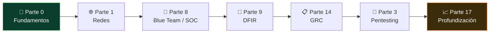

# 🏦 Analista de Ciberseguridad (institución regulada)

> El perfil defensivo generalista dentro de una organización: monitoreas con un SIEM,
> gestionas eventos, logs, alertas, vulnerabilidades e incidentes, y lo haces bajo el paraguas
> de marcos normativos (NIST, ISO 27001, ISO 27035, ISO 22301). No es un rol de una sola
> especialidad: es el que sostiene la seguridad operativa del día a día en un entorno regulado.
>
> **Nivel de entrada:** intermedio; suele pedir ~2 años de experiencia y titulación · **Foco:** monitoreo (SIEM), gestión de eventos/logs/alertas, vulnerabilidades, respuesta a incidentes y cumplimiento normativo · **Certificación faro:** CompTIA CySA+ / BTL1


<!-- insignias:inicio -->

<div align="center">

[](README.md)
[](README.md)
[](../certificaciones/README.md)
[](../classes/README.md)

</div>

<!-- insignias:fin -->

## 🧭 Qué es y por qué importa

Muchas ofertas de empleo no piden un pentester, ni un forense, ni un auditor GRC puro: piden un
**Analista de Ciberseguridad** a secas. Es el perfil híbrido que vigila la seguridad de una
organización de punta a punta — típicamente en un **banco, aseguradora, administradora de fondos,
empresa de salud o utility**, es decir, sectores **regulados** donde la ciberseguridad no es
opcional sino una obligación legal.

Este rol combina dos mundos que en organizaciones grandes están separados, pero que en la mayoría
recaen sobre la misma persona:

- **La operación defensiva (blue team):** monitorear la telemetría con un **SIEM**, triar alertas,
  analizar eventos y logs, investigar incidentes y coordinar la respuesta. Es el músculo de
  [Analista SOC / Blue Team](soc-blue-team.md) y de [DFIR](dfir.md), pero en una versión más
  generalista y menos 24/7.
- **El marco normativo (GRC):** trabajar dentro de **NIST, ISO 27001** (gestión de la seguridad),
  **ISO 27035** (gestión de incidentes) e **ISO 22301** (continuidad de negocio). No solo detectas:
  documentas, reportas y demuestras cumplimiento ante auditores y reguladores. Es el terreno de
  [GRC / Gestión de seguridad](grc.md).

Se apoya, además, en la **gestión de vulnerabilidades** — el ciclo de descubrir, priorizar y
cerrar debilidades — que tiene su propia [guía de rol](gestion-vulnerabilidades.md).

Importa porque es **uno de los puestos in-house más demandados y estables** del sector. No tiene el
brillo del red team ni la adrenalina del pentesting, pero es la columna vertebral de la seguridad
de miles de organizaciones, y en sectores regulados **la plaza casi nunca desaparece**: mientras
haya normativa que cumplir, hará falta alguien que la sostenga en el día a día.

> **De dónde sale esta guía.** Está calcada de una oferta real de empleo (BN Fondos / Banco Nacional
> de Costa Rica, *Analista de Ciberseguridad*): SIEM, análisis de eventos/logs/alertas,
> vulnerabilidades e incidentes, más NIST, ISO 27001, ISO 27035 e ISO 22301, con requisito de
> titulación e incorporación al colegio profesional. Es el retrato fiel de lo que el mercado pide
> bajo este título.

## 🗓️ Un día en el puesto

No hay turnos nocturnos rotativos como en un SOC 24/7 puro, pero sí una jornada de guardia
constante sobre el estado de la organización:

- **Revisión del SIEM:** empiezas mirando las alertas de la noche. Trias: descartas falsos
  positivos, enriqueces las que importan con contexto (¿de qué usuario, de qué sistema, es
  esperado?) y escalas o investigas las serias.
- **Gestión de eventos e incidentes:** cuando una alerta se confirma, abres el proceso de respuesta
  — documentas la línea de tiempo, coordinas la contención con IT, informas a quien corresponde. En
  un entorno regulado, **cada incidente deja rastro documental** porque puede haber que reportarlo.
- **Gestión de vulnerabilidades:** revisas el último escaneo (Nessus, Qualys, Tenable), priorizas
  por criticidad y exposición, y das seguimiento a que los equipos de IT parcheen. Buena parte del
  trabajo es **perseguir cierres**, no solo encontrar fallos.
- **Cumplimiento y documentación:** actualizas políticas, preparas evidencia para una auditoría
  ISO 27001, mapeas controles contra NIST CSF, o revisas que el plan de continuidad (ISO 22301)
  siga vigente. Aquí es donde el rol se separa del SOC puro.
- **Coordinación transversal:** reuniones con IT, con riesgo, con negocio. En organizaciones que
  trabajan con **agilismo y foco en experiencia de cliente**, participas en los ceremoniales del
  equipo y traduces la seguridad a un lenguaje que el negocio entienda.

Dicho sin adornos: es un rol de **mucha responsabilidad y visibilidad interna, con una carga
documental real**. Si te gusta solo lo técnico y detestas escribir políticas o preparar evidencia
de auditoría, este perfil te va a pesar. Si te motiva sostener la seguridad de una organización
entera y moverte entre lo técnico y lo normativo, encajas.

## 🧠 Qué necesitas saber

### Conocimiento técnico

- **Sistemas operativos y sus logs.** Windows (Event Logs, Sysmon) y Linux: dónde vive la evidencia
  y cómo se ve la actividad normal frente a la sospechosa. Es la base del monitoreo.
- **El SIEM como herramienta central:** cómo se ingiere la telemetría, cómo se consulta y cómo se
  correlacionan eventos. Saber leer y escribir búsquedas es pan de cada día.
- **Análisis de eventos, logs y alertas:** el corazón operativo. Separar señal de ruido, reconstruir
  qué pasó a partir de rastros dispersos y decidir cuándo algo es un incidente de verdad.
- **Gestión de vulnerabilidades:** el ciclo completo — escaneo, priorización por riesgo, seguimiento
  del parcheo y verificación del cierre.
- **Respuesta a incidentes:** el ciclo NIST/SANS de preparación, detección, contención, erradicación
  y recuperación — que es justo lo que estandariza **ISO 27035**.
- **Marcos normativos, de verdad y no de memoria:** **NIST CSF**, **ISO 27001** (SGSI),
  **ISO 27035** (gestión de incidentes) e **ISO 22301** (continuidad de negocio). No como siglas de
  currículum, sino sabiendo qué exige cada uno y cómo se traduce en controles concretos.

### Herramientas del oficio

```text
SIEM:            Splunk, Microsoft Sentinel, Elastic Stack, Wazuh, QRadar
Vulnerabilidades: Nessus, Qualys, Tenable, OpenVAS
Endpoint/EDR:    Sysmon, Microsoft Defender, EDR comerciales
Detección:       reglas Sigma, MITRE ATT&CK
Incidentes/GRC:  ticketing, matrices de riesgo, herramientas de SGSI y evidencia de auditoría
Normativa:       NIST CSF, ISO 27001, ISO 27035, ISO 22301 como marco de trabajo
```

La herramienta no hace al analista. El SIEM entrega alertas, no veredictos; el escáner entrega
CVE, no prioridades. Lo que se paga es tu **criterio** para interpretar, priorizar y decidir.

### Habilidades no técnicas

- **Criterio bajo ruido:** la habilidad central de todo perfil defensivo — mantener la atención y
  el juicio cuando la mayoría de las alertas no son nada.
- **Redacción y documentación:** en un entorno regulado, lo que no está documentado no existe.
  Reportes de incidente, evidencia de auditoría y comunicación con el negocio son parte del trabajo,
  no un extra.
- **Comunicación con perfiles no técnicos:** traducir riesgo a lenguaje de negocio, de riesgo o de
  auditoría. Muchas ofertas piden nociones de **agilismo, design thinking y experiencia de cliente**
  precisamente por esto.
- **Rigor y trazabilidad:** el cumplimiento se sostiene en hacer las cosas de forma consistente y
  dejar rastro. La disciplina pesa tanto como el conocimiento técnico.

## 📚 Tu ruta en el programa

<!-- recorrido:inicio -->



<!-- recorrido:fin -->

Este es un rol **híbrido**, así que la ruta cruza tres bloques: la operación defensiva (Blue Team),
la respuesta a incidentes (DFIR) y el marco normativo (GRC). Orden recomendado:

1. 📚 [**Parte 0 — Fundamentos**](../classes/parte-0-fundamentos-y-prerrequisitos/README.md)
   (001–025) · Linux, Windows y redes: la base del monitoreo. Clave:
   [003 — Frameworks de seguridad (NIST, ISO 27001, MITRE ATT&CK)](../classes/parte-0-fundamentos-y-prerrequisitos/003-frameworks-de-seguridad-nist-csf-iso-27001-mitre-att-ck-y-diamond-model/README.md),
   el vocabulario normativo del puesto.
2. 📚 [**Parte 1 — Redes y seguridad de redes**](../classes/parte-1-redes-y-seguridad-de-redes/README.md)
   (026–045) · no puedes analizar tráfico ni logs de red si no sabes cómo se ve el tráfico legítimo.
3. 📚 [**Parte 8 — Blue Team, detección y SOC**](../classes/parte-8-blue-team-deteccion-y-soc/README.md)
   (181–200) · **el núcleo operativo del rol**, el SIEM y el análisis de eventos.
4. 📚 [**Parte 9 — Forense digital y respuesta a incidentes**](../classes/parte-9-forense-digital-y-respuesta-a-incidentes/README.md)
   (201–220) · el ciclo de incidentes que estandariza ISO 27035.
5. 📚 [**Parte 14 — GRC, riesgo y cumplimiento**](../classes/parte-14-grc-riesgo-y-cumplimiento/README.md)
   (276–290) · **la mitad normativa**: ISO 27001, NIST CSF, continuidad de negocio y auditoría.
6. 📚 [**Parte 3**](../classes/parte-3-hacking-etico-y-pentesting-metodologia/README.md) y
   [**Parte 17**](../classes/parte-17-profundizacion-para-certificaciones/README.md) · el ciclo de
   gestión de vulnerabilidades y el reporte profesional.

Clases concretas por las que empezar:

- 🏢 [181 · El SOC moderno: roles, niveles y procesos](../classes/parte-8-blue-team-deteccion-y-soc/181-el-soc-moderno-roles-niveles-y-procesos/README.md) — el mapa de la operación defensiva.
- 🗃️ [182 · Logging y fuentes de telemetría](../classes/parte-8-blue-team-deteccion-y-soc/182-logging-y-fuentes-de-telemetria/README.md) — de dónde salen los eventos que analizarás.
- 🔎 [183 · SIEM: arquitectura y componentes](../classes/parte-8-blue-team-deteccion-y-soc/183-siem-arquitectura-y-componentes/README.md) y [184 · Splunk para detección](../classes/parte-8-blue-team-deteccion-y-soc/184-splunk-para-deteccion/README.md) — el corazón del monitoreo.
- 🪟 [190 · Análisis de logs de Windows (Event Logs y Sysmon)](../classes/parte-8-blue-team-deteccion-y-soc/190-analisis-de-logs-de-windows-event-logs-y-sysmon/README.md) — donde vive la mayoría de las alertas.
- 🧬 [187 · Detección basada en MITRE ATT&CK](../classes/parte-8-blue-team-deteccion-y-soc/187-deteccion-basada-en-mitre-att-ck/README.md) — el lenguaje común que estructura el análisis.
- 🩹 [071 · Análisis de vulnerabilidades con Nessus y OpenVAS](../classes/parte-3-hacking-etico-y-pentesting-metodologia/071-analisis-de-vulnerabilidades-con-nessus-y-openvas/README.md) y [318 · Gestión del programa de vulnerabilidades](../classes/parte-17-profundizacion-para-certificaciones/318-gestion-del-programa-de-vulnerabilidades/README.md) — el ciclo de vulnerabilidades de principio a fin.
- 🚨 [202 · El ciclo de respuesta a incidentes (NIST y SANS)](../classes/parte-9-forense-digital-y-respuesta-a-incidentes/202-el-ciclo-de-respuesta-a-incidentes-nist-y-sans/README.md) y [215 · Playbooks de respuesta a incidentes](../classes/parte-9-forense-digital-y-respuesta-a-incidentes/215-playbooks-de-respuesta-a-incidentes/README.md) — el núcleo de ISO 27035.

La mitad normativa (Parte 14):

- 🏛️ [278 · ISO/IEC 27001 e implantación de un SGSI](../classes/parte-14-grc-riesgo-y-cumplimiento/278-iso-iec-27001-e-implantacion-de-un-sgsi/README.md) — el estándar que vertebra el puesto.
- 🎯 [279 · NIST Cybersecurity Framework](../classes/parte-14-grc-riesgo-y-cumplimiento/279-nist-cybersecurity-framework/README.md) — el marco de referencia que pide la oferta.
- 🔁 [283 · Continuidad de negocio y plan de recuperación ante desastres](../classes/parte-14-grc-riesgo-y-cumplimiento/283-continuidad-de-negocio-y-plan-de-recuperacion-ante-desastres/README.md) — el terreno de **ISO 22301**.
- 📋 [285 · Auditoría de seguridad](../classes/parte-14-grc-riesgo-y-cumplimiento/285-auditoria-de-seguridad/README.md) y [321 · Comunicación y reporte para analistas de seguridad](../classes/parte-17-profundizacion-para-certificaciones/321-comunicacion-y-reporte-para-analistas-de-seguridad/README.md) — demostrar y reportar cumplimiento.

### Laboratorio y CTF

- 🧪 [`blue-team-soc`](../labs/blue-team-soc/README.md) — monta un SIEM, ingiere telemetría, escribe
  reglas y triaja alertas reales: la práctica del corazón operativo del rol.
- 🧪 [`rootcause-windows`](../labs/rootcause-windows/README.md) — controles, hardening y análisis en
  Windows, el sistema donde más vas a mirar logs.
- 🚩 [CTF de forense y redes](../ctf/README.md) — leer una captura, seguir un flujo y reconstruir un
  incidente: justo los músculos del análisis de eventos.

## 🎓 Certificaciones

Con archivo en el programa (mapean a partes concretas):

- 📋 [**CompTIA CySA+** (CS0-003)](../certificaciones/comptia-cysa-plus-cs0-003.md) — **la
  certificación faro** de este perfil: analista de seguridad con foco en monitoreo, análisis de
  comportamiento, gestión de vulnerabilidades y respuesta. Es la que mejor describe el puesto.
- 🥇 [**BTL1** (Blue Team Level 1)](../certificaciones/btl1.md) — cien por cien práctica: SIEM,
  análisis de logs, threat intel, forense y respuesta. Demuestra que sabes hacer la parte operativa.
- 🎓 [**CompTIA Security+** (SY0-701)](../certificaciones/comptia-security-plus-sy0-701.md) — la
  certificación **de entrada** al sector. No es específica, pero abre puertas de RRHH y asienta el
  vocabulario común. Buen primer hito si aún no tienes ninguna.
- 🏛️ [**CISSP**](../certificaciones/cissp.md) — a medio plazo, para el lado de gestión y
  cumplimiento: gobernanza, riesgo y seguridad como disciplina de organización. Exige experiencia.

La certificación oficial **ISO 27001** (Lead Implementer / Auditor) es muy relevante para la mitad
normativa del puesto; el programa cubre su contenido en la
[clase 278](../classes/parte-14-grc-riesgo-y-cumplimiento/278-iso-iec-27001-e-implantacion-de-un-sgsi/README.md),
pero el examen se saca aparte con un organismo acreditado. Consulta el
[mapeo completo a certificaciones](../certificaciones/README.md) para ver cuánto cubre el programa.

## 📈 Progresión de carrera y salario

Ruta habitual: **Analista de Ciberseguridad → Analista senior / especialista → Líder de seguridad
o [CISO adjunto](ciso-jefe-seguridad.md)**. Desde aquí se abren caminos hacia la especialización (SOC, DFIR, gestión de
vulnerabilidades) o hacia la gestión pura (GRC, gobernanza, dirección de seguridad). El perfil
híbrido es una **excelente rampa** porque tocas de todo y descubres hacia dónde quieres pivotar.

Rangos **orientativos y aproximados** (brutos anuales; varían mucho por sector, tamaño de empresa,
regulación y experiencia — referencia, no promesa):

```text
Región                      Entrada (~2 años)     Senior / especialista
--------------------------  --------------------  ------------------------
LATAM                       USD 15k – 30k / año   USD 32k – 60k+ / año
Centroamérica (banca/CR)*   USD 18k – 35k / año   USD 36k – 60k+ / año
España                      EUR 24k – 36k / año   EUR 40k – 65k+ / año
Remoto (USD)                USD 55k – 90k / año   USD 100k – 150k+ / año
```

\* En instituciones financieras reguladas (banca, administradoras de fondos, aseguradoras) el puesto
suele pagar por encima del promedio del país y ser **más estable**, a cambio de más carga normativa
y documental. Los números remotos en USD asumen contratación por empresas de EE. UU./Europa, con
listón alto de inglés.

## ⚠️ Mitos y errores comunes

- **"Es solo mirar un SIEM todo el día."** El monitoreo es una parte; la otra mitad es gestión de
  vulnerabilidades, respuesta a incidentes y cumplimiento. Es de los roles más **transversales** que
  hay.
- **"La parte normativa es relleno."** En un entorno regulado, ISO 27001 e ISO 22301 no son adorno:
  son obligación legal, y una auditoría fallida tiene consecuencias reales. El cumplimiento es
  trabajo técnico serio, no papeleo.
- **"Necesito ser experto ofensivo primero."** No. Se entra con fundamentos sólidos de redes,
  sistemas y análisis de logs. Entender el ataque ayuda, pero no hace falta pasar por OSCP.
- **"Un analista lo hace todo solo."** En organizaciones grandes el rol se reparte entre SOC, DFIR,
  GRC y gestión de vulnerabilidades; en las medianas y pequeñas, en cambio, sí recae en una persona.
  Sabe en cuál te estás metiendo antes de aceptar.
- **"El curso me da todo lo que pide la oferta."** No del todo; lee la nota de honestidad de abajo.

> **Honestidad, sin marketing:** este programa te da la **base técnica y normativa** del puesto —el
> SIEM, el análisis de eventos/logs/alertas, la gestión de vulnerabilidades, la respuesta a
> incidentes y los marcos NIST/ISO 27001/27035/22301—. Lo que **no** te da son los requisitos
> formales y de contexto que muchas ofertas añaden: **titulación universitaria, incorporación a un
> colegio profesional, conocimiento del negocio** (p. ej. fondos de inversión) y competencias
> transversales como **agilismo, design thinking, design sprint o analítica de datos**. Esos los
> aportas tú con formación reglada y experiencia. El curso te hace **técnicamente capaz**; el título
> y el contexto de negocio los pones tú.

## 🚀 Siguientes pasos

1. **Asienta la base** con las **Partes 0 y 1**: sin redes, Windows y Linux sólidos, ni el SIEM ni
   los logs te dirán nada.
2. Haz la **Parte 8** completa y monta el laboratorio [`blue-team-soc`](../labs/blue-team-soc/README.md):
   ingiere telemetría real y triaja tus primeras alertas.
3. Cierra el ciclo defensivo con la **Parte 9** (respuesta a incidentes) y el ciclo de
   vulnerabilidades de las **Partes 3 y 17**.
4. Estudia la **Parte 14 (GRC)** para dominar la mitad normativa: ISO 27001 (278), NIST CSF (279) y
   continuidad de negocio (283, el terreno de ISO 22301).
5. Apunta a **CySA+** como certificación de rol; si buscas primero abrir puertas de RRHH, empieza por
   **Security+**, y planifica **CISSP** o **ISO 27001** a medio plazo.
6. Si vas a por una institución regulada, **estudia el requisito formal**: revisa si la plaza exige
   titulación y colegiatura, y prepara ese lado en paralelo al técnico.

---

- ⬅️ [Volver al índice de rutas](./README.md)
- 🏠 [Inicio del programa](../README.md)
