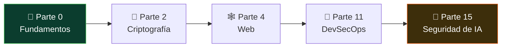

# 🕸️ AppSec / Bug Bounty

> Buscas el fallo en el código y en el diseño de las aplicaciones: o para arreglarlo
> desde dentro, o para reportarlo desde fuera a cambio de una recompensa.
>
> **Nivel de entrada:** intermedio (requiere web, HTTP y algo de programación) · **Foco:** seguridad de aplicaciones web · **Certificación faro:** BSCP / eWPTX

<!-- insignias:inicio -->

<!-- insignias:fin -->

## 🧭 Qué es y por qué importa

La superficie de ataque de casi cualquier empresa moderna es una aplicación web o una API.
El correo, la banca, el historial médico, el panel de administración de tu infraestructura:
todo es una app. Encontrar y cerrar los fallos de esas aplicaciones **antes** de que alguien
los explote es el trabajo de AppSec.

Este rol tiene **dos caras** que comparten conocimiento pero no el día a día ni el modelo
económico. Conviene entenderlas por separado desde el principio:

- **AppSec engineer (defensivo, dentro de una empresa).** Trabajas con los equipos de
  desarrollo. Revisas código, modelas amenazas, defines requisitos de seguridad, montas
  las herramientas del pipeline (SAST, DAST, SCA) y ayudas a arreglar lo que se encuentra.
  Tu producto no es un exploit: es una aplicación que se rompe menos y un equipo que
  programa con más criterio. Es un empleo estable, con salario y horario.
- **Bug bounty hunter (ofensivo, por recompensas).** Cazas vulnerabilidades en programas
  públicos (HackerOne, Bugcrowd, Intigriti, YesWeHack) o en programas privados por invitación.
  Reportas, y si el fallo es válido y nuevo, cobras. No hay jefe ni sueldo: cobras por
  resultado. Puede ser un complemento, un aprendizaje brutal o —para muy pocos— un ingreso
  principal.

Mucha gente empieza en bug bounty por la libertad y termina en AppSec por la estabilidad, o
hace las dos cosas a la vez. El conocimiento técnico es el mismo; cambia el sombrero y el
contrato. Lo que este programa **no** puede darte es la experiencia de revisar el código de
producción de una empresa real ni la constancia de meses cazando sin cobrar: eso lo pone la
práctica.

## 🗓️ Un día en el puesto

Depende de la cara del rol. Un **AppSec engineer** en un día normal:

- Revisa un pull request marcado por riesgo: lee el diff buscando inyección, control de
  acceso roto o manejo inseguro de secretos, y comenta con el desarrollador.
- Participa en un ejercicio de modelado de amenazas de una funcionalidad nueva antes de que
  se escriba una línea.
- Ajusta reglas del SAST para que deje de gritar falsos positivos (el ruido mata la adopción).
- Triage de hallazgos: separar lo explotable de lo teórico y priorizar por impacto real.
- Escribe guías y da charlas internas. Buena parte del trabajo es convencer, no romper.

Un **bug bounty hunter** en un día de caza:

- Elige un objetivo dentro del alcance del programa y lee las reglas: qué dominios entran,
  qué está prohibido, cuánto pagan por severidad.
- Mapea la aplicación con Burp: enumera endpoints, parámetros, roles y flujos de negocio.
- Prueba hipótesis: un IDOR aquí, un SSRF allá, una lógica de negocio que se salta un pago.
- Cuando encuentra algo, lo confirma, mide su impacto y escribe un reporte reproducible. El
  reporte es el entregable que se paga; uno malo se cierra como "informativo" y no cobras.
- La mayoría de las horas terminan sin hallazgo. La paciencia y la metodología son el oficio.

## 🧠 Qué necesitas saber

### Conocimiento técnico

- **La web por dentro:** HTTP/HTTPS, cookies, cabeceras, CORS, el modelo de origen, cómo
  viaja una petición del navegador al servidor. Sin esto, cada bug es magia.
- **El OWASP Top 10 y más allá:** inyección (SQL, comandos, NoSQL), XSS, SSRF, control de
  acceso roto (IDOR), deserialización insegura, SSTI, XXE. No de memoria: entendiendo la
  causa raíz de cada familia.
- **Seguridad de APIs:** REST y GraphQL, autenticación y autorización, JWT y OAuth. Hoy la
  mayor parte de la lógica vive en la API, no en la página.
- **Criptografía aplicada, no académica:** hashing de contraseñas, TLS, almacenamiento de
  secretos. Su mal uso es un hallazgo recurrente.
- **Leer código:** al menos un lenguaje de backend (JavaScript/Node, Python, Java o PHP) lo
  suficiente para seguir el flujo de datos y detectar dónde entra la entrada del usuario. El
  AppSec engineer vive de esto; el hunter lo agradece cuando hay código fuente disponible.
- **La superficie moderna:** aplicaciones con LLM. Prompt injection, fuga de datos vía RAG y
  agentes con demasiados permisos son la nueva clase de vulnerabilidad, y ya se pagan bounties.

### Herramientas del oficio

- **Burp Suite:** el estándar absoluto del rol. Proxy, Repeater, Intruder, escáner y
  extensiones. Aprende a usarlo bien antes que cualquier otra cosa.
- **OWASP ZAP:** alternativa libre, útil para automatización y para quien no paga Burp Pro.
- **Recon y descubrimiento:** herramientas de enumeración de subdominios, directorios y
  parámetros; el hunter vive del reconocimiento amplio.
- **Del lado del engineer:** SAST (análisis estático), DAST (dinámico) y SCA (dependencias)
  integrados en el pipeline; escáneres de secretos y hooks de pre-commit.
- **Scripting:** Python para automatizar lo repetitivo, adaptar payloads y procesar resultados.

Regla del oficio: la herramienta encuentra lo evidente; el dinero (o el fix que importa) está
en lo que exige entender la aplicación. Automatiza, pero sabe hacerlo a mano.

### Habilidades no técnicas

- **Escribir claro:** el reporte es el producto. Un hallazgo mal explicado no se arregla y no
  se paga. Un buen reporte reproduce el fallo paso a paso y demuestra el impacto.
- **Paciencia y método:** tanto revisar código como cazar bugs son maratones. La mayoría del
  tiempo no encuentras nada; los buenos son ordenados y tercos, no genios instantáneos.
- **Ética y alcance:** actúas solo dentro del alcance autorizado —el contrato de tu empresa o
  las reglas del programa de bounty—. Salirte de ahí es delito, no investigación.
- **Comunicación con desarrolladores:** sobre todo en AppSec. Convences colaborando, no
  humillando a quien escribió el código.

## 📚 Tu ruta en el programa

<!-- recorrido:inicio -->

<!-- recorrido:fin -->

El orden importa. Cada parte apoya a la siguiente; saltarte los fundamentos se paga después.

1. 📚 [**Parte 0 — Fundamentos**](../classes/parte-0-fundamentos-y-prerrequisitos/README.md)
   (001–025). El cimiento común: línea de comandos, redes, HTTP, Python y la ética y legalidad
   que sostienen todo lo demás. No es opcional.
2. 📚 [**Parte 2 — Criptografía aplicada**](../classes/parte-2-criptografia-aplicada/README.md)
   (046–065). Foco en hashing, TLS, contraseñas y JWT: lo que aparece como hallazgo real en
   aplicaciones. No necesitas ser criptógrafo, pero sí reconocer el mal uso.
3. 📚 [**Parte 4 — Seguridad web**](../classes/parte-4-seguridad-de-aplicaciones-web/README.md)
   (086–115). **El núcleo del rol.** Aquí vive el oficio completo, del proxy al bug bounty.
   Clases especialmente relevantes:
   [087 — OWASP Top 10](../classes/parte-4-seguridad-de-aplicaciones-web/087-owasp-top-10-panorama-general/README.md),
   [088 — Burp Suite](../classes/parte-4-seguridad-de-aplicaciones-web/088-burp-suite-configuracion-y-flujo-de-trabajo/README.md),
   [091 — Inyección SQL](../classes/parte-4-seguridad-de-aplicaciones-web/091-inyeccion-sql-fundamentos/README.md),
   [096 — XSS reflejado](../classes/parte-4-seguridad-de-aplicaciones-web/096-cross-site-scripting-xss-reflejado/README.md),
   [099 — SSRF](../classes/parte-4-seguridad-de-aplicaciones-web/099-server-side-request-forgery-ssrf/README.md)
   y [114 — Bug bounty: metodología y plataformas](../classes/parte-4-seguridad-de-aplicaciones-web/114-bug-bounty-metodologia-y-plataformas/README.md).
4. 📚 [**Parte 11 — DevSecOps y SDLC**](../classes/parte-11-devsecops-y-seguridad-del-sdlc/README.md)
   (236–248). **El lado defensivo del rol.** Aquí aprendes a integrar la seguridad en el ciclo
   de desarrollo y a hacer del hallazgo un proceso, no un incendio. Empieza por
   [236 — Secure SDLC y shift-left](../classes/parte-11-devsecops-y-seguridad-del-sdlc/236-secure-sdlc-y-filosofia-shift-left/README.md)
   y [238 — SAST](../classes/parte-11-devsecops-y-seguridad-del-sdlc/238-sast-analisis-estatico-de-codigo/README.md).
   Si apuntas a AppSec engineer, esta parte es tan importante como la 4.
5. 📚 [**Parte 15 — Seguridad de IA/LLM**](../classes/parte-15-seguridad-de-ia-y-machine-learning/README.md)
   (291–300). **La superficie moderna.** Las aplicaciones con LLM son la nueva clase de
   objetivo. Empieza por
   [295 — OWASP Top 10 para LLM](../classes/parte-15-seguridad-de-ia-y-machine-learning/295-owasp-top-10-para-aplicaciones-con-llm/README.md)
   y [296 — Prompt injection y jailbreaks](../classes/parte-15-seguridad-de-ia-y-machine-learning/296-prompt-injection-y-jailbreaks/README.md).
6. 📚 Cierra el círculo con
   [115 — Secure coding y defensa web](../classes/parte-4-seguridad-de-aplicaciones-web/115-secure-coding-y-defensa-de-aplicaciones-web/README.md):
   el puente entre romper y construir, imprescindible para el engineer.

Practica en los laboratorios, que es donde se aprende de verdad:

- 🧪 [`appsec-web`](../labs/appsec-web/README.md) para explotar las vulnerabilidades web con las
  manos, y [`appsec-code`](../labs/appsec-code/README.md) para revisar código y encontrar el
  fallo en la fuente (la mitad engineer del rol).
- 🧪 [`devsecops-pipeline`](../labs/devsecops-pipeline/README.md) para el lado del **SDLC**:
  auditar un repositorio completo en ocho capas (dependencias, SAST, secretos, Dockerfile,
  contenedor y CI/CD) y entregar el informe priorizado. Es la práctica de la Parte 11.
- 🚩 [CTF de web](../ctf/README.md) para afilar bajo presión y sin pistas.

## 🎓 Certificaciones

Las certis abren puertas en filtros de RR. HH., pero lo que te contrata (o te hace ganar un
bounty) es demostrar que sabes. Úsalas como orden, no como colección.

- 🎓 [**Security+ (SY0-701)**](../certificaciones/comptia-security-plus-sy0-701.md) — entrada.
  Valida la base y desbloquea entrevistas si vienes de cero. No es específica de web.
- 🎓 [**CompTIA PenTest+ (PT0-002)**](../certificaciones/comptia-pentest-plus-pt0-002.md) —
  puente generalista de ofensiva; cubre método y herramientas, útil como paso intermedio.
- **Burp Suite Certified Practitioner (BSCP)** — la certi **faro** práctica y específica de
  este rol: examen basado en explotar vulnerabilidades reales con Burp. Muy valorada y
  directamente alineada con el trabajo. En este programa se menciona como referencia; no
  tiene ficha propia.
- **eWPTX** (INE/eLearnSecurity) — certificación web avanzada, práctica y muy respetada para
  demostrar profundidad en explotación de aplicaciones. También se menciona como referencia,
  sin ficha propia.
- 🎓 [**OSCP (PEN-200)**](../certificaciones/oscp-pen-200.md) — no es específica de web, pero
  su prestigio ofensivo suma si además haces pentesting de sistemas.

Consulta el [índice de certificaciones](../certificaciones/README.md) para ver cuánto cubre el
programa de cada examen. La honestidad del oficio: ninguna certi sustituye horas de laboratorio.

## 📈 Progresión de carrera y salario

Los dos caminos divergen, así que léelos por separado.

**AppSec engineer (empleo estable):**

1. **Desarrollador con foco en seguridad / junior AppSec** — entras revisando y aprendiendo el pipeline.
2. **AppSec engineer** — llevas revisiones, modelado de amenazas y las herramientas del ciclo.
3. **Senior AppSec / Security champion lead** — defines el programa de seguridad de producto y mentorizas.
4. **Especialización o gestión:** product security architect, líder de AppSec, o cruce hacia
   [pentester](./README.md) o [red teamer](./README.md).

Rangos salariales **orientativos** para AppSec engineer (brutos anuales, muy dependientes de
país, experiencia, sector e inglés; referencia, no promesa):

- **LATAM:** entrada aproximada USD 15.000–30.000; con experiencia USD 30.000–60.000+.
- **España:** entrada aproximada 28.000–38.000 €; senior 50.000–75.000 €+.
- **Remoto / USD (clientes de EE. UU./Europa):** seniors con frecuencia por encima de
  USD 100.000–140.000, pero la competencia es global y la vara, alta.

**Bug bounty (ingreso variable):** aquí toca ser brutalmente honesto. **Los ingresos son muy
variables e inconsistentes.** La mayoría de los cazadores gana poco o nada durante meses; una
minoría gana un complemento decente; un puñado, cifras altas que llenan titulares y distorsionan
las expectativas. No hay sueldo, ni piso, ni garantía: cobras por hallazgo válido y nuevo, y
muchos reportes se cierran como duplicados o informativos sin pago. Como **fuente de ingreso
principal es un camino de altísima varianza** que solo sostiene gente con muchísima experiencia
y disciplina. Como **complemento y como escuela**, en cambio, es excelente: te fuerza a
practicar contra objetivos reales y construye un portafolio que sí te consigue empleo. La
recomendación honesta: cázalo por el aprendizaje y el extra, no cuentes con ello para pagar el
alquiler hasta que los números, durante meses, demuestren lo contrario.

El inglés técnico y un buen portafolio (reportes públicos, writeups, CTF) mueven ambos caminos
más que cualquier otra cosa.

## ⚠️ Mitos y errores comunes

- **"Bug bounty es dinero fácil."** Es lo contrario: ingreso inconsistente, mucha competencia y
  meses sin cobrar. La mayoría gana poco. Entra por el aprendizaje, no por la promesa de riqueza.
- **"Con el escáner de Burp basta."** El escáner encuentra lo evidente, que ya reportaron cien
  personas antes. El dinero y el fix que importa están en lo que exige entender la aplicación.
- **"AppSec es solo romper."** La mitad del rol es construir: modelar amenazas, revisar código y
  convencer a desarrolladores. Un AppSec que no sabe programar ni comunicar es un AppSec a medias.
- **"Puedo probar en cualquier web para aprender."** No. Solo dentro del alcance autorizado: el
  programa de bounty o el contrato de tu empresa. Fuera de ahí es delito.
- **"La certi me consigue el trabajo."** Es un filtro de entrada, no una garantía. Sin práctica
  demostrable no pasas la parte técnica de la entrevista ni encuentras un bug real.
- **"Este curso me vuelve profesional."** Te da el conocimiento técnico y el método. La
  experiencia con código de producción y la constancia de la caza se ganan con la práctica. El
  programa te hace competente y creíble; el oficio lo pule el tiempo.

## 🚀 Siguientes pasos

1. Si vienes de cero, no saltes: haz la **Parte 0** completa antes de emocionarte con los exploits.
2. Encadena **Parte 2 → Parte 4** y no avances sin sentirte cómodo con HTTP, Burp y el OWASP Top 10.
3. Monta [`appsec-web`](../labs/appsec-web/README.md) y explota cada vulnerabilidad que estudies
   con tus propias manos; el conocimiento que no ejecutas se evapora.
4. Practica revisión de código en [`appsec-code`](../labs/appsec-code/README.md) y resuelve
   [CTF de web](../ctf/README.md) con regularidad.
5. Añade la **Parte 11** si apuntas a AppSec engineer y la **Parte 15** para no quedarte fuera de
   la superficie de IA/LLM.
6. Apunta a la [**Security+**](../certificaciones/comptia-security-plus-sy0-701.md) o
   [**PenTest+**](../certificaciones/comptia-pentest-plus-pt0-002.md) como primer hito, y pon la
   **BSCP** o la **eWPTX** como meta específica del rol.
7. Escribe **writeups** y reporta en un programa de bounty aunque no cobres al principio. Un
   portafolio público vale más que diez líneas en el currículum.

---

- ⬅️ [Volver al índice de rutas](./README.md)
- 🏠 [Inicio del programa](../README.md)
