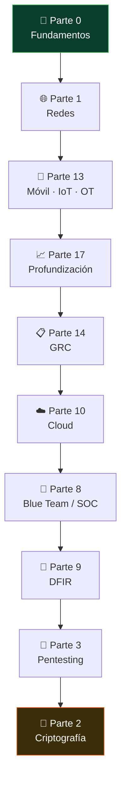

# 🏭 Arquitecto de Ciberseguridad IT/OT (industria e infraestructura crítica)

> El rol que **diseña** —no opera— la seguridad de una planta: dónde va cada zona, qué atraviesa
> cada conducto, qué protocolo industrial se deja pasar y cuál se corta, cómo se conectan la red
> corporativa (**IT**), la red de proceso (**OT**), la nube y el SOC sin abrir un camino desde
> internet hasta un PLC. En entornos donde un fallo no tumba un servicio: **para una planta**.
>
> **Nivel de entrada:** senior; 4–5 años de ciberseguridad con exposición real a entornos industriales · **Foco:** arquitectura y segmentación IT/OT, modelo Purdue, zonas y conductos IEC 62443, integración con nube y SOC, auditoría de cumplimiento · **Certificación faro:** ISA/IEC 62443 Cybersecurity Specialist + **GICSP** (fuera del programa; dentro, CISSP por el dominio de arquitectura)


<!-- insignias:inicio -->

<div align="center">

[](README.md)
[](README.md)
[](../certificaciones/README.md)
[](../classes/README.md)

</div>

<!-- insignias:fin -->

## 🧭 Qué es y por qué importa

Hay una diferencia que lo explica casi todo: en **IT** el peor caso es que se pierdan datos; en
**OT** el peor caso es que se rompa algo físico o se mate a alguien. Por eso el orden de la tríada
se invierte —**disponibilidad e integridad primero**, confidencialidad después— y por eso las
recetas que funcionan en una red corporativa (parchea el martes, escanea toda la red, mete un
agente en cada host) van de mal a catastrófico en una planta: hay PLCs que se cuelgan con un
escaneo de puertos y hay ventanas de mantenimiento que se abren **una vez al año**.

El arquitecto IT/OT es quien traduce esa restricción en un diseño. El trabajo tiene tres capas:

- **Arquitectura y segmentación.** Levantar el **modelo Purdue** del entorno real (niveles 0 a 5),
  definir **zonas y conductos** según **IEC 62443-3-2**, decidir qué vive en la **iDMZ** industrial
  —historiador replicado, salto de acceso remoto, servidor de parches— y escribir la política de
  cada conducto: qué protocolo, en qué dirección, con qué inspección. Esto es lo que se entrega,
  y lo que después audita un tercero.
- **Integración IT / OT / nube / SOC.** El negocio quiere datos de planta en la nube y el SOC
  quiere telemetría de OT. Ambas cosas se pueden hacer **sin** que el camino sea bidireccional:
  recolección pasiva, réplica hacia arriba, diodo o *gateway* unidireccional donde el riesgo lo
  justifique, y nunca un agente pesado sobre un controlador. Diseñar ese flujo es la mitad del
  puesto.
- **Evaluación y cumplimiento.** Auditar lo que ya existe contra **IEC 62443**, **NIST SP 800-82**,
  **NIST CSF** e **ISO 27001**; medir el nivel de seguridad (**SL-A** alcanzado frente a **SL-T**
  objetivo) de cada zona; y convertir la brecha en un plan con fechas, costo y dueño. Incluye
  **pentesting OT/ICS**, que en este mundo significa sobre todo **análisis pasivo, laboratorio y
  réplica** — la prueba activa contra producción es la excepción y va firmada.

En qué se diferencia de las rutas vecinas de este curso:

- Frente a [Analista de Seguridad de Infraestructura](seguridad-infraestructura.md): ese rol
  **opera** los controles y sostiene la telemetría; este **decide dónde van** y por qué. Uno mantiene
  el firewall, el otro define la política de la zona que el firewall implementa.
- Frente a [Cloud Security Engineer](cloud-security.md): comparten la parte de nube, pero aquí la
  nube es el **extremo de arriba** de una arquitectura que empieza en un sensor. El diseño se juzga
  por lo que ocurre en el nivel 1, no en la VPC.
- Frente a [Analista de Seguridad Ofensiva](analista-seguridad-ofensiva.md): el pentest OT es una
  **entrada** de tu diseño, no tu oficio. Y se hace con reglas distintas: pasivo por defecto.
- Frente al [CISO](ciso.md) y a [GRC](grc.md): tú no decides el apetito de riesgo de la
  organización; lo traduces a topología, reglas y controles concretos y demuestras que el diseño
  sostiene lo que la norma exige.

Importa porque es de los puestos **peor cubiertos del mercado**: hay mucha gente de seguridad que no
distingue un PLC de una HMI, y mucha gente de automatización que no ha oído hablar de zero trust. El
que sabe hablar los dos idiomas es escaso — y en países cuya economía se apoya en minería, energía,
agua, celulosa o portuario, es un rol **estratégico**, no de apoyo.

> **De dónde sale esta guía.** Está calcada de una oferta real de empleo
> ([Indra Group, *Arquitecto de Ciberseguridad IT/OT*, Santiago, Chile](https://www.linkedin.com/jobs/view/4450124062/) —
> el aviso ya está cerrado, pero el perfil que describe es el estándar del sector): diseñar
> arquitecturas de ciberseguridad para **entornos industriales y corporativos**; desarrollar
> estrategias de **segmentación y segregación de redes**; definir controles para redes industriales
> y plataformas corporativas; **integrar de forma segura IT, OT, Cloud y SOC**; ejecutar
> **auditorías y evaluaciones de cumplimiento**; y diseñar arquitecturas **resilientes para
> infraestructuras críticas**. Requisitos: ingeniería informática, de sistemas o redes; **4–5 años**
> en ciberseguridad IT/OT; conocimientos avanzados de **Fortinet** y **Palo Alto Networks**;
> experiencia en **OT/ICS pentesting**; dominio del **modelo Purdue** y del enfoque de **zonas y
> conductos**; **IEC 62443**, **NIST CSF**, **NIST SP 800-82** e **ISO 27001**; experiencia en
> **Cloud Security**; e **inglés intermedio**.

## 🗓️ Un día en el puesto

Es un trabajo de **diseñar, revisar y defender decisiones**, con mucha reunión con gente que no es
de seguridad — automatización, operaciones, mantenimiento, el integrador y el fabricante:

- **Levantamiento de la arquitectura real.** Casi nunca hay un diagrama fiel. Se reconstruye
  mirando configuraciones, tablas de rutas, reglas de firewall y —sobre todo— **escuchando la red
  en modo pasivo**. La primera sorpresa suele ser un enlace que nadie recordaba.
- **Diseño de zonas y conductos.** Agrupar activos por criticidad y función, dibujar el conducto
  entre zonas y escribir su política: protocolo, sentido, inspección y quién la aprueba.
- **Revisión de un cambio.** Un proveedor pide acceso remoto a una HMI para una puesta en marcha.
  Tu respuesta no es "sí" ni "no": es **cómo** —salto intermedio, MFA, sesión grabada, ventana
  temporal, cuenta que caduca sola.
- **Especificación de controles.** La regla del NGFW industrial que solo permite `Modbus/TCP`
  de la zona A a la B en una dirección; la lista blanca de aplicaciones en la HMI; el modo de
  monitorización pasiva del sensor OT.
- **Evaluación de cumplimiento.** Recorrer los requisitos de **IEC 62443-3-3** o de **NIST SP
  800-82** zona por zona, marcar lo que no se cumple y estimar el esfuerzo. Papel, sí, pero es el
  papel que consigue el presupuesto.
- **Coordinación con el SOC.** Qué telemetría de OT llega al SIEM, en qué formato y qué se hace con
  una alerta que **no se puede contener aislando el equipo**, porque ese equipo está controlando un
  proceso en marcha.
- **Arquitectura resiliente.** Redundancia, estados seguros, qué pasa si cae el enlace con la
  corporativa, y cómo se recupera un controlador. Esto se cruza con continuidad de negocio y con la
  gente de *safety*, que no es lo mismo que *security* — y confundirlas es un error caro.
- **Traducción.** Explicarle a un jefe de planta por qué su ventana de parcheo importa, y a un
  gerente de TI por qué no puede desplegar el agente corporativo en el nivel 1. Todos los días.

Dicho sin adornos: **se toca poco teclado y se dibuja mucho**. Si lo que quieres es operar
herramientas, [SecOps](secops-engineer.md) o [SOC](soc-blue-team.md) encajan mejor. Si te gusta
entender un sistema completo y decidir su forma, este es el techo técnico del lado defensivo.

## 🧠 Qué necesitas saber

### Conocimiento técnico

- **Redes de verdad, hasta capa 2.** VLANs, *trunking*, enrutamiento, NAT, VLAN hopping, ARP y
  por qué una VLAN **no es** un límite de seguridad por sí sola. La segmentación es el núcleo del
  puesto y se sostiene o se cae aquí.
- **Modelo Purdue y arquitectura OT.** Niveles 0–5, qué vive en cada uno (sensor/actuador, PLC/RTU,
  HMI/SCADA, MES, corporativa), qué es la **iDMZ** y por qué el historiador se replica en lugar de
  consultarse desde arriba.
- **Protocolos industriales.** **Modbus**, **DNP3**, **S7comm**, OPC UA, EtherNet/IP: qué hacen, por
  qué nacieron **sin autenticación ni cifrado** y qué se puede inspeccionar de ellos en un firewall
  con reconocimiento de aplicación.
- **IEC 62443 en serio.** No como sigla: **-3-2** (análisis de riesgo, zonas y conductos), **-3-3**
  (requisitos de sistema y niveles **SL 1–4**), **-4-1/-4-2** (lo que le exiges al fabricante y al
  integrador). Esta última parte es la que convierte tu diseño en cláusulas de contrato.
- **NIST SP 800-82 Rev. 3, NIST CSF e ISO 27001.** El trío que te van a pedir citar: guía específica
  de OT, marco de función/perfil y el SGSI dentro del que todo esto se gobierna.
- **Firewalls de nueva generación.** **Fortinet** y **Palo Alto** aparecen literales en la oferta:
  políticas, zonas, inspección de aplicación, IPS con firmas ICS, alta disponibilidad y los modelos
  con carcasa industrial. El concepto lo aprendes en el curso; **la consola es del fabricante**.
- **Acceso remoto seguro.** Salto/*bastion*, **MFA**, **PAM** con grabación de sesión y cuentas
  temporales para proveedores. Es el vector de entrada número uno a OT, muy por delante del
  exploit exótico.
- **Monitorización pasiva.** Espejo de puerto, **TAP**, Zeek y sensores OT: ver sin inyectar un solo
  paquete. En OT, escuchar es la técnica por defecto.
- **Nube e híbrido.** Dónde acaba la planta y empieza la nube: identidad, IAM, postura (CSPM),
  recolección de logs y el flujo de datos de proceso hacia arriba **sin ruta de vuelta**.
- **OT/ICS pentesting con criterio.** Alcance y reglas de engagement por escrito, laboratorio o
  réplica, análisis pasivo primero, y saber decir *no* a un escaneo activo en producción.
- **Resiliencia y continuidad.** Redundancia, estados seguros, RTO/RPO de proceso, plan de
  recuperación de un controlador y la frontera entre *safety* (SIS) y *security*.

### Herramientas del oficio

```text
Perímetro y zonas:  Fortinet (FortiGate), Palo Alto Networks — políticas, App-ID/IPS, HA industrial
Red:                switches gestionados, VLAN, ACL, TAP y espejo de puerto, NAC, VPN IPsec
Visibilidad OT:     monitorización pasiva (Zeek, sensores ICS), captura con Wireshark + disectores
Simulación y lab:   OpenPLC, GRFICS, Conpot, ModbusPal, pymodbus (nunca contra producción)
Marcos:             IEC 62443 (-3-2, -3-3, -4-2), NIST SP 800-82 Rev. 3, NIST CSF, ISO 27001
Diagramación:       diagramas de zonas/conductos, inventario de activos, matriz de flujos
Nube:               AWS / Azure — identidad, red, logging y postura (CSPM)
SOC:                SIEM, MITRE ATT&CK for ICS, casos de uso y playbooks específicos de OT
Acceso remoto:      bastion/jump host, MFA, PAM con grabación de sesión
```

Aquí manda el **criterio de diseño** sobre el dominio de un producto: la marca del firewall cambia
de cliente en cliente; el modelo Purdue y las zonas no.

### Habilidades no técnicas

- **Traducir entre dos culturas.** Automatización y TI miden el éxito con métricas distintas.
  Buena parte del trabajo es conseguir que las dos partes acepten el mismo diagrama.
- **Redacción y documentación.** El entregable del puesto es un documento: diagrama, memoria de
  diseño, matriz de flujos, informe de brecha. Si no está escrito, no existe.
- **Defender un diseño con argumentos.** Vas a decir que no a cosas que otros dan por hechas. Sin
  el porqué en términos de riesgo y de proceso, pierdes.
- **Prudencia operativa.** El instinto de "lo escaneo y vemos" es exactamente lo que no debes
  tener. En OT se pregunta antes.
- **Inglés técnico.** La oferta pide intermedio; la realidad es que las normas, los manuales de
  fabricante y los avisos de vulnerabilidad de ICS están en inglés.

## 📚 Tu ruta en el programa

<!-- recorrido:inicio -->



<!-- recorrido:fin -->

Ruta **de arquitectura defensiva**: redes y segmentación como cimiento, la clase de ICS/SCADA como
eje, y GRC como marco. Orden recomendado:

1. 📚 [**Parte 0 — Fundamentos**](../classes/parte-0-fundamentos-y-prerrequisitos/README.md)
   (001–025) · **010–011** (TCP/IP y protocolos), **003** (NIST CSF, ISO 27001 y MITRE) y **025**
   (ética, alcance y legalidad — en OT no es un formalismo, es lo que evita parar una planta).
2. 📚 [**Parte 1 — Redes y seguridad de redes**](../classes/parte-1-redes-y-seguridad-de-redes/README.md)
   (026–045) · **el cimiento del puesto**: **042 (segmentación y zero trust)** —la clase que más se
   parece a tu trabajo diario—, **034 (firewalls)**, **035 (IDS/IPS)**, **039 (ataques de capa 2 y
   VLAN hopping** — por qué una VLAN no basta**)**, 036 (VPN), 043 (NSM), **044 (Zeek**, tu
   monitorización pasiva**)** y 045 (NetFlow).
3. 📚 [**Parte 13 — Móvil, IoT e inalámbrica**](../classes/parte-13-seguridad-movil-iot-e-inalambrica/README.md)
   · **273 (ICS/SCADA)** es **la clase central de esta ruta**: Purdue, Modbus/DNP3/S7, iDMZ,
   IEC 62443 y casos reales (Stuxnet, Ucrania, TRITON). Complementa con **266** (superficie IoT),
   267 (firmware), 274 (bus CAN) y 275 (dispositivos médicos, si el sector es salud).
4. 📚 [**Parte 17 — Profundización**](../classes/parte-17-profundizacion-para-certificaciones/README.md)
   · **la capa de arquitectura**: **316 (modelos de seguridad y arquitectura)**, **329 (arquitectura
   empresarial y zero trust)**, **324 (hardening y gestión de configuración)**, **315 (MFA y PAM** —
   el acceso remoto de proveedores**)**, 313 (IAM), **317 (seguridad física y ambiental** — en una
   planta esto es literal**)**, 318 (programa de vulnerabilidades) y 322 (threat intelligence).
5. 📚 [**Parte 14 — GRC, riesgo y cumplimiento**](../classes/parte-14-grc-riesgo-y-cumplimiento/README.md)
   · el marco que te van a auditar: **279 (NIST CSF)**, **278 (ISO 27001)**, 280 (controles CIS),
   277 (riesgo), **283 (continuidad y recuperación** — la parte "resiliente" de la oferta**)**,
   **284 (riesgo de terceros** — integradores y fabricantes**)** y **285 (auditoría)**.
6. 📚 [**Parte 10 — Nube y contenedores**](../classes/parte-10-seguridad-en-la-nube-y-contenedores/README.md)
   · **221 (responsabilidad compartida)**, 222 (IAM), 223/224 (AWS y Azure), **231 (CSPM)** y
   **234 (logging y detección)**: el extremo de arriba de tu arquitectura.
7. 📚 [**Parte 8 — Blue Team y SOC**](../classes/parte-8-blue-team-deteccion-y-soc/README.md)
   · la integración con el SOC: **182 (telemetría)**, **183 (SIEM)**, **187 (detección basada en
   MITRE ATT&CK** — existe una matriz específica para ICS**)**, 191 (logs de red) y 195 (threat
   intelligence).
8. 📚 [**Parte 9 — DFIR**](../classes/parte-9-forense-digital-y-respuesta-a-incidentes/README.md)
   · **202 (ciclo de respuesta)**, **215 (playbooks)** y **219 (ejercicios de mesa)**: el simulacro
   de un incidente en planta es el mejor examen de un diseño.
9. 📚 [**Parte 3 — Pentesting**](../classes/parte-3-hacking-etico-y-pentesting-metodologia/README.md)
   · solo lo que necesita el "OT/ICS pentesting" de la oferta: **067 (reglas de engagement y
   alcance)**, 069 (reconocimiento activo, para saber qué **no** hacer en OT), 071 (Nessus/OpenVAS)
   y **085 (reporte profesional)**.
10. 📚 [**Parte 2 — Criptografía**](../classes/parte-2-criptografia-aplicada/README.md)
    · **055 (PKI)**, **056 (TLS)** y 063 (gestión de secretos): lo que sostiene OPC UA seguro, el
    acceso remoto y los certificados de los equipos.

Clases concretas por las que empezar:

- 🏭 [273 · Seguridad de sistemas de control industrial (ICS/SCADA)](../classes/parte-13-seguridad-movil-iot-e-inalambrica/273-seguridad-de-sistemas-de-control-industrial-ics-scada/README.md) — **la clase central**: modelo Purdue, protocolos industriales, iDMZ, IEC 62443 y NIST SP 800-82, con laboratorio sobre simulador.
- 🚧 [042 · Segmentación de red y arquitectura zero trust](../classes/parte-1-redes-y-seguridad-de-redes/042-segmentacion-de-red-y-arquitectura-zero-trust/README.md) — el marco conceptual de las zonas y los conductos.
- 🧱 [034 · Firewalls: tipos, iptables y nftables](../classes/parte-1-redes-y-seguridad-de-redes/034-firewalls-tipos-iptables-y-nftables/README.md) y [035 · IDS/IPS con Snort y Suricata](../classes/parte-1-redes-y-seguridad-de-redes/035-ids-ips-con-snort-y-suricata/README.md) — el control que especificas, con las manos y sin licencia.
- 🪤 [039 · Ataques de capa 2: ARP spoofing y VLAN hopping](../classes/parte-1-redes-y-seguridad-de-redes/039-ataques-de-capa-2-arp-spoofing-y-vlan-hopping/README.md) — por qué una VLAN sola no separa nada.
- 👁️ [044 · Zeek para análisis de red a gran escala](../classes/parte-1-redes-y-seguridad-de-redes/044-zeek-para-analisis-de-red-a-gran-escala/README.md) y [026 · Wireshark: captura y análisis de paquetes](../classes/parte-1-redes-y-seguridad-de-redes/026-wireshark-captura-y-analisis-de-paquetes/README.md) — escuchar sin tocar, la técnica por defecto en OT.
- 🏛️ [316 · Modelos de seguridad y arquitectura](../classes/parte-17-profundizacion-para-certificaciones/316-modelos-de-seguridad-y-arquitectura/README.md) y [329 · Arquitectura de seguridad empresarial y zero trust](../classes/parte-17-profundizacion-para-certificaciones/329-arquitectura-de-seguridad-empresarial-y-zero-trust/README.md) — el oficio de diseñar, no de operar.
- 🔑 [315 · MFA y gestión de accesos privilegiados (PAM)](../classes/parte-17-profundizacion-para-certificaciones/315-mfa-y-gestion-de-accesos-privilegiados-pam/README.md) — el acceso remoto de proveedores, que es por donde entran.
- 📐 [279 · NIST Cybersecurity Framework](../classes/parte-14-grc-riesgo-y-cumplimiento/279-nist-cybersecurity-framework/README.md) y [278 · ISO/IEC 27001 e implantación de un SGSI](../classes/parte-14-grc-riesgo-y-cumplimiento/278-iso-iec-27001-e-implantacion-de-un-sgsi/README.md) — dos de los cuatro marcos que exige la oferta.
- ♻️ [283 · Continuidad de negocio y plan de recuperación ante desastres](../classes/parte-14-grc-riesgo-y-cumplimiento/283-continuidad-de-negocio-y-plan-de-recuperacion-ante-desastres/README.md) y [284 · Gestión de riesgo de terceros y proveedores](../classes/parte-14-grc-riesgo-y-cumplimiento/284-gestion-de-riesgo-de-terceros-y-proveedores/README.md) — la "arquitectura resiliente" y el integrador que instala tu planta.
- ⚖️ [067 · Reglas de engagement, alcance y contratos](../classes/parte-3-hacking-etico-y-pentesting-metodologia/067-reglas-de-engagement-alcance-y-contratos/README.md) — en OT, el documento que evita que una prueba se convierta en una parada de producción.
- 🎲 [219 · Ejercicios de mesa (tabletop)](../classes/parte-9-forense-digital-y-respuesta-a-incidentes/219-ejercicios-de-mesa-tabletop/README.md) — la forma barata de probar si tu arquitectura aguanta un incidente.

### Laboratorio y CTF

- 🧪 [`redes-nmap`](../labs/redes-nmap/README.md) — descubrimiento y enumeración: saber qué hay de
  verdad en la red antes de dibujarla. Practica aquí lo que **nunca** harás igual en producción OT.
- 🧪 [`blue-team-soc`](../labs/blue-team-soc/README.md) — la integración con el SOC: telemetría,
  SIEM y detección sobre la que se apoya tu diseño.
- 🧪 [`cloud-security`](../labs/cloud-security/README.md) — el extremo de nube de la arquitectura,
  con hallazgos de postura que después conviertes en requisitos.
- 🧪 [`rootcause-windows`](../labs/rootcause-windows/README.md) — las HMIs y estaciones de ingeniería
  son Windows, a menudo antiguos: mirar un endpoint con criterio es parte del trabajo.
- 🏭 **Laboratorio propio de ICS** (fuera del programa, montable con la clase 273): **OpenPLC**,
  **GRFICS** o **Conpot** en una red aislada. Es el único sitio donde puedes tocar Modbus sin
  consecuencias, y es lo que va a diferenciar tu candidatura.
- 🚩 [CTF de redes y forense](../ctf/README.md) — leer una captura y reconstruir un flujo, que es
  el músculo del análisis pasivo.

## 🎓 Certificaciones

Con archivo en el programa (mapean a partes concretas):

- 🎓 [**CISSP**](../certificaciones/cissp.md) — el dominio de **arquitectura e ingeniería de
  seguridad** es justo el de este rol, y es la certificación generalista que más pesa en una
  vacante de arquitecto.
- 🎓 [**CompTIA Security+** (SY0-701)](../certificaciones/comptia-security-plus-sy0-701.md) — la
  base, si aún no la tienes; a este nivel es filtro de RR. HH. más que otra cosa.
- 📋 [**CompTIA CySA+** (CS0-003)](../certificaciones/comptia-cysa-plus-cs0-003.md) y
  [**PenTest+** (PT0-002)](../certificaciones/comptia-pentest-plus-pt0-002.md) — refuerzan la parte
  de detección y la de pruebas de seguridad que pide la oferta.

Fuera del programa, las que de verdad marcan a un perfil OT: **ISA/IEC 62443 Cybersecurity
Specialist** (la certificación de la norma, y la más alineada con el puesto), **GICSP** (GIAC Global
Industrial Cyber Security Professional) y **GRID** para detección en ICS, y las de fabricante que
nombra la oferta — **Fortinet NSE 4–7 / FCSS** y **Palo Alto PCNSE**. Para la parte de arquitectura
pura, **SABSA** o **TOGAF**. Consulta el
[mapeo completo a certificaciones](../certificaciones/README.md) para ver la cobertura del programa.

## 📈 Progresión de carrera y salario

Ruta habitual: **Ingeniero de redes o de automatización → Analista/Ingeniero de seguridad OT →
Arquitecto de ciberseguridad IT/OT → Líder de seguridad industrial o [CISO](ciso.md) de una
compañía industrial**. Se llega por dos caminos y ambos son válidos: desde **TI/redes** aprendiendo
proceso, o desde **automatización** aprendiendo seguridad. Los que vienen de automatización suelen
tener la ventaja difícil de copiar: entienden qué pasa si el proceso se detiene.

Rangos **orientativos y aproximados** (brutos anuales; varían por sector, tamaño y madurez de la
organización — referencia, no promesa):

```text
Región                        Semi-senior (4-5 años)   Arquitecto senior / líder
----------------------------  -----------------------  --------------------------
LATAM                         USD 30k - 55k / año      USD 60k - 95k+ / año
Chile (minería/energía)*      USD 40k - 70k / año      USD 75k - 110k+ / año
España (industria/utilities)  EUR 45k - 65k / año      EUR 70k - 95k+ / año
Remoto (USD)                  USD 80k - 130k / año     USD 140k - 200k+ / año
```

\* En **minería, energía, agua, celulosa y portuario** el rol paga por encima del promedio del
sector defensivo: la escasez es real y el costo de una parada de planta hace que el puesto se
compare con lo que evita, no con lo que cuesta. A cambio: **viajes a faena**, turnos de puesta en
marcha y ventanas de mantenimiento nocturnas o de fin de semana.

## ⚠️ Mitos y errores comunes

- **"OT es IT con máquinas viejas."** No: es un mundo con otra escala de prioridades. Un parche que
  en IT se aplica el martes, en OT puede esperar un año porque abrir el proceso cuesta más que el
  riesgo que cierra — y esa decisión se documenta, no se ignora.
- **"Con una VLAN ya está segmentado."** Una VLAN separa dominios de difusión, no privilegios.
  Sin política en el conducto y sin control en el punto de cruce, la segmentación es decorativa
  (clases 039 y 042).
- **"Air gap."** Casi nunca existe. Hay un portátil de mantenimiento, un módem del fabricante, un
  pendrive o una conexión "temporal" de hace seis años. Diseña asumiendo que **hay** camino.
- **"Escaneo la red OT para hacer el inventario."** Es la forma más rápida de tumbar un PLC. El
  inventario se construye **pasivamente** y con las configuraciones en la mano.
- **"El firewall industrial resuelve el problema."** El equipo es un medio; lo que protege es la
  **política** que escribes en él, y esa sale del análisis de zonas y conductos, no del catálogo.
- **"Safety y security son lo mismo."** No. El sistema instrumentado de seguridad (SIS) protege a
  las personas del proceso; tú proteges el proceso del atacante. TRITON existe precisamente porque
  alguien atacó lo primero.
- **"Es un rol de entrada si sé de redes."** No lo es. La oferta pide 4–5 años, y con razón: aquí
  se firman decisiones con consecuencias físicas.
- **"El curso me da todo lo que pide la oferta."** Casi nunca; lee la nota de abajo.

> **Honestidad, sin marketing:** este programa te da **el cuerpo conceptual** del puesto — redes y
> capa 2, firewalls e IDS/IPS, segmentación y zero trust, monitorización pasiva con Zeek, el
> fundamento ICS/SCADA completo (Purdue, Modbus/DNP3/S7, iDMZ, IEC 62443 y NIST SP 800-82 en la
> clase 273), arquitectura de seguridad (316 y 329), PAM y acceso remoto, nube, integración con el
> SOC, continuidad, riesgo de terceros, auditoría y los marcos NIST CSF e ISO 27001. Lo que **no**
> te da, y conviene decirlo claro: **IEC 62443 en profundidad** —el programa la presenta en una
> clase, no la recorre parte por parte, y el puesto exige dominarla—; **Fortinet y Palo Alto como
> producto**, que se aprenden con el fabricante y no hay forma de simular aquí; **OT/ICS pentesting
> avanzado**, del que el curso cubre el criterio y el marco pero no una metodología ICS dedicada;
> el **laboratorio industrial** (OpenPLC/GRFICS/Conpot lo montas tú siguiendo la clase 273, no viene
> hecho); la **regulación local de infraestructura crítica** —en Chile, la Ley Marco de
> Ciberseguridad y lo que la ANCI exige a los servicios esenciales; en Europa, NIS2—; y los **4–5
> años de experiencia en planta**, que son el requisito real y no se sustituyen con material de
> estudio. El curso te hace **capaz de sostener el diseño y la conversación técnica**; la planta,
> el fabricante y los años los pones tú.

## 🚀 Siguientes pasos

1. **Asegura redes de verdad** (Parte 1, con 034, 035, 039 y 042). Si tu segmentación no se
   sostiene en capa 2, el resto del diseño es un dibujo bonito.
2. **Haz la clase 273 entera, con el laboratorio.** Monta OpenPLC o GRFICS en una red aislada,
   captura Modbus en Wireshark y escribe un registro para ver el efecto. Ese día entiendes por qué
   OT se defiende distinto.
3. **Dibuja un Purdue completo** de una planta ficticia —o de tu laboratorio— con sus niveles,
   su iDMZ, sus zonas y sus conductos, y **escribe la política de cada conducto**. Es el entregable
   del puesto y el mejor objeto de portafolio que puedes llevar a una entrevista.
4. **Sube a arquitectura** con 316 y 329, y añade el acceso remoto de proveedores con 315.
5. **Aprende a auditarte:** recorre tu propio diseño contra **279 (NIST CSF)** y **285 (auditoría)**
   y produce un informe de brecha con esfuerzo estimado. Ese documento es la mitad del trabajo real.
6. **Cierra el flujo hacia arriba:** nube (221, 231, 234) y SOC (182, 183, 187), diseñando la
   telemetría de OT **sin ruta de vuelta** hacia el proceso.
7. **Prueba el diseño con un [tabletop](../classes/parte-9-forense-digital-y-respuesta-a-incidentes/219-ejercicios-de-mesa-tabletop/README.md)**:
   ransomware en la corporativa que amenaza con saltar a OT. Si no sabes qué se aísla primero, el
   diseño todavía no está terminado.
8. **Estudia la IEC 62443 por tu cuenta** (empieza por **-3-2** y **-3-3**) y apunta a la
   certificación de la norma o a **GICSP**. Es lo que separa a un candidato de seguridad genérica de
   un arquitecto OT.

---

- ⬅️ [Volver al índice de rutas](./README.md)
- 🏠 [Inicio del programa](../README.md)
