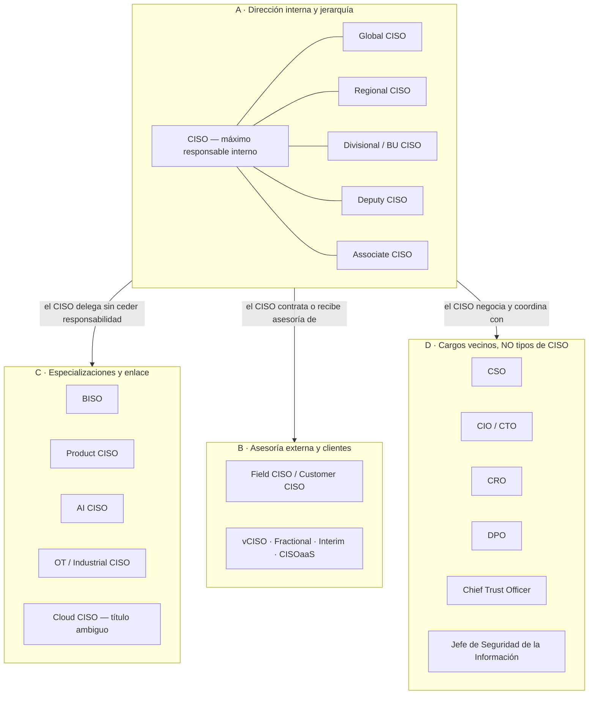
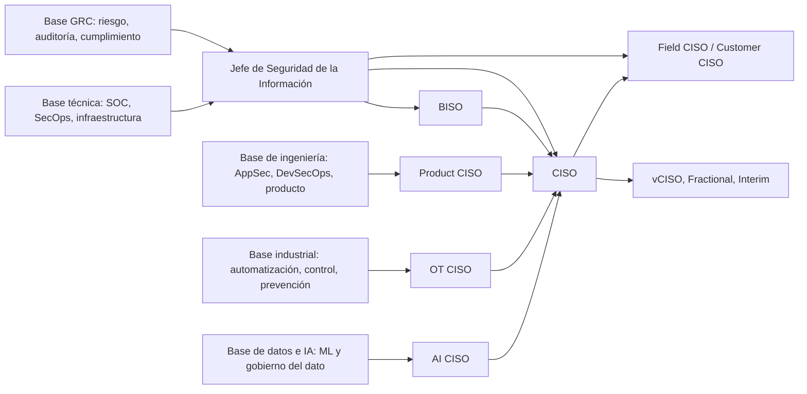

# 🗂️ El ecosistema CISO: qué es cada cargo y en qué se diferencia

> Hay una sola palabra —**CISO**— y al menos veinte cargos que la usan. Algunos son el mismo
> trabajo con distinto tamaño de organización. Otros son un **modelo de contratación**, no un
> puesto. Otros trabajan **para un proveedor** y asesoran a clientes que no son su empleador. Y
> unos cuantos ni siquiera son tipos de CISO: son cargos vecinos que la conversación de pasillo
> mezcla con él.
>
> Esta página es el **índice y el árbitro** del ecosistema. Aquí se decide qué significa cada
> título, quién tiene mandato y quién solo tiene influencia, y hacia dónde ir a leer.

**Fecha de consulta de las fuentes normativas y de los marcos citados: 26 de agosto de 2026.**
Las normas cambian; la sección [🇨🇱 Contexto chileno](#-contexto-chileno-y-latinoamericano)
explica cómo verificar el estado vigente en lugar de confiar en esta página.

## 🧭 Por qué existe esta página

Un título no es un mandato. Dos personas con la misma tarjeta —«CISO»— pueden tener trabajos
incompatibles: una firma el presupuesto de seguridad de un banco y responde ante el directorio;
la otra viaja a reuniones con clientes de un fabricante de software y no controla ni un peso del
presupuesto de seguridad de esos clientes.

La confusión no es inocua. Produce tres errores caros:

| Error | Cómo se ve en la práctica | Qué cuesta |
|---|---|---|
| Confundir **asesoría de proveedor** con **auditoría independiente** | Un Field CISO recomienda la plataforma de su propia empresa y el cliente lo lee como un dictamen neutral | El cliente compra un control que no era su prioridad y deja abierto el riesgo que sí lo era |
| Confundir **tener el título** con **tener el mandato** | Se nombra un «CISO» sin presupuesto, sin línea de reporte al directorio y sin poder de veto | La organización cree que cubrió el riesgo; en realidad solo creó un responsable sin herramientas |
| Confundir **asesorar** con **aceptar el riesgo** | Un vCISO redacta el análisis de riesgo y nadie del cliente firma la aceptación del riesgo residual | Cuando ocurre el incidente no hay dueño: ni el asesor podía decidir, ni el negocio decidió |

Todo lo que sigue existe para que esos tres errores no te pasen.

## 🗺️ Mapa de cargos

**Cómo leer el mapa.** Las líneas del bloque A son de **alcance**, no de subordinación
automática: un Regional CISO puede reportar al Global CISO o al responsable del país, según cómo
esté montada la empresa. La flecha hacia B es la única que cruza la frontera de la organización:
todo lo que hay en B trabaja **desde fuera**. La flecha hacia D no es de mando: son pares con los
que se negocia, y en el caso del DPO hay además una independencia que la norma que lo crea
protege.

## 🧩 Las cuatro familias

### A. Dirección interna y jerarquía

Son **variaciones de alcance, territorio o nivel** dentro del mismo oficio: dirigir el programa de
seguridad de la organización que te paga. El trabajo esencial —mandato, estrategia, riesgo,
presupuesto, equipo, respuesta a incidentes, relación con el directorio— es el mismo, y por eso
**no tienen guía propia**: se desarrollan dentro de la [ruta CISO](ciso.md).

| Cargo | Qué cambia respecto del CISO «a secas» | Nivel de consolidación |
|---|---|---|
| **CISO** | Nada: es el cargo base | Consolidado |
| **Global CISO** | Alcance multinacional; arbitra entre marcos legales que se contradicen y define qué es política global y qué es adaptación local | Variante organizacional |
| **Regional CISO** | Una región (LatAm, EMEA, APAC); ejecuta la política global y traduce el requisito regulatorio local | Variante organizacional |
| **Divisional / Business Unit CISO** | Una división o filial con su propia cuenta de resultados; suele tener presupuesto propio | Variante organizacional |
| **Deputy CISO** | Segundo de a bordo con delegación amplia; cubre al CISO y a menudo lleva la ejecución del programa | Variante organizacional |
| **Associate CISO** | Título de progresión interna, más junior que Deputy; alcance acotado a un dominio | Variante organizacional, poco estandarizada |

> ⚠️ **Ninguno de estos títulos garantiza autoridad.** «Global» describe geografía, no poder. Un
> Global CISO sin presupuesto consolidado y sin línea al directorio tiene menos capacidad de
> decidir que un Divisional CISO que sí los tiene. Aplica el
> [test del mandato](#-el-test-del-mandato-cómo-comprobar-un-cargo-real).

### B. Asesoría externa y relación con clientes

Aquí la persona **no es empleada de la organización cuyo riesgo se discute**, o lo es bajo una
figura temporal y contractual. Esto cambia todo: qué puede decidir, ante quién responde y dónde
está el conflicto de interés.

| Cargo | Qué describe realmente el término | Guía |
|---|---|---|
| **Field CISO** | Un rol **dentro de un proveedor** (fabricante, MSSP, consultora) que habla con los clientes en su idioma ejecutivo: asesora, evangeliza, acompaña la venta y devuelve al producto lo que el mercado pide | [`field-ciso.md`](field-ciso.md) |
| **Customer CISO** | Prácticamente el mismo puesto con el énfasis puesto en la **cuenta ya cliente** (postventa, adopción, relación a largo plazo) en lugar de en la captación | [`field-ciso.md`](field-ciso.md) |
| **vCISO / Virtual CISO** | **Modalidad de prestación**: funciones de CISO ejercidas en remoto y por contrato, normalmente por un consultor o una firma | [`vciso.md`](vciso.md) |
| **Fractional CISO** | **Dedicación parcial**: unas horas o días al mes para una organización que no sostiene un cargo a tiempo completo | [`vciso.md`](vciso.md) |
| **Interim CISO** | **Temporalidad**: ocupa el cargo mientras se cubre una vacante o se atraviesa una crisis; suele ser a tiempo completo y con más autoridad que un fractional | [`vciso.md`](vciso.md) |
| **CISO as a Service** | **Un servicio empresarial**, no una persona: una firma entrega la función con un equipo detrás y un contrato con SLA | [`vciso.md`](vciso.md) |

> 🚫 **No son sinónimos.** «Virtual» describe el **cómo**, «fractional» el **cuánto**, «interim»
> el **hasta cuándo** y «CISO as a Service» el **quién responde** (una empresa, no un individuo).
> Un mismo encargo puede ser las cuatro cosas a la vez —un vCISO fractional interino prestado por
> una firma como servicio— y por eso el término suelto no informa: informa el contrato.

### C. Especializaciones y funciones de enlace

Recortan el trabajo del CISO por **dominio** (producto, nube, IA, planta industrial) o por
**unidad de negocio**. Algunos están razonablemente asentados; otros son emergentes.

| Cargo | Qué recorta | Consolidación del título | Guía |
|---|---|---|---|
| **BISO** (*Business Information Security Officer*) | Una unidad de negocio: es el enlace entre esa unidad y el programa central | Especialización con práctica establecida en banca, seguros y grandes tecnológicas | [`biso.md`](biso.md) |
| **Product CISO** | La confianza y el riesgo de **lo que la empresa vende**, no de lo que usa | Emergente; convive con «Head of Product Security» y «VP Product Security» | [`product-ciso.md`](product-ciso.md) |
| **AI CISO** | El gobierno y la seguridad de los **sistemas de IA** propios y de terceros | **Título emergente**, aún poco estandarizado; a menudo es un encargo añadido al CISO o al responsable de riesgo | [`ai-ciso.md`](ai-ciso.md) |
| **OT / Industrial CISO** | La **planta**: control industrial, continuidad de proceso y seguridad de las personas | Especialización consolidada en energía, minería, agua, manufactura y transporte | [`ot-ciso.md`](ot-ciso.md) |
| **Cloud CISO** | Ambiguo por diseño (ver abajo) | Sin consolidar | — |

#### Por qué «Cloud CISO» no tiene guía propia

Se analizó y **se decidió no crearla**. El término designa hoy dos cosas distintas y ninguna de
las dos sostiene una ruta independiente en este programa:

1. **En un proveedor de nube** es un puesto de la oficina del CISO del proveedor que asesora a
   clientes y hace evangelización: eso es, funcionalmente, un [Field CISO](field-ciso.md) con
   especialidad en nube. Su día, su audiencia y su conflicto de interés son los del Field CISO.
2. **En una organización cliente** designa a quien responde por la seguridad del programa de
   nube. Esa función ya está cubierta por dos rutas existentes: la
   [ruta CISO](ciso.md) para el mandato y el gobierno, y la de
   [**Cloud Security Engineer**](cloud-security.md) para la ingeniería (postura, IAM, CSPM,
   Kubernetes, respuesta en la nube).

Crear una tercera ruta habría duplicado contenido sin añadir competencias ni entregables propios,
que es exactamente el criterio que este ecosistema aplica para decidir. Si te ofrecen un cargo
con ese nombre, léelo con el [test del mandato](#-el-test-del-mandato-cómo-comprobar-un-cargo-real)
y sabrás en cuál de los dos casos estás.

### D. Cargos vecinos que NO son tipos de CISO

Aparecen aquí **para no confundirlos**, no porque deriven del CISO. Convertirlos en «variantes»
sería inventarse una jerarquía que no existe.

| Cargo | Qué es realmente | Dónde se toca con el CISO | Dónde no |
|---|---|---|---|
| **CSO** (*Chief Security Officer*) | Seguridad **en sentido amplio**: física, patrimonial, personas, investigaciones y, a veces, también la información | Cuando la seguridad física y la lógica comparten un incidente (acceso a un centro de datos, sabotaje) | El CSO no es el «jefe del CISO» por definición; en unas empresas lo es y en otras son pares |
| **CIO / CTO** | Responsables de la **tecnología y su entrega**: disponibilidad, proyectos, plataforma, producto | Comparten inventario, arquitectura y proyectos | Sus incentivos difieren: entregar rápido frente a entregar seguro. Que el CISO reporte al CIO es común y crea una tensión que hay que gestionar de forma explícita |
| **CRO** (*Chief Risk Officer*) | El riesgo **empresarial completo**: crédito, mercado, operacional, reputacional | El riesgo cibernético es un riesgo operacional más dentro de su cartera | El CRO no gestiona controles técnicos; el CISO no gestiona riesgo de crédito |
| **Chief Trust Officer** | La **confianza del cliente** como cargo de cara al mercado: transparencia, certificaciones, comunicación | Se apoya en las evidencias que produce el CISO | No responde por la operación de seguridad |
| **DPO** (*Data Protection Officer*) | Responsable de **protección de datos personales**, con **independencia funcional** exigida por la norma que lo crea | Comparten controles: cifrado, accesos, retención, notificación de brechas | **No se absorbe dentro del CISO**: el DPO supervisa el cumplimiento y debe poder discrepar del negocio y del propio CISO sin represalia |
| **Head of Information Security** / **Jefe de Seguridad de la Información** | Dirige el **programa** de seguridad y su equipo, pero pide el presupuesto en lugar de firmarlo | Es el mando medio del que sale, con frecuencia, el futuro CISO | Ver la [ruta dedicada](ciso-jefe-seguridad.md) |
| **GRC Manager** | Gobierno, riesgo y cumplimiento: **mide y asesora**, no decide | Produce la materia prima del CISO: riesgos, controles, auditorías | Ver [`grc.md`](grc.md) |
| **Security Architect** | **Diseña** cómo se construye la seguridad | Traduce la estrategia del CISO a arquitectura | Ver [`arquitecto-it-ot.md`](arquitecto-it-ot.md) |
| **Product Security Lead / AppSec Lead** | Seguridad **del código y del producto**, en la práctica de ingeniería | Alimenta al Product CISO donde este existe | Ver [`appsec.md`](appsec.md) |
| **SOC Manager / SecOps Lead / DevSecOps Lead** | Dirigen **operaciones**: detección, respuesta, pipeline | Ejecutan la parte del programa que el CISO define | Ver [`soc-blue-team.md`](soc-blue-team.md), [`secops-analista.md`](secops-analista.md) y [`devsecops-engineer.md`](devsecops-engineer.md) |
| **Incident Response Manager** | Dirige la respuesta técnica a incidentes | En crisis, es quien opera mientras el CISO decide y comunica | Ver [`dfir.md`](dfir.md) |

> 📌 **Regla de honestidad.** Si una oferta te presenta un CSO, un CIO o un DPO como «un tipo de
> CISO», la oferta está describiendo mal el puesto. Pregunta por el mandato, no por el título.

## 📊 Matriz comparativa central

Diez atributos separan estos cargos mejor que cualquier definición. Se presentan en tres bloques
—la misma convención que la [matriz de roles SecOps/DevSecOps](../docs/matriz-roles-secops-devsecops.md)—
para que cada tabla siga siendo legible en pantalla y en el PDF. **Las filas son las mismas en los
tres bloques**, así que se leen en horizontal como una sola matriz.

### Bloque 1 — Identidad, alcance y audiencia

| Rol | Interno / externo | Alcance | Audiencia principal |
|---|---|---|---|
| **CISO** | Interno (empleado) | Toda la organización | Directorio, CEO, comité de riesgo, regulador |
| **Global CISO** | Interno | Grupo multinacional | Directorio del grupo y reguladores de varios países |
| **Regional CISO** | Interno | Una región | Dirección regional y el Global CISO |
| **Divisional / BU CISO** | Interno | Una división con resultado propio | Dirección de la división y el CISO corporativo |
| **Deputy CISO** | Interno | Delegado del CISO, amplio | El CISO y los responsables de área |
| **Associate CISO** | Interno | Un dominio acotado | Su CISO o Deputy |
| **Field CISO** | **Externo** (empleado de un proveedor) | Las cuentas que atiende | CISOs y direcciones de los **clientes** |
| **Customer CISO** | **Externo** (proveedor) | Cartera de clientes existentes | El CISO cliente y su equipo |
| **vCISO / Fractional / Interim** | **Externo contratado** (o temporal interno) | Lo que diga el contrato | Dirección o dueños de la empresa contratante |
| **CISO as a Service** | **Externo** (una firma) | Lo que diga el contrato marco | Dirección de la empresa contratante |
| **BISO** | Interno | Una unidad de negocio | Dirección de esa unidad y el CISO |
| **Product CISO** | Interno | Los productos y servicios que se venden | Producto, ingeniería, clientes y equipos de venta |
| **AI CISO** | Interno | Sistemas de IA propios y de terceros | Comité de IA o de riesgo, ciencia de datos, legal |
| **OT / Industrial CISO** | Interno | Plantas, procesos y activos ciberfísicos | Operaciones, ingeniería, prevención de riesgos y dirección |

### Bloque 2 — Poder real: autoridad, presupuesto, equipo y riesgo

| Rol | Autoridad formal | Presupuesto | Equipo propio | Responsabilidad por el riesgo |
|---|---|---|---|---|
| **CISO** | Mandato explícito; veto argumentado | Propio, lo defiende y lo ejecuta | Sí | **Responde por el programa**; el riesgo residual lo acepta el negocio |
| **Global CISO** | Mandato de grupo; política vinculante | Consolidado (a veces solo influye sobre el local) | Sí, con equipos regionales | Responde ante el directorio del grupo |
| **Regional CISO** | Delegada dentro de la política global | Regional, acotado | Sí, más pequeño | Responde por su región |
| **Divisional / BU CISO** | Delegada; alineada a la política corporativa | De la división | Sí | Responde por su división |
| **Deputy CISO** | Delegada; ejerce en ausencia del CISO | Ejecuta, no lo defiende él | Habitualmente sí | Comparte la ejecución, no la titularidad |
| **Associate CISO** | Limitada a su dominio | No | A veces | Sobre su dominio |
| **Field CISO** | **Ninguna sobre el cliente** | **No** sobre el cliente | No (sobre el cliente) | **Ninguna**: no acepta ni gestiona el riesgo del cliente |
| **Customer CISO** | Ninguna sobre el cliente | No | No | Ninguna |
| **vCISO / Fractional / Interim** | **La que fije el contrato**, ni más ni menos | Solo si el contrato lo dice | Rara vez; suele dirigir gente del cliente | Asesora y propone; **la aceptación la firma el cliente** |
| **CISO as a Service** | Contractual, de la firma proveedora | Según contrato | El de la firma, no el del cliente | Contractual; no sustituye al dueño del riesgo |
| **BISO** | Influencia fuerte, decisión limitada | Rara vez propio | Pequeño o ninguno | Traduce y prioriza; el dueño es la unidad de negocio |
| **Product CISO** | Sobre requisitos y puertas de publicación | A veces, dentro de ingeniería | Sí (AppSec, seguridad de producto) | Responde por el riesgo **del producto** |
| **AI CISO** | Variable; suele ser normativa, no ejecutiva | Rara vez propio al principio | Pequeño | Sobre el riesgo de los sistemas de IA |
| **OT / Industrial CISO** | Compartida con Operaciones y prevención de riesgos | A veces propio, a veces del área industrial | Sí | Comparte responsabilidad con la seguridad de proceso |

### Bloque 3 — Componente comercial y entregables

| Rol | Componente comercial | Entregables que lo definen |
|---|---|---|
| **CISO** | Ninguno hacia dentro; sí ante clientes y aseguradoras | Plan director, registro de riesgos, presupuesto defendido, informe al directorio, plan de crisis probado |
| **Global CISO** | Ninguno | Política global, modelo operativo, mapa de obligaciones por país |
| **Regional CISO** | Ninguno | Plan regional, brecha frente a la política global, informe regional |
| **Divisional / BU CISO** | Ninguno | Plan de la división, riesgos aceptados por su dirección |
| **Deputy CISO** | Ninguno | Ejecución del plan, informes, continuidad del mando |
| **Associate CISO** | Ninguno | Entregables de su dominio |
| **Field CISO** | **Sí, y hay que declararlo** | Sesión de descubrimiento, evaluación de madurez, recomendación con hipótesis explícitas, contenido y charlas, retroalimentación al producto |
| **Customer CISO** | Sí (renovación y expansión de cuenta) | Plan conjunto de éxito, revisión periódica de servicio, escalamiento ejecutivo |
| **vCISO / Fractional / Interim** | Sí en la venta del contrato; **no** dentro del encargo | Declaración de trabajo, análisis de riesgo, plan director, actas de comité, traspaso documentado |
| **CISO as a Service** | Sí | Contrato con SLA, catálogo de servicio, informes periódicos, matriz de escalamiento |
| **BISO** | No | Roadmap de la unidad, traducción de riesgo a lenguaje de negocio, excepciones con vencimiento |
| **Product CISO** | Indirecto: la seguridad como argumento de venta | Paquete de confianza del producto, SDLC con puertas, modelo de amenazas, respuesta a cuestionarios de clientes, política de divulgación |
| **AI CISO** | No | Inventario de sistemas de IA, registro de riesgos de IA, política de uso, evaluación previa al despliegue |
| **OT / Industrial CISO** | No | Inventario de activos OT, modelo de zonas y conductos, plan de continuidad de proceso, procedimiento de acceso remoto de proveedores |

### Resumen en una línea

| Si la persona… | Entonces es… |
|---|---|
| responde ante el directorio de la empresa que protege | un **CISO** (con el adjetivo de alcance que corresponda) |
| cobra de un proveedor y asesora a clientes | un **Field CISO** o **Customer CISO** |
| ejerce funciones de CISO por contrato y con dedicación acotada | un **vCISO / fractional / interim**, según qué acote el contrato |
| representa a una unidad de negocio ante el programa central | un **BISO** |
| responde por lo que la empresa **vende**, no por lo que usa | un **Product CISO** |
| responde por modelos, datos de entrenamiento y agentes | un **AI CISO** (título emergente) |
| responde por una planta y por la seguridad de las personas | un **OT CISO** |
| supervisa el cumplimiento en privacidad con independencia | un **DPO**, que no es un CISO |

## ⚖️ Las distinciones que no puedes confundir

1. **CISO frente a Field CISO.** El CISO tiene mandato **interno**: presupuesto, equipo y
   responsabilidad ante el directorio de su propia organización. El Field CISO trabaja **desde un
   proveedor hacia clientes**: no controla el presupuesto del cliente, no dirige a su equipo y no
   acepta su riesgo residual. Puede influir mucho y decidir nada.
2. **Asesoría de proveedor frente a auditoría independiente.** Un Field CISO puede participar en
   preventa; lo que no puede es presentar una recomendación comercial como si fuera un dictamen
   independiente. La diferencia se sostiene declarando el interés y separando en el documento
   **hecho observado**, **hipótesis**, **opinión profesional** y **propuesta del proveedor**.
3. **vCISO frente a CISO.** El vCISO puede ejercer funciones ejecutivas reales, pero su autoridad
   **nace del contrato**: si el contrato no dice que puede detener un despliegue, no puede.
   Escribirlo antes de empezar es parte del trabajo.
4. **Asesorar frente a aceptar el riesgo.** Quien acepta el riesgo residual es **el dueño del
   negocio**, con nombre, firma y fecha de revisión. Ningún asesor externo puede aceptarlo por él,
   y ningún CISO debería aceptarlo en su lugar.
5. **BISO frente a CISO.** El BISO conecta **una** unidad de negocio con el programa central:
   traduce en ambos sentidos y prioriza dentro de esa unidad. No sustituye al programa.
6. **Product CISO frente a CISO.** El Product CISO responde por la seguridad y la confianza de
   **lo que se vende**. El CISO responde por la organización que lo construye. Se solapan en el
   SDLC y se separan en todo lo demás.
7. **AI CISO: título emergente.** Existe el trabajo —inventariar modelos, gobernar datos de
   entrenamiento, evaluar agentes, responder por el uso de IA de terceros—, pero el título aún no
   está estandarizado. Comprueba el mandato antes de asumir que es un cargo ejecutivo.
8. **OT CISO: la seguridad de las personas manda.** En una planta, un control de ciberseguridad
   que impide una parada de emergencia no es un control: es un peligro. Ciberseguridad,
   continuidad y seguridad física se equilibran, no se ordenan por preferencia.
9. **DPO: independencia protegida.** El DPO no se absorbe dentro del CISO. Su función incluye
   supervisar el cumplimiento y poder discrepar; juntarlos en la misma persona crea un conflicto
   que hay que documentar y, en varios marcos, evitar.
10. **Conocimiento frente a experiencia ejecutiva.** Este programa te entrega el cuerpo de
    conocimiento y evidencias verificables de aprendizaje. **No sustituye** los años de
    trayectoria, la gestión de una crisis real, el trato con un regulador ni la defensa de un
    presupuesto ante un directorio. Cualquier curso que te prometa lo contrario te está vendiendo
    algo.

## 🧪 El test del mandato: cómo comprobar un cargo real

Aplícalo a una oferta de empleo, a una propuesta de vCISO o a tu propio puesto actual. Son ocho
preguntas; las respuestas —no el título— dicen qué cargo es de verdad.

| # | Pregunta | Qué revela | Señal de alarma |
|---|---|---|---|
| 1 | ¿A quién reportas y con qué frecuencia ves al directorio? | Nivel real del cargo | «Reportas al jefe de sistemas y presentas una vez al año» para un puesto llamado CISO |
| 2 | ¿Existe un presupuesto de seguridad y quién lo firma? | Capacidad de ejecutar | No hay línea presupuestaria propia |
| 3 | ¿Quién acepta formalmente un riesgo que decides no tratar? | Dónde vive la responsabilidad | «Lo aceptas tú»: te están trasladando una decisión de negocio |
| 4 | ¿Puedes detener un despliegue o una compra? ¿Está por escrito? | Autoridad frente a influencia | Solo «recomiendas» |
| 5 | ¿Qué equipo depende de ti y cuál te presta servicio? | Ejecución frente a coordinación | Ni propio ni prestado: el cargo es decorativo |
| 6 | ¿Tienes objetivos comerciales asociados? | Si estás en la familia B | Un cargo «interno» con cuota de ventas |
| 7 | ¿Qué obligación regulatoria concreta recae sobre la organización y quién la firma? | Exposición real | Nadie sabe responderla |
| 8 | ¿Hay seguro de responsabilidad para la administración y te alcanza? | Cómo te ve legalmente la empresa | Responsabilidad sin cobertura ni respaldo |

Si las respuestas a 2, 3 y 4 son «no», tienes un **cargo decorativo**: el título del CISO con las
herramientas de un asesor. Es una situación legítima para negociar, no para descubrir después de
firmar.

## 🧗 Rutas de progresión

Nadie entra por aquí. Todas estas rutas se alcanzan **desde otro sitio**, y el sitio de partida
condiciona a cuál llegas antes.

**Lo que el diagrama no dice y hay que decir:**

- **Field CISO y vCISO no son «el retiro» del CISO.** Son oficios distintos con habilidades
  propias: el Field CISO necesita hablar en público, escribir para no técnicos y sostener una
  conversación comercial honesta; el vCISO necesita vender, contratar, delimitar alcance y
  traspasar. Un buen CISO puede ser un mal Field CISO.
- **Se puede llegar a Field CISO sin haber sido CISO**, viniendo de consultoría o de preventa
  técnica con suficiente altura de conversación. Lo que no se puede es fingir la experiencia
  ejecutiva delante de alguien que sí la tiene.
- **El BISO es una escuela de CISO**: obliga a traducir riesgo a lenguaje de negocio todos los
  días, que es la habilidad que más se echa en falta al llegar al cargo.

## 📚 Qué leer en este programa

| Guía | Cuándo es tu página |
|---|---|
| [🎩 **CISO / Director de Seguridad de la Información**](ciso.md) | Quieres el cargo interno, en cualquiera de sus alcances (global, regional, divisional, deputy, associate) |
| [🛰️ **Field CISO / Customer CISO**](field-ciso.md) | Asesoras a clientes desde un proveedor |
| [🧾 **vCISO, Fractional, Interim y CISO as a Service**](vciso.md) | Ejerces la función por contrato |
| [🔗 **BISO**](biso.md) | Eres el enlace de una unidad de negocio |
| [📦 **Product CISO**](product-ciso.md) | Respondes por lo que la empresa vende |
| [🤖 **AI CISO**](ai-ciso.md) | Gobiernas los sistemas de IA |
| [🏭 **OT / Industrial CISO**](ot-ciso.md) | Respondes por una planta |
| [👔 **Jefe de Seguridad de la Información**](ciso-jefe-seguridad.md) | Diriges el programa pero pides el presupuesto |
| [🏢 **Jefe de Infraestructura y Ciberseguridad**](jefe-infraestructura-ciberseguridad.md) | La misma jefatura responde por operar y por proteger |
| [🏛️ **GRC / Gestión de seguridad**](grc.md) | Mides y asesoras; no decides |
| [🏗️ **Arquitecto de Ciberseguridad IT/OT**](arquitecto-it-ot.md) | Diseñas la arquitectura de planta |
| [☁️ **Cloud Security Engineer**](cloud-security.md) | Construyes la seguridad de la nube |

**Práctica común a todo el ecosistema:** el laboratorio ejecutivo
[`labs/ciso-leadership`](../labs/ciso-leadership/README.md) —catorce escenarios sobre
organizaciones ficticias, quince plantillas reutilizables y rúbricas— y su
[evaluación](../labs/ciso-leadership/EVALUACION.md).

## 🇨🇱 Contexto chileno y latinoamericano

> ⚖️ **Esto no es asesoría legal.** Es material de estudio. Las normas cambian y su aplicación
> depende del sector, del tamaño y de la calificación que haga la autoridad. Verifica siempre en
> la fuente oficial y consulta con un abogado antes de tomar una decisión.

### La regla que más se incumple al hablar de cargos

**Ninguna norma chilena vigente crea el cargo de «CISO» ni le asigna responsabilidad legal
personal por el solo hecho de llevar el título.** Las obligaciones recaen sobre la
**organización** y, según el caso, sobre sus órganos de administración. Que en la práctica el
CISO sea quien las ejecuta y quien las firma internamente es una decisión de la empresa, no una
imposición legal automática. Cuando alguien te diga «la ley obliga al CISO a…», pide el artículo.

### Marco vigente que conviene conocer

| Norma | Qué establece, en corto | Dónde verificarlo |
|---|---|---|
| **Ley 21.663, Ley Marco de Ciberseguridad** (publicada el 8 de abril de 2024) | Crea la **Agencia Nacional de Ciberseguridad (ANCI)**, define **servicios esenciales** y **operadores de importancia vital (OIV)**, y establece deberes de gestión de riesgo y de **reporte de incidentes** al CSIRT Nacional | [BCN · Ley 21.663](https://www.bcn.cl/leychile/navegar?i=1202434) · [ANCI](https://anci.gob.cl/) |
| **Deber de reportar (artículo 9)** | Alerta temprana en un máximo de **3 horas** desde el conocimiento del incidente; actualización a las **72 horas** (**24 horas** si es un OIV con su servicio esencial afectado); informe final en un máximo de **15 días corridos** desde la alerta temprana | [ANCI · Instrucciones](https://anci.gob.cl/normativa/instrucciones/) · [CSIRT Nacional](https://www.csirt.gob.cl) |
| **Ley 21.719 sobre protección de datos personales** (publicada el 13 de diciembre de 2024) | Sustituye el régimen de la Ley 19.628, crea la **Agencia de Protección de Datos Personales** y refuerza derechos, deberes y sanciones. **Entrada en vigencia: 1 de diciembre de 2026** | [BCN · Ley 21.719](https://www.bcn.cl/leychile/navegar?idNorma=1209272) · [BCN · Ley 19.628](https://www.bcn.cl/leychile/navegar?idNorma=141599) |
| **CMF · RAN Capítulo 20-10**, gestión de la seguridad de la información y ciberseguridad (vigente desde el 1 de diciembre de 2020) | Requisitos de gobierno, gestión de riesgo, controles, terceros, continuidad y reporte para bancos, sus filiales, sociedades de apoyo al giro, cooperativas supervisadas y emisores u operadores de tarjetas | [CMF · Capítulo 20-10](https://www.cmfchile.cl/portal/principal/613/w3-article-29310.html) |

### Qué figura aparece según el tamaño y la regulación

Esta tabla describe **patrones observables del mercado**, no una obligación normativa.

| Situación de la organización | Figura que suele aparecer | Por qué |
|---|---|---|
| Gran empresa regulada (banca, seguros, utilities, telecomunicaciones) | **CISO dedicado**, a veces con **BISO** por filial | La normativa sectorial exige gobierno, evidencia y reporte sostenidos |
| Grupo multinacional con filial en Chile | **Regional o Divisional CISO** local bajo un **Global CISO** | Hay política corporativa y a la vez obligaciones locales |
| Empresa mediana (100–1.000 personas) | **Jefe de Infraestructura y Ciberseguridad** o **Jefe de Seguridad de la Información** | No sostiene un cargo de dirección exclusivo, pero necesita alguien que responda |
| Empresa pequeña o en fase de crecimiento rápido | **vCISO / fractional**, o **servicio administrado** | Necesita criterio ejecutivo unas horas al mes, no un sueldo de dirección |
| Operador calificado como **OIV** | **CISO** o responsable formal con línea directa a la administración | Los deberes de la Ley 21.663 requieren un interlocutor con capacidad de decidir |
| Industria con planta (minería, energía, agua, celulosa, alimentos) | **OT CISO** o **arquitecto IT/OT**, con Operaciones al lado | El riesgo incluye la seguridad de las personas y la continuidad del proceso |
| Empresa que **vende** software o servicios digitales | **Product CISO** o responsable de seguridad de producto | El riesgo que más pesa es el de sus clientes, no el propio |
| Organización que trata datos personales a escala | Responsable de privacidad o **DPO** | La Ley 21.719 endurece deberes y sanciones desde diciembre de 2026 |

### Cómo verificar el estado vigente

1. **Ley y reglamentos:** [BCN · Ley Chile](https://www.bcn.cl/leychile) — comprueba la versión
   vigente y las modificaciones posteriores a esta fecha de consulta.
2. **Instrucciones y calificación de operadores de importancia vital:** [ANCI](https://anci.gob.cl/normativa/instrucciones/).
3. **Reporte de incidentes y alertas:** [CSIRT Nacional](https://www.csirt.gob.cl).
4. **Sector financiero:** [CMF](https://www.cmfchile.cl) — normativa vigente y sus actualizaciones.
5. **Privacidad:** la autoridad de protección de datos que designa la Ley 21.719 y la propia BCN.
6. **Tu sector:** el regulador que te corresponda (energía, salud, transporte, telecomunicaciones).

Para el resto de Latinoamérica el patrón se repite con distintos nombres: una autoridad nacional
de ciberseguridad, una autoridad de datos personales y un regulador financiero con su propia
circular. **Comprueba las tres antes de escribir una política que diga «cumplimos».**

### Ofertas de empleo como evidencia contextual

Las ofertas sirven para estudiar **qué pide el mercado hoy** y con qué nombre lo pide. No sirven
para afirmar qué es un cargo. Si las usas, trátalas como lo que son: evidencia contextual, con
fecha de consulta, sin generalizar de un anuncio a toda una profesión y sin convertir un
requisito de una empresa en un requisito universal.

## 🌎 Marcos internacionales de referencia

Se citan como fuente de **estructura y vocabulario**, no como obligación. Ninguno de ellos crea el
cargo de CISO ni define su jerarquía.

| Marco | Para qué lo usa este ecosistema | Enlace |
|---|---|---|
| **NIST Cybersecurity Framework 2.0** | La función **Gobernar (GV)** —añadida en la versión 2.0— es el mejor mapa público de lo que un CISO debe poder demostrar | [nist.gov/cyberframework](https://www.nist.gov/cyberframework) |
| **NIST AI Risk Management Framework (AI RMF 1.0)** | Estructura del trabajo del AI CISO: gobernar, mapear, medir y gestionar el riesgo de sistemas de IA | [nist.gov/itl/ai-risk-management-framework](https://www.nist.gov/itl/ai-risk-management-framework) |
| **NIST SP 800-82 Rev. 3** | Seguridad de tecnología operacional: el texto de referencia del OT CISO | [csrc.nist.gov](https://csrc.nist.gov/pubs/sp/800/82/r3/final) |
| **IEC 62443** | Zonas, conductos y niveles de seguridad en sistemas de automatización industrial | [iec.ch](https://www.iec.ch/) |
| **ISO/IEC 27001** | Sistema de gestión de seguridad de la información: la columna vertebral del programa | [iso.org](https://www.iso.org/standard/27001) |
| **ISO/IEC 42001** | Sistema de gestión de IA: el equivalente de 27001 para sistemas de inteligencia artificial | [iso.org](https://www.iso.org/standard/81230.html) |
| **CISA** | Guías operativas y objetivos de desempeño intersectoriales | [cisa.gov](https://www.cisa.gov/) |
| **ENISA** | Panorama de amenazas europeo y guías sectoriales | [enisa.europa.eu](https://www.enisa.europa.eu/) |
| **OWASP SAMM y ASVS** | Madurez del ciclo de desarrollo y requisitos verificables de aplicación: el instrumental del Product CISO | [owaspsamm.org](https://owaspsamm.org/) · [ASVS](https://owasp.org/www-project-application-security-verification-standard/) |
| **ISACA** (CISM, CRISC) e **ISC2** (CISSP) | Cuerpos de conocimiento de gestión y gobierno de seguridad | [isaca.org](https://www.isaca.org/) · [isc2.org](https://www.isc2.org/) |
| **IAPP** | Cuerpo de conocimiento de privacidad, útil para separar bien DPO y CISO | [iapp.org](https://iapp.org/) |

> 📄 **Sobre las normas ISO e IEC:** son documentos de pago y con derechos reservados. Este
> programa explica sus conceptos y su estructura; **no reproduce su texto**. Para implantar o
> auditar necesitas la copia oficial.

## 🎓 Evaluación

El ecosistema se evalúa en dos sitios, con dos propósitos distintos:

- **[Evaluación del ecosistema CISO](../labs/ciso-leadership/EVALUACION.md)** — preguntas de
  escenario, ejercicio RACI, ejercicio de aceptación de riesgo, caso de conflicto de interés en
  preventa e informe ejecutivo. Comprueba que **distingues quién decide, quién asesora y quién
  responde**.
- **[Examen final por rol](../docs/examen-final-por-rol.md)** — un capstone propio para cada ruta
  independiente: CISO, Field CISO, vCISO, BISO, Product CISO, AI CISO y OT CISO.

## 📎 Fuentes y fecha de consulta

Todas consultadas el **26 de agosto de 2026**.

- Biblioteca del Congreso Nacional de Chile — [Ley 21.663, Ley Marco de Ciberseguridad](https://www.bcn.cl/leychile/navegar?i=1202434); [Ley 21.719 sobre protección y tratamiento de datos personales](https://www.bcn.cl/leychile/navegar?idNorma=1209272); [Ley 19.628 sobre protección de la vida privada](https://www.bcn.cl/leychile/navegar?idNorma=141599).
- Agencia Nacional de Ciberseguridad de Chile — [sitio institucional](https://anci.gob.cl/) e [instrucciones sobre la Ley Marco](https://anci.gob.cl/normativa/instrucciones/), de donde proceden los plazos de reporte de 3 horas, 72 horas (24 horas para operadores de importancia vital) y 15 días corridos.
- [CSIRT Nacional de Chile](https://www.csirt.gob.cl) — canal de reporte de incidentes.
- Comisión para el Mercado Financiero — [RAN Capítulo 20-10, Gestión de Seguridad de la Información y Ciberseguridad](https://www.cmfchile.cl/portal/principal/613/w3-article-29310.html), vigente desde el 1 de diciembre de 2020.
- NIST — [Cybersecurity Framework 2.0](https://www.nist.gov/cyberframework); [AI Risk Management Framework](https://www.nist.gov/itl/ai-risk-management-framework); [SP 800-82 Rev. 3, Guide to Operational Technology Security](https://csrc.nist.gov/pubs/sp/800/82/r3/final).
- ISO — [ISO/IEC 27001](https://www.iso.org/standard/27001) e [ISO/IEC 42001](https://www.iso.org/standard/81230.html) (documentos de pago; no se reproduce su texto).
- [IEC](https://www.iec.ch/) — serie IEC 62443 para automatización industrial.
- [CISA](https://www.cisa.gov/) y [ENISA](https://www.enisa.europa.eu/) — guías operativas y panorama de amenazas.
- [OWASP SAMM](https://owaspsamm.org/) y [OWASP ASVS](https://owasp.org/www-project-application-security-verification-standard/).
- [ISACA](https://www.isaca.org/), [ISC2](https://www.isc2.org/) e [IAPP](https://iapp.org/) — cuerpos de conocimiento y certificaciones.

## 🔗 Relacionado

- 🧭 [Índice de rutas por rol](README.md)
- 🗺️ [Matriz de roles SecOps y DevSecOps](../docs/matriz-roles-secops-devsecops.md) — la misma
  disciplina de separar roles, aplicada a la familia operativa.
- 🧪 [Laboratorio ejecutivo CISO](../labs/ciso-leadership/README.md)
- 🎓 [Examen final por rol](../docs/examen-final-por-rol.md)
- 📚 [Parte 14 — GRC, riesgo y cumplimiento](../classes/parte-14-grc-riesgo-y-cumplimiento/README.md)
