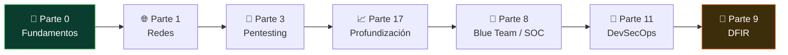

# 🛡️ Analista de Gestión de Vulnerabilidades

> No buscas el exploit heroico: sostienes el ciclo aburrido y crítico que mantiene una
> organización parchada — descubrir, priorizar, remediar, verificar y reportar, semana tras
> semana.
>
> **Nivel de entrada:** junior/intermedio (base sólida de sistemas y redes, no requiere saber explotar) · **Foco:** vulnerability management y security operations · **Certificación faro:** CySA+

<!-- insignias:inicio -->

<!-- insignias:fin -->

## 🧭 Qué es y por qué importa

La gestión de vulnerabilidades (VM) no es un pentest. El pentest es un evento acotado que
demuestra un camino de ataque; la VM es un **ciclo continuo** que nunca termina. La diferencia
importa porque define tu trabajo diario: no entregas un informe espectacular una vez al año,
mantienes bajo control una superficie que cambia cada día con cada parche, cada servidor nuevo
y cada CVE publicado.

El ciclo tiene cinco fases y todas son tuyas:

1. **Descubrir** — escanear la infraestructura (Nessus, Qualys, OpenVAS) y mantener un
   inventario de activos que sea real, no el que dice la hoja de cálculo de hace dos años.
2. **Priorizar** — aquí está el oficio. No puedes parchar todo, así que decides qué primero.
   Ya no basta con la severidad **CVSS**: se combina con **EPSS** (probabilidad de que un CVE
   se explote en los próximos 30 días) y con el catálogo **CISA KEV** (vulnerabilidades con
   explotación activa confirmada). Eso es **risk-based VM**: priorizar por riesgo real, no por
   un número base.
3. **Remediar** — casi nunca parcheas tú. Coordinas con IT, sistemas y desarrollo para que lo
   hagan, dentro de un **SLA de remediación** (p. ej. crítico en 7 días, alto en 30).
4. **Verificar** — reescanear y confirmar que el parche cerró el hueco. "Lo marcaron como
   resuelto" no es lo mismo que "está resuelto".
5. **Reportar** — traducir miles de hallazgos a métricas y decisiones para dirección.

Importa porque la mayoría de las brechas reales no usan un 0-day exótico: usan una
vulnerabilidad conocida, con parche disponible, que nadie aplicó a tiempo. Tú eres quien
cierra esa ventana.

## 🗓️ Un día en el puesto

No hay un día idéntico, pero el patrón se repite:

- **Revisar el tablero de escaneos:** qué corrió anoche, qué activos nuevos aparecieron, qué
  escaneos fallaron por credenciales o firewall (los falsos negativos silenciosos son tu
  enemigo).
- **Triage de hallazgos:** separar el ruido (falsos positivos, hallazgos informativos) de lo
  accionable. Un escáner escupe miles de líneas; tu valor es reducir eso a lo que de verdad
  importa hoy.
- **Priorizar la cola:** cruzar los hallazgos con EPSS, KEV y la criticidad del activo. Un
  "medio" en un servidor expuesto a internet con exploit público pesa más que un "crítico" en
  una máquina aislada de laboratorio.
- **Perseguir a otros equipos:** buena parte del día es seguimiento. Abrir tickets, empujar
  parches que llevan tres semanas parados, negociar ventanas de mantenimiento, explicar por
  qué ese CVE no puede esperar al próximo trimestre. Se dice poco, pero es el núcleo del rol.
- **Verificar remediaciones:** reescanear lo que dicen haber cerrado y actualizar el estado.
- **Reportar y medir:** actualizar métricas de cobertura, tiempo medio de remediación (MTTR)
  y cumplimiento de SLA para la reunión con IT o con dirección.

Es un trabajo de escritorio, muy de coordinación y de constancia. Si esperas adrenalina
constante, este no es el puesto; si te da satisfacción ver la deuda de vulnerabilidades bajar
mes a mes, encajas.

## 🧠 Qué necesitas saber

### Conocimiento técnico

- **Sistemas operativos por dentro:** Windows y Linux — servicios, procesos, gestión de
  paquetes y, sobre todo, **cómo se aplica un parche** y qué puede romper. Sin esto no
  entiendes lo que reportas.
- **Redes:** TCP/IP, puertos, segmentación, cómo un activo queda expuesto y por qué un escaneo
  autenticado ve mucho más que uno sin credenciales.
- **El modelo de vulnerabilidad:** qué es un CVE, cómo se puntúa con CVSS (base, temporal,
  ambiental), qué añade EPSS y qué significa que algo entre al catálogo KEV.
- **Hardening y gestión de configuración:** benchmarks CIS, líneas base seguras, y por qué una
  mala configuración es una vulnerabilidad aunque no tenga CVE.
- **Cadena de suministro de software (SCA):** las dependencias de terceros y sus CVEs son hoy
  una de las mayores fuentes de exposición.
- **Nociones de explotación (contexto, no oficio):** no necesitas explotar, pero entender cómo
  se aprovecha una vulnerabilidad te permite priorizar con criterio.

### Herramientas del oficio

- **Escáneres de vulnerabilidades:** Nessus (Tenable), Qualys, Rapid7 InsightVM/Nexpose y el
  libre OpenVAS/Greenbone. Son el corazón del trabajo.
- **Priorización basada en riesgo:** las fuentes EPSS (FIRST) y el catálogo CISA KEV, además
  de los módulos de risk-based scoring de las propias plataformas.
- **SCA / dependencias:** herramientas de análisis de composición de software (Dependabot,
  Trivy, Grype, OWASP Dependency-Check) para el código y los contenedores.
- **Ticketing e inventario:** Jira, ServiceNow o similares — porque remediar es coordinar, y
  coordinar es rastrear.
- **EDR/AV como control compensatorio:** cuando un parche no puede aplicarse ya, un EDR bien
  configurado reduce el riesgo mientras tanto; hay que saber leer y ajustar esos controles.
- **Scripting básico:** Python o PowerShell para exportar, cruzar y reportar datos sin morir
  en Excel.

### Habilidades no técnicas

- **Comunicación y negociación:** pasarás el día pidiendo a gente ocupada que priorice tu
  parche sobre su backlog. Sin tacto y datos, no lo consigues.
- **Escribir para dos públicos:** el detalle técnico para quien parcha y el resumen de riesgo
  para quien decide y paga.
- **Constancia y método:** el rol premia la disciplina, no los golpes de genio. Un ciclo bien
  llevado mes tras mes vale más que un hallazgo brillante aislado.
- **Tolerancia a la fricción:** te dirán "eso no se puede parchar ahora" muchas veces. Saber
  cuándo insistir, cuándo escalar y cuándo aceptar un riesgo documentado es parte del oficio.

## 📚 Tu ruta en el programa

<!-- recorrido:inicio -->

<!-- recorrido:fin -->

El orden importa: primero la base técnica, luego el escaneo, luego el ciclo completo y su
gobierno.

1. 📚 [**Parte 0 — Fundamentos**](../classes/parte-0-fundamentos-y-prerrequisitos/README.md)
   (001–025). Windows, Linux y redes. Sin esto no distingues un hallazgo real de un falso
   positivo. No es opcional.
2. 📚 [**Parte 1 — Redes y escaneo**](../classes/parte-1-redes-y-seguridad-de-redes/README.md)
   (026–045). Nmap y enumeración: aprender a ver la superficie antes de escanearla con
   herramientas más pesadas.
3. 📚 [**Parte 3 — Análisis de vulnerabilidades**](../classes/parte-3-hacking-etico-y-pentesting-metodologia/README.md).
   El corazón técnico del rol:
   [071 — Análisis de vulnerabilidades con Nessus y OpenVAS](../classes/parte-3-hacking-etico-y-pentesting-metodologia/071-analisis-de-vulnerabilidades-con-nessus-y-openvas/README.md)
   y [085 — Reporte profesional de pentest](../classes/parte-3-hacking-etico-y-pentesting-metodologia/085-reporte-profesional-de-pentest/README.md),
   que enseña a comunicar hallazgos con severidad y evidencia.
4. 📚 [**Parte 17 — Profundización**](../classes/parte-17-profundizacion-para-certificaciones/README.md).
   Aquí pasas del escaneo al **programa** de VM:
   [318 — Gestión del programa de vulnerabilidades](../classes/parte-17-profundizacion-para-certificaciones/318-gestion-del-programa-de-vulnerabilidades/README.md)
   es la clase central de esta ruta;
   [324 — Hardening y gestión de configuración](../classes/parte-17-profundizacion-para-certificaciones/324-operaciones-de-seguridad-hardening-y-gestion-de-configuracion/README.md),
   [322 — Threat Intelligence operacional avanzada](../classes/parte-17-profundizacion-para-certificaciones/322-threat-intelligence-operacional-avanzada/README.md)
   (para nutrir la priorización) y
   [321 — Comunicación y reporte](../classes/parte-17-profundizacion-para-certificaciones/321-comunicacion-y-reporte-para-analistas-de-seguridad/README.md).
5. 📚 [**Parte 8 — Blue Team y SOC**](../classes/parte-8-blue-team-deteccion-y-soc/README.md).
   El contexto operativo: [189 — Análisis de endpoints con EDR](../classes/parte-8-blue-team-deteccion-y-soc/189-analisis-de-endpoints-con-edr/README.md)
   (control compensatorio), [188 — Threat hunting](../classes/parte-8-blue-team-deteccion-y-soc/188-threat-hunting-metodologia/README.md),
   [195 — Threat Intelligence operacional](../classes/parte-8-blue-team-deteccion-y-soc/195-threat-intelligence-operacional/README.md)
   y [197 — Métricas y madurez del SOC](../classes/parte-8-blue-team-deteccion-y-soc/197-metricas-y-madurez-del-soc/README.md),
   porque VM se mide igual que un SOC.
6. 📚 [**Parte 11 — DevSecOps**](../classes/parte-11-devsecops-y-seguridad-del-sdlc/README.md).
   La vulnerabilidad moderna vive en el código y sus dependencias:
   [240 — SCA, dependencias y riesgo de terceros](../classes/parte-11-devsecops-y-seguridad-del-sdlc/240-sca-dependencias-y-riesgo-de-terceros/README.md)
   y [245 — Gestión de vulnerabilidades a escala](../classes/parte-11-devsecops-y-seguridad-del-sdlc/245-gestion-de-vulnerabilidades-a-escala/README.md).
7. 📚 [**Parte 9 — DFIR**](../classes/parte-9-forense-digital-y-respuesta-a-incidentes/README.md).
   [219 — Ejercicios de mesa (tabletop)](../classes/parte-9-forense-digital-y-respuesta-a-incidentes/219-ejercicios-de-mesa-tabletop/README.md):
   los simulacros donde una vulnerabilidad sin parchar se convierte en la lección del incidente.

Practica en los laboratorios, que es donde el ciclo se vuelve músculo:

- 🧪 [`appsec-code`](../labs/appsec-code/README.md) y [`appsec-web`](../labs/appsec-web/README.md)
  para ver hallazgos reales de código y web que luego hay que priorizar y remediar.
- 🧪 [`rootcause-windows`](../labs/rootcause-windows/README.md) para entender causa raíz,
  parches y hardening en Windows.
- 🧪 [`devsecops-pipeline`](../labs/devsecops-pipeline/README.md) — **el más alineado con este
  rol**: practica la priorización real (KEV → EPSS → CVSS ajustado por exposición), la
  remediación con verificación y reversión, y la sección de **cobertura** del informe, que es
  lo que separa un reporte creíble de un volcado de escáner.

## 🎓 Certificaciones

Las certis abren filtros de RR. HH., pero lo que te contrata es demostrar que sostienes un
ciclo. Úsalas como orden, no como colección.

- 🎓 [**Security+ (SY0-701)**](../certificaciones/comptia-security-plus-sy0-701.md) — entrada.
  Valida la base y desbloquea entrevistas. Empieza aquí si vienes de cero.
- 🎓 [**CySA+ (CS0-003)**](../certificaciones/comptia-cysa-plus-cs0-003.md) — **el faro** de
  esta ruta. Es la certi de analista blue-team enfocada justo en gestión de vulnerabilidades,
  análisis de datos de seguridad y respuesta. Si apuntas a este rol, es tu objetivo natural.
- 🎓 [**PenTest+ (PT0-002)**](../certificaciones/comptia-pentest-plus-pt0-002.md) — opcional
  y complementaria. No necesitas ser pentester, pero entender el lado ofensivo mejora tu
  priorización. Menciónala como refuerzo, no como requisito.
- **Certificaciones de producto** — Tenable (Nessus), Qualys y Rapid7 ofrecen certificaciones
  de sus plataformas. No las cubre este programa y son de proveedor, pero en muchos puestos
  reales pesan tanto como una certi neutral, porque demuestran manejo de la herramienta que ya
  usa la empresa.

Consulta el [índice de certificaciones](../certificaciones/README.md) para ver cuánto cubre el
programa de cada examen.

## 📈 Progresión de carrera y salario

Camino típico, con nombres que varían según la empresa:

1. **Analista de gestión de vulnerabilidades junior** — ejecutas escaneos, haces triage y
   sigues tickets dentro de un proceso ya definido.
2. **Analista de VM** — llevas el ciclo completo de un ámbito, defines la priorización y
   negocias SLAs con los equipos técnicos.
3. **Analista senior / VM engineer** — automatizas el programa, integras EPSS/KEV en el
   scoring, diseñas métricas y afinas las plataformas a escala.
4. **Especialización o gestión:** líder del programa de VM, ingeniero de detección, analista
   SOC/blue team, AppSec, o hacia GRC y gestión de riesgo. Es un rol con muchas salidas.

Rangos salariales **orientativos** (brutos anuales, muy dependientes de país, experiencia,
sector e inglés; referencia, no promesa):

- **LATAM:** entrada aproximada USD 10.000–22.000; con experiencia USD 22.000–45.000+. Gran
  variación entre países y entre empresa local y multinacional.
- **España:** entrada aproximada 22.000–32.000 €; senior 40.000–58.000 €+.
- **Remoto / USD (para clientes de EE. UU./Europa):** notablemente más alto, con seniors
  fácilmente por encima de USD 80.000–110.000, pero la competencia es global.

El inglés técnico, el dominio de una plataforma (Tenable/Qualys/Rapid7) y saber automatizar
mueven estos números más que casi cualquier otra cosa.

## ⚠️ Mitos y errores comunes

- **"Es lo mismo que un pentest."** No. El pentest es un evento; la VM es un ciclo continuo.
  Confundirlos lleva a esperar adrenalina donde hay constancia.
- **"El escáner hace el trabajo."** El escáner genera datos; tú generas decisiones. Sin triage
  y priorización, solo produces una lista de miles de líneas que nadie lee.
- **"Prioriza siempre por CVSS."** El score base ignora si el CVE se explota de verdad.
  Sin **EPSS** y **CISA KEV**, malgastas esfuerzo en críticos teóricos e ignoras medios que ya
  están siendo explotados. Eso es lo que corrige el **risk-based VM**.
- **"Mi trabajo termina cuando reporto el hallazgo."** Termina cuando se **verifica** el
  parche. Un hallazgo reportado y olvidado sigue siendo un agujero abierto.
- **"Solo es apretar botones y leer reportes."** Buena parte del rol es **perseguir a otros
  equipos** para que parcheen: negociar, insistir, escalar. Si detestas el seguimiento y la
  política interna, este puesto te va a desgastar.
- **"Este curso me vuelve analista de VM profesional."** Te da el ciclo, las herramientas y el
  criterio de priorización. La política interna de empujar parches en una empresa real, la
  gestión de excepciones de riesgo y la escala se ganan en el trabajo.

## 🚀 Siguientes pasos

1. Si vienes de cero, haz la **Parte 0** completa antes de tocar un escáner. La base de
   sistemas es la que te deja distinguir señal de ruido.
2. Encadena **Parte 1 → Parte 3** y monta Nessus u OpenVAS en un laboratorio propio para
   escanear tus máquinas y practicar el triage.
3. Estudia la **clase 318** como columna vertebral del rol y complétala con la **321** de
   comunicación y reporte.
4. Practica el ciclo en [`appsec-code`](../labs/appsec-code/README.md),
   [`appsec-web`](../labs/appsec-web/README.md) y
   [`rootcause-windows`](../labs/rootcause-windows/README.md): descubre, prioriza, propón la
   remediación y verifícala.
5. Interioriza **CVSS + EPSS + CISA KEV** hasta que priorizar por riesgo sea automático; es lo
   que separa a un analista de VM de quien solo reenvía reportes del escáner.
6. Apunta a la [**Security+**](../certificaciones/comptia-security-plus-sy0-701.md) como primer
   hito y a la [**CySA+**](../certificaciones/comptia-cysa-plus-cs0-003.md) como meta del rol.

---

- ⬅️ [Volver al índice de rutas](./README.md)
- 🏠 [Inicio del programa](../README.md)
